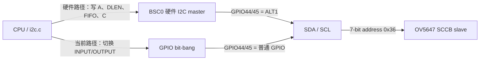
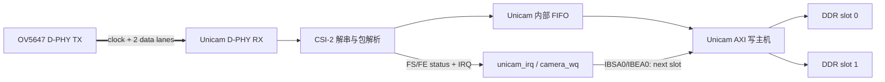

# 树莓派摄像头驱动：OV5647 + Unicam CSI-2

硬件：Raspberry Pi 3B+，Camera Module v1.3（OmniVision OV5647），接在板载 CAMERA 排线口（CSI1）。

路线：由 ARM 直接驱动，不经过 GPU 固件的摄像头栈（`start_x.elf`、MMAL/VCHIQ）。
内核自己完成 I2C 配置传感器、开电源与时钟、用 Unicam 接收 MIPI CSI-2 数据并 DMA 到内存；
用户态 `camshot` 把原始 Bayer 数据转换成 BMP 或基线 JPEG。这与 Linux 主线的
`bcm2835-unicam` + `ov5647` 驱动是同一种结构，本驱动的寄存器配置也都取自这两个 Linux 驱动。

当前状态：OV5647 已在 Pi 3 真机完成 SCCB 探测、CSI-2/Unicam RAW10 采集和测试彩图 BMP 输出；
已验证的真机路径使用轮询完成帧。当前版本进一步加入 CSI1 IRQ 主路径、10 ms watchdog、DMA
双缓冲及只读 mmap，已通过完整构建，IRQ 主路径仍需烧录后以真机日志确认。

## 0. 文件

| 文件 | 内容 | 对应的 Linux 代码 |
|---|---|---|
| `kernel/mbox.[ch]` | 新增。共享的固件 property mailbox（带锁）：电源域、扩展 GPIO、时钟频率 | `raspberrypi-firmware.c` |
| `kernel/i2c.[ch]` | 新增。BSC I2C 主机，轮询方式；BSC0 切到 GPIO 44/45 | `i2c-bcm2835.c` |
| `kernel/camsensor.h` | 新增。传感器接口：`struct camsensor`、`sensor_ops`、`cam_mode`、`camsensor_bus` | V4L2 subdev（`v4l2_subdev_ops`） |
| `kernel/ov5647.c` | 新增。`sensor_ops` 的一个实现：上电、读芯片 ID、640x480 RAW10 寄存器表、开关数据流、测试图 | `drivers/media/i2c/ov5647.c` |
| `kernel/unicam.c` | 新增。桥接驱动：CSI1 接收器、CAM1 时钟、帧状态机、中断、`/dev/video0`；只通过 `sensor_ops` 访问传感器 | `bcm2835-unicam.c` |
| `kernel/camera.h` | 新增。内核与用户程序共用的帧头格式和常量 | — |
| `user/camshot.c` | 拍照、RAW10 解包、去马赛克、白平衡并输出 BMP/JPEG | — |
| `user/jpeg.[ch]` | 无浮点、流式基线 JPEG 编码器，YCbCr 4:2:0，供拍照及未来 MJPEG 复用 | — |
| `kernel/memlayout.h`、`vm.c` | 摄像头 DMA 区 `CAMDMA`（非缓存映射）；`CSI1_IRQ` | — |
| `kernel/bcm2837.c`、`trap.c` | CSI1 中断的识别、分发、开关 | — |
| `kernel/file.h`、`user/init.c` | 主设备号 `CAMERA = 5`，`mknod /dev/video0` | — |
| `kernel/main.c` | 启动时先 `ov5647_init()` 注册传感器，再 `camera_init()` 探测；检查内核镜像没有越过 `EARLYTOP` | — |
| `Makefile` | 新目标文件和 `_camshot` | — |
| `user/user.h` | 补上 include guard（见第 12 节） | — |

## 1. 结构

```text
user:   camshot ── open/read("/dev/video0") ──┐
                                              │ struct cam_frame_hdr + RAW10
kernel: unicam.c  /dev/video0 读一次 = 拍一帧 ◄┘     （桥接驱动）
          ├─ mbox.c    电源域 UNICAM1
          ├─ CM_CAM1   CSI 的 "lp" 时钟 100 MHz
          ├─ sensor_ops ──► ov5647.c ── i2c.c ── BSC0 (GPIO 44/45) ── 传感器 0x36
          │   (camsensor.h)      └─ mbox.c：摄像头供电 GPIO
          └─ Unicam CSI1 ◄══ 2 lane MIPI CSI-2 ══ 传感器
                  │ DMA（总线地址 0xC0000000 | phys）
                  ▼
               CAMDMA：物理 0x07200000，非缓存映射
```

## 1.1 传感器接口：sensor_ops

`unicam.c` 不认识任何具体传感器，不写传感器寄存器，也不包含 `ov5647_*` 调用；
`ov5647.c` 也不碰 Unicam。两者之间只有 `kernel/camsensor.h` 这一层接口，
仿照 Linux V4L2 子设备，只保留 xv6 用得到的部分：

| Linux | 本工程 | 作用 |
|---|---|---|
| `struct v4l2_subdev` | `struct camsensor` | 一个传感器实例：名称、ops、模式表、总线参数、预热帧数、私有状态 |
| `core_ops.s_power` + runtime PM | `ops->power_on / power_off` | 供电、校验芯片 ID、进入 LP-11；断电 |
| `video_ops.s_stream` | `ops->stream_on(mode) / stream_off` | 按模式写寄存器并开始出流；停止 |
| `v4l2_ctrl_handler`（先缓存，`s_stream` 时由 `__v4l2_ctrl_handler_setup` 写入） | `ops->set_ctrl(id, val)`，下次 `stream_on` 时生效 | 目前只有 `CAM_CTRL_TEST_PATTERN` |
| `pad_ops.enum_frame_size` / `get_fmt` | `modes[]`：`struct cam_mode` | 宽、高、每行字节数、CSI-2 数据类型、Bayer 顺序（`CAM_FMT_*`）、传感器私有的寄存器表 |
| 设备树 endpoint：`data-lanes`、`clock-noncontinuous` | `struct camsensor_bus` | lane 数、是否非连续时钟、虚拟通道 |
| `v4l2_async_register_subdev` + notifier | `camsensor_register()` + `camera_init()` 依次探测 | 桥接驱动发现传感器 |

```c
struct sensor_ops {
  int  (*power_on)(struct camsensor *s);
  void (*power_off)(struct camsensor *s);
  int  (*stream_on)(struct camsensor *s, const struct cam_mode *mode);
  int  (*stream_off)(struct camsensor *s);
  int  (*set_ctrl)(struct camsensor *s, int id, int value);   // 可以为 0
};
```

桥接驱动从传感器拿到并用于配置 Unicam 的信息：

| 来自 | 字段 | 写到 Unicam 的哪里 |
|---|---|---|
| `bus.data_lanes` | 1 或 2 | lane 时钟门控 `0x7e802004`；`DAT1` 是否使能 |
| `bus.noncontinuous_clk` | 0/1 | `CLK`、`DATn` 是否加 `TRE`/`HSE`（连续时钟需要） |
| `bus.vc` | 0～3 | `IDI0[7:6]` |
| `mode->csi_dt` | 如 `0x2b` RAW10 | `IDI0[5:0]` |
| `mode->bytesperline` | 必须是 16 的倍数 | `IBLS` |
| `bytesperline × height` | 不超过 `CAM_MAX_FRAME_BYTES`（512 KB） | `IBEA0`（真缓冲的结束地址） |
| `warmup_frames` | OV5647 为 30 | 状态机 `WARMUP` 阶段丢弃的帧数 |
| `mode->format` | `CAM_FMT_*` | 不写硬件，原样放进帧头交给用户态 |

### 锁与调用约定

所有 `sensor_ops` 回调都在进程上下文中调用，调用时桥接驱动持有拍照睡眠锁 `cam.busy`，
所以回调里可以忙等，也可以睡眠，不会和另一次拍照并发。`camwrite()` 修改控制值时同样先拿这把锁，
保证不会在 `stream_on` 读取控制值的过程中改动它。

### 增加一个新传感器（例：IMX219，Camera v2）

只需要新增一个文件，`unicam.c` 不用改：

```c
// kernel/imx219.c（示意）
static const struct cam_mode imx219_modes[] = {
  { .name = "640x480 RAW10", .width = 640, .height = 480,
    .bytesperline = 800, .csi_dt = CSI2_DT_RAW10,
    .format = CAM_FMT_SRGGB10P,          // IMX219 是 RGGB
    .priv = &imx219_vga_regs },
};
static const struct sensor_ops imx219_ops = {
  .power_on = imx219_power_on,           // 扩展 GPIO 5 上电，I2C 地址 0x10，ID 0x0219
  .power_off = imx219_power_off,
  .stream_on = imx219_stream_on,
  .stream_off = imx219_stream_off,
  .set_ctrl = imx219_set_ctrl,
};
static struct camsensor imx219_sensor = {
  .name = "IMX219", .ops = &imx219_ops,
  .modes = imx219_modes, .nmodes = NELEM(imx219_modes),
  .bus = { .data_lanes = 2, .noncontinuous_clk = 1, .vc = 0 },
  .warmup_frames = 30,
};
void imx219_init(void) { camsensor_register(&imx219_sensor); }
```

然后在 `main()` 里 `camera_init()` 之前调用 `imx219_init()`，`Makefile` 里加上 `imx219.o`。
启动时 `camera_init()` 按注册顺序逐个调用 `power_on`，第一个读到正确芯片 ID 的传感器被绑定。
用户态 `camshot` 从帧头读取宽、高和 Bayer 顺序，所以不需要修改。

## 2. 板级连线（Pi 3B+）

| 项目 | 值 | 来源（Raspberry Pi Linux 设备树/驱动） |
|---|---|---|
| 传感器 I2C | BSC0（`0x7e205000`）走 GPIO 44/45，ALT1，地址 0x36 | `bcm283x-rpi-i2c0mux_0_44.dtsi`、`bcm283x.dtsi`、`overlays/ov5647.dtsi` |
| 摄像头供电 | 固件扩展 GPIO 5（`CAM_GPIO0`），mailbox 编号 128+5 | `bcm2710-rpi-3-b-plus.dts`：`cam1_reg` |
| 传感器时钟 | 摄像头板上的 25 MHz 晶振，不需要 SoC 输出时钟 | overlay：`cam1_clk` fixed-clock 25 MHz |
| 接收器 | Unicam CSI1：寄存器 `0x7e801000`，lane 时钟门控 `0x7e802004` | `bcm270x.dtsi`：`csi1` |
| 中断 | `interrupts = <2 7>`，即 GPU IRQ 39 | `bcm270x.dtsi` |
| 电源域 | `RPI_POWER_DOMAIN_UNICAM1` = 13，固件里的编号是 **14** | `raspberrypi-power.c`：`dom->domain = xlate_index + 1` |
| lp 时钟 | 时钟管理器 `CM_CAM1CTL/DIV`（`0x7e101048/4c`），100 MHz | `clk-bcm2835.c`；unicam：`clk_set_rate(..., 100 MHz)` |
| VPU 时钟 | Unicam 要求至少 250 MHz | unicam：`UNICAM_MIN_VPU_CLOCK_RATE`；本工程 `config.txt` 已有 `core_freq=250` |
| CSI-2 链路 | 2 条数据 lane，非连续时钟 | overlay：`data-lanes = <1 2>; clock-noncontinuous` |

电源域编号是一个容易出错的地方：设备树里的 `UNICAM1` 是 13，但发给固件时要加 1。

ARM 物理地址 = 总线地址 `0x7e......` 换成 `0x3f......`。这些寄存器都在内核已经映射的 16 MB
外设窗口里。

### 2.1 15 芯排线与 D-PHY

排线本身不是 D-PHY；它只是 15 根铜导体。D-PHY 是 OV5647 内部的高速发送 PHY、差分线路及
BCM2837 Unicam 内部的接收 PHY 的合称。排线同时承载 D-PHY、低速 SCCB/I2C、控制、电源和地。
Pi 3 使用的标准 15-pin 接口定义如下（方向以 Pi 主板为准）：

| Pin | 信号 | 含义 |
|---:|---|---|
| 1 | GND | 地 |
| 2 / 3 | CAM_DN0 / CAM_DP0 | D-PHY 数据 lane 0 的负/正差分线，输入到 Pi |
| 4 | GND | 差分对之间的回流与隔离 |
| 5 / 6 | CAM_DN1 / CAM_DP1 | D-PHY 数据 lane 1 的负/正差分线，输入到 Pi |
| 7 | GND | 地 |
| 8 / 9 | CAM_CN / CAM_CP | D-PHY 时钟 lane 的负/正差分线，输入到 Pi |
| 10 | GND | 地 |
| 11 | CAM_IO0 | 3.3 V GPIO，通常用于 active-high power enable |
| 12 | CAM_IO1 | 3.3 V GPIO，可作时钟、LED 等，取决于模块 |
| 13 / 14 | SCL / SDA | 3.3 V SCCB/I2C 控制总线；不是 D-PHY lane |
| 15 | 3V3 | Pi 向相机板供电 |

Pin 1 的方向不能只凭排线蓝色加强片猜测；应按连接器触点和主板丝印确认。官方定义见
[Raspberry Pi camera connector pinout](https://github.com/raspberrypi/documentation/blob/master/documentation/asciidoc/accessories/camera/advanced.adoc)。

D-PHY 的 P/N 两根线传送互补电压，接收端判断的是差分电压，不是把它们当普通 GPIO 读 0/1。
低功耗状态使用 LP 电平（停止出流时为 LP-11）；高速传输时 lane 进入 HS 差分模式。两条数据
lane 并行承载 CSI-2 字节流，clock lane 提供源同步时钟。

## 3. 启动时探测

`main()` → `ov5647_init()` → `camera_init()`：

1. `ov5647_init()` 用 `camsensor_register()` 登记 OV5647 驱动，此时还不访问硬件；
2. `camera_init()` 注册字符设备 `CAMERA`（5）→ `/dev/video0`，不论是否找到摄像头；
3. 对每个登记过的传感器，先检查它的默认模式 Unicam 能否接收（lane 数、每行字节数、帧大小），
   再调用 `power_on`。OV5647 的做法是：固件扩展 GPIO 5 先拉低 20 ms、再置 1 → 等待
   100 ms → GPIO 44/45 以约 25 kHz 软件 SCCB 读取 `0x300a/0x300b`，应为 `0x56 0x47`；
4. 第一个成功的传感器被绑定，打印
   ```text
   camera: OV5647 on CSI1 (2 lanes) -> /dev/video0, 640x480 RAW10
   ```
   然后调用 `power_off`，等到 `read()` 时再上电；
5. 都不成功时打印 `camera: no sensor found (N driver(s) tried)`，`/dev/video0` 的
   `read()` 返回 -1。

### 3.1 摄像头 SCCB/I2C 的电气连接与逐位时序

OV5647 的 `0x36` 是 7 位从机地址。GPIO44/45 选择 ALT1 时，它们分别连接到
`BSC0.SDA0/SCL0`，由 BSC0 硬件状态机产生时序；切回普通 GPIO INPUT/OUTPUT 时，则由 CPU
执行 `bb_start()`、`bb_write_byte()`、`bb_read_byte()` 和 `bb_stop()` 逐位产生同一套时序。
当前 `ov5647_use_bitbang=1`，所以正常的 OV5647 寄存器访问实际走后一条路径：每次传输先由
`bsc_force_off(0)` 关闭 BSC0，再暂时接管 GPIO44/45，结束后恢复原来的 ALT1 复用。ALT1 只是
同一个 BSC0 的可选引脚出口，不是另一条 I2C channel；一条总线上可以并联多个地址不同的
slave，但事务仍由同一把 `i2c_lock` 串行化。



软件路径用 GPIO 方向切换模拟开漏，而不是主动输出高电平：

| 逻辑状态 | GPIO操作 | 线路上的结果 |
|---|---|---|
| 输出 0 | 输出锁存器先清零，再设 `FSEL_OUTPUT` | 主机主动拉低 |
| 输出 1/释放 | 设 `FSEL_INPUT` | 高阻态，由相机板上的上拉电阻拉高 |

`bb_low(pin)` 实现第一行，`bb_release(pin)` 实现第二行；后者还等待并确认线路真的升高，因此
SCL 被从设备拉低、排线短路或上拉不足都能以超时暴露出来。与常见 MCU 示例里的推挽 SCL 相比，
开漏上升沿较慢，却不会出现主机主动输出高电平、从设备同时拉低所造成的驱动冲突，也保留了
检查 clock stretching 的能力。

总线空闲时 SDA=SCL=1。只有下面两个边沿允许 SDA 在 SCL=1 时改变：

```text
START：SCL保持高，SDA从高变低
STOP ：SCL保持高，SDA从低变高

普通数据位：SCL低时设置/释放SDA，SCL升高后接收方采样，再把SCL拉低
```

对应代码过程是：

```text
bb_start()
  release SDA -> release SCL -> low SDA -> low SCL

bb_write_byte(byte)
  对 bit7..bit0：设置SDA -> SCL高（从机采样）-> SCL低
  第9拍：主机释放SDA -> SCL高 -> 读取SDA；低=从机ACK，高=NACK

bb_read_byte(&byte, ack)
  主机释放SDA
  对 bit7..bit0：SCL高 -> 主机采样SDA -> SCL低
  第9拍：还有后续字节就由主机拉低SDA发ACK；最后一个字节释放SDA发NACK

bb_stop()
  low SDA -> release SCL -> release SDA
```

因此“ACK/NACK 由谁发”取决于数据方向：主机写地址或数据时，OV5647 在第九拍产生 ACK；主机
读取数据时，主机在第九拍回应，最后一个字节必须 NACK，然后发 STOP。当前驱动没有单独的
`NoAck()` 函数，NACK 已集成在 `bb_read_byte(..., ack=0)` 中。

OV5647 寄存器地址为 16 位。写 `0x3034 = 0x1a` 的线上字节如下，其中 `0x6c` 是
`0x36 << 1 | WRITE`：

```text
START -> 0x6c -> ACK -> 0x30 -> ACK -> 0x34 -> ACK
      -> 0x1a -> ACK -> STOP
```

读取芯片 ID 高字节 `0x300a` 时，当前软件 SCCB 使用传感器实测可接受的分离 STOP/START，
而不是 repeated START；读方向地址是 `0x6d = 0x36 << 1 | READ`：

```text
START -> 0x6c -> ACK -> 0x30 -> ACK -> 0x0a -> ACK -> STOP
START -> 0x6d -> ACK -> 0x56 <- NACK -> STOP
```

这个低速控制口只读写芯片 ID、模式、曝光、增益和 MIPI 开关。图像像素不走 I2C，而是走
两 lane CSI-2 到 Unicam，再由 Unicam DMA 写入内存，所以 25 kHz 软件 SCCB 不限制拍照帧率。

BSC0 也可以接到 GPIO 0/1（ALT0，HAT ID EEPROM）。为了避免两组引脚同时接在同一个控制器上，
如果 GPIO 0/1 当前是 ALT0，就先把它们切成输入。

驱动仍保留与 Linux `i2c-bcm2835` 相同的 BSC0 组合事务实现：写 16 位寄存器地址，不发送 STOP，
紧接 repeated START 后读取数据。BCM2835 BSC 有状态机硬件限制，写 FIFO 不能预填；驱动先启动
空写事务，等 `TXW` 后填充，并在最后一个写字节后立即切换到读阶段。`i2c_write_read()` 实现了
这条路径。不过当前这块 OV5647 模块已经通过实机确认 BSC0 始终失败而 GPIO SCCB 可以工作，
所以 OV5647 v8 不再先执行 BSC 探测，而是从第一次 ID 读取起直接使用软件 SCCB。BSC 路径保留
给控制器诊断和以后其它传感器使用。探测 `0x36` 仍失败时还可以检查地址 `0x10`，
用来提示是否实际连接了 IMX219 Camera v2。IMX219 探测同样同时尝试 repeated-START 与分离
STOP/START，并读取寄存器 `0x0000` 的 16 位芯片 ID；有效值为 `0x0219`。随后还检查 `0x1a`
（IMX477/IMX708/IMX296 等常用地址），最后明确打印三个候选地址的 ACK/NACK 摘要。

若三个硬件 BSC 探测都 NACK，驱动会再做一次独立的软件 I2C 诊断。它临时将 GPIO44/45 从
ALT1 改成开漏 GPIO，以约 100 kHz bit-bang 发送地址字节并读取第九个时钟的 ACK，随后恢复
ALT1。这个测试不读写传感器寄存器：若 BSC 与 bit-bang 都 NACK，故障位于控制器之外（排线、
插槽、真实供电或模块）；若 bit-bang ACK 而 BSC NACK，传感器、地址、供电、上拉和排线均已
得到验证，故障只在 BSC0 的复用或时序路径。官方 `bcm283x.dtsi` 的 `i2c0_gpio44` 明确规定
GPIO44/45 使用 ALT1，所以不能把它改成 ALT0。

早期 bring-up 版本在出现“bit-bang ACK、BSC NACK”时，会恢复 ALT1 后做 BSC 恢复扫描：依次使用
100/50/25/10 kHz 重新读取 `0x300a/0x300b`。每次重配同时按 Linux `i2c-bcm2835` 的比例更新
`BSC_DIV` 与 `BSC_DEL`，并在写入地址、长度和 FIFO 后用 `dsb sy` 保证寄存器配置在 START
之前对控制器可见。第一个成功的速率会保留给后面的整个传感器寄存器表。成功日志为：

```text
ov5647: BSC recovered at 25000 Hz, chip-id=5647
```

失败时每档会打印 `status/now/div`。若四档都保持 `ERR=0x100`，就已经排除了总线速度和普通
MMIO 写入顺序问题，下一步应检查 BSC0 控制器路由/固件占用，而不应再更换传感器或排线。

早期 bit-bang 诊断在第九个 ACK 时钟也调用了普通的 `bb_release()`。该函数用于数据位时会等待
SDA 回到高电平，但 ACK 的定义恰好是从设备保持 SDA 为低，因此曾在 ACK 前错误等待 100 µs，
造成同一个模块有时显示 ACK、有时显示 NACK。现在 ACK 周期只把 SDA 切成输入，在 SCL 高电平
中间直接采样；而且无论这次诊断结果如何，BSC 的四档恢复扫描都会执行。

当前驱动直接使用完整的软件 SCCB 事务读取 `0x300a/0x300b`。读到 `0x5647` 后打印
`using GPIO software SCCB; BSC0 bypassed`，此后 OV5647 的读、写及模式寄存器表全部走 GPIO44/45
软件 SCCB。软件事务采用 OV5647 可接受的 STOP/START 分离读法；速度较硬件控制器低，但启动时
写约百个短寄存器仍可接受，并且图像本身通过 CSI-2/Unicam DMA 传输，不受软件 I2C 速度影响。
软件路径开始事务时会直接关闭 BSC、清 FIFO 和 sticky 状态，再把 GPIO44/45 切换为开漏 GPIO；
它不会调用 BSC 的 TA 等待恢复，因为触发后备路径的前提正是硬件状态机已经出现异常 TA/CLKT。
此外，BSC 的失败事务可能让 SCCB 从设备停在一个字节中间。软件事务开始时先检查 SDA/SCL；
只有 SDA 被从设备保持为低时才产生最多 9 个 SCL 恢复脉冲，随后发送 STOP。总线已经空闲时
不再无条件插入 9 个额外时钟。首次芯片 ID 读取最多重试三次，避免一次残留事务让启动探测偶发失败。
OV5647 公共表中的 `0x0103=1` 会触发软件复位，期间 SCCB 暂时不应答。GPIO SCCB 路径在该项后
明确等待 10 ms；普通寄存器写入也最多重试三次，防止复位后的第一项 `0x3034` 偶发 NACK。

诊断还通过 `GET_GPIO_CONFIG` 回读 CAM_GPIO0 的方向与极性。标准 Pi 3 应显示
`direction=output polarity=normal state=1`。三个常见地址均 NACK 时，bit-bang 会继续扫描所有
合法的 7-bit 地址 `0x08..0x77`；扫描只发送地址字节与 STOP，不写任何传感器寄存器。若
`0x36` 已经 ACK、但 ID 寄存器读取失败，则不会继续扫描，而是立即断电并交给外层执行干净的
电源周期。

电源配置现在与 Linux `gpio-raspberrypi-exp.c` 一致：先读取并保留固件 GPIO 的 polarity，再设置
CAM_GPIO0；低—高电源边沿后通过 `GET_GPIO_STATE` 回读。I2C 初始化还会显式设置 `BSC_DEL` 的
FEDL/REDL，避免继承固件使用 BSC0 后留下的边沿采样配置。

失败诊断示例：

```text
ov5647: no reply at i2c0 0x36 (GPIO44/45), BSC raw=90000131 flags=131 \
now=... div=2500 fsel=55 levels=3
```

- `flags & 0x100` 是 `ERR/NACK`：控制器发出了事务，但从设备未应答；
- `flags & 0x200` 是时钟拉伸超时；
- `fsel=55` 表示 GPIO44/45 都是 ALT1；
- `levels=3` 表示 SDA、SCL 均为高，物理总线处于空闲状态；若不是 3，优先检查摄像头供电、排线
  方向和接触；
- `now & 1` 是 BSC 的 `TA`（transfer active）。错误清理后它必须为 0。真 BCM2837 与 QEMU
  在这一点不同：若 TA 尚为 1 就撤掉 `I2CEN`，真机状态机可能被冻结。驱动先保持 `I2CEN`、
  清 FIFO并等待 NACK+STOP 使 TA 清零，随后才关闭控制器并清 sticky 状态位；
- 旧版内核的 `%x` 会把最高位为 1 的寄存器值按有符号数输出，所以 `0x90000131` 曾显示为
  `-6ffffecf`；现在 `%x` 已按标准改成无符号十六进制。

若真机同时满足下面四项：

1. `CAM_GPIO0 direction=output polarity=normal state=1`；
2. BSC 在 100/50/25/10 kHz 都返回 `ERR/NACK`；
3. 修正 ACK 时序后的 GPIO bit-bang 在 `0x36/0x10/0x1a` 都 NACK；
4. bit-bang 全地址扫描找不到任何设备；

则不再是 BSC 寄存器、分频或地址问题，而是摄像头没有在电气上响应。Pi 3B 和 3B+ 的官方设备树
都包含 `bcm283x-rpi-i2c0mux_0_44.dtsi`，确认标准 CSI1 插座连接的是 GPIO44/45；两款板的
`cam1_reg` 也都是 expander GPIO 5、active-high。此时应断电后重新插紧排线并按连接器内部金属弹片
确认触点方向，检查模块电源，或用 Raspberry Pi OS 加 `dtoverlay=ov5647` 后在同一套硬件上验证。
如果 Linux 同样探测不到 `0x36`，就可以确认是排线、插座或模块问题，而不是 xv6 驱动。

## 4. 拍一帧的完整流程

`read(/dev/video0)` → `cam_stream_start()`（首次）→ `cam_grab()`：

| 步骤 | 做什么 |
|---|---|
| 1 | `mbox_set_domain(14, on)`：打开 UNICAM1 电源域 |
| 2 | CAM1 时钟：源 PLLD_PER（500 MHz）÷ 5 = 100 MHz；如果 BUSY 位不置起，就改用 19.2 MHz 晶振并打印提示 |
| 3 | `sensor->power_on`：传感器上电，校验 ID，输出使能，进入 LP-11（stream off） |
| 4 | 清零帧缓冲，状态置为 `WARMUP` |
| 5 | `unicam_start(&sensor->bus, mode)`：按 Linux `unicam_start_rx()` 配置接收器，DMA 指针先指向 dummy |
| 6 | 打开 CSI1 中断 |
| 7 | `sensor->stream_on(mode)`：OV5647 依次写公共寄存器表 → 640x480 模式表 → HTS/VTS/曝光/增益 → VC → 缓存的测试图 → 退出软件待机 → MIPI 开始发送 |
| 8 | 进程在专用 `&cam.done_count` 等待通道睡眠；CSI1 FS/FE IRQ 是主完成源，10 ms delayed work 只作 watchdog；最多 4 s |
| 9 | FE 把 ACTIVE 槽放入 DONE 队列；普通 `read` 拷出帧，mmap 模式只返回槽号和帧头 |
| 10 | 最后一个 `/dev/video0` 引用关闭时，才执行 `sensor->stream_off` → 关中断 → `unicam_stop()` → 断电 |

顺序与 Linux 相同：开始时先启动接收器再让传感器出流，结束时先停传感器再停接收器。
真机 bring-up 阶段会分别打印 sensor powered、receiver enabled、三组 OV5647 寄存器表以及
sensor streaming；因此并发的 Wi-Fi/SDIO 错误日志不会再掩盖摄像头实际停在哪个阶段。

首次真机出流时发现，错误的 CSI1 legacy IRQ 路由可能让 CPU0 陷入电平中断，连负责更新
`ticks` 的 Generic Timer 都得不到执行。当前版本以 CSI1 IRQ 为主路径，但连续 100 次中断都没有
Unicam 状态时会屏蔽该 IRQ；独立 `camera_wq` 每 10 ms 运行一次同一服务函数作为 watchdog，超时
使用不依赖 timer IRQ 的 `CNTVCT_EL0`。因此错误 IRQ 不再造成无限等待。

当日志显示

```text
unicam: frame captured by polling; CSI1 IRQ 39 intentionally masked
```

表示完整的 sensor → CSI-2 → Unicam → DMA 路径已经成功，但 IRQ 39 已被显式关闭；如果显示
`did not fire`，则本次帧由 watchdog 收到而硬件 IRQ 没有到达。两种情况都保留有界兜底，不影响
用户进程睡眠等待。

## 5. Unicam 配置要点

全部来自 `unicam_start_rx()`，这里只列出与本场景相关的取值：

| 寄存器 | 值 | 说明 |
|---|---|---|
| lane 时钟门控 `0x7e802004` | `0x5a000015` | 密码 `0x5a` + CLK、DAT0、DAT1 各 `01` |
| `ANA` | 先 `AR=1, CTATADJ=7, PTATADJ=7`，1.5 ms 后清 `AR` | 模拟部分复位 |
| `CTRL` | `CPR` 脉冲复位；CSI-2 模式；`PFT=0xf`；`OET=128` | |
| `PRI` | `PP=0xe, NP=8, PT=2, PE=1` | AXI 访问优先级 |
| `CLT` / `DLT` | `term_en=2, settle=6` | 以 lp 时钟为单位 |
| `CMP0` | `PCE GI CPH PCDT=1` | 包比较；Linux 注释：没有它会丢帧结束事件 |
| `CLK` / `DAT0` / `DAT1` | `EN | LPE` | 非连续时钟：不打开 HS 终端 |
| `IBLS` | 800 | 每行字节数（640×10/8，必须是 16 的倍数） |
| `IPIPE` | 0 | 不解包，保持 CSI-2 RAW10 打包格式 |
| `IDI0` | `0x2b` | VC 0，数据类型 RAW10 |
| `ICTL` | `FSIE FEIE IBOB`，再 `LIP=1`、`TFC=1` | 帧开始/结束中断；装载指针；与下一个帧开始同步 |

### 5.1 FIFO、DMA 缓冲和帧通知

这里有两种容易混淆的“buffer”：

1. **Unicam 内部 FIFO**：位于 D-PHY/CSI-2 包解析器与 AXI 写主机之间，是 SoC 内部的小容量
   硬件队列。它没有可供软件填写的内存地址，也不是 `kalloc()` 出来的区域。当前代码通过
   `PRI` 设置 AXI normal/panic 优先级和阈值，通过 `ICTL.IBOB` 选择 image-buffer overflow 行为；
   `STA.IFO`、`STA.OFO` 分别报告输入/输出 FIFO overflow。`IBLS=800` 是 DDR 行跨度，不是 FIFO
   大小。本项目可见的寄存器手册没有提供“给 FIFO 分配 N 字节”的接口。
2. **DDR 图像缓冲**：这是最终保存整帧的内存。当前保留 2 MB `CAMDMA`，其中两个 512 KB 槽
   组成双缓冲，后面再放 dummy page。CPU 把槽的 bus 起止地址写入 `IBSA0/IBEA0`，Unicam 自己
   作为 AXI bus master 把 FIFO 中的像素写到 DDR；这条路径不使用通用 BCM DMA channel。
   `IBWP` 是当前写指针，`IBLS` 是行跨度。Unicam 内部还保存一组 shadow/next 指针，并在 FS
   到达时锁存，因此软件可以在当前帧写入期间提前排好下一槽。



OV5647 不通过一根额外 GPIO 通知 Unicam“现在接收”。开始顺序是：CPU 先配置并使能 Unicam，
再通过 SCCB 清除 OV5647 的 software standby。随后发生：

1. OV5647 的 clock/data lane 从 LP-11 进入 HS，Unicam D-PHY 用 SoT 同步完成时钟恢复和解串；
2. OV5647 在 data lane 上发送 CSI-2 **Frame Start short packet**（DT `0x00`、VC0）；
3. Unicam 包解析器识别 FS，置 `ISTA.FSI`，把 shadow `IBSA0/IBEA0` 锁存为本帧地址并开始接收
   RAW10 long packet（DT `0x2b`）；
4. 每行像素经内部 FIFO 由 AXI 写主机搬到 DDR；CPU 不逐字节参与；
5. OV5647 发送 **Frame End short packet**（DT `0x01`），Unicam 置 `ISTA.FEI`/`STA.PI0` 并产生
   CSI1 IRQ；中断处理把 ACTIVE 槽移入 DONE 队列并唤醒等帧进程。

所以电气层的 LP→HS/SoT 告诉接收 PHY“一段高速 burst 来了”，CSI-2 协议层的 FS/FE short
packet 才告诉 Unicam“帧从这里开始/结束”。SCCB 只负责预先配置传感器，并不参与逐帧握手。

## 6. 帧状态机

```text
WARMUP ──(第 30 个 FS)──► STREAMING ──read/有空槽──► ARMED
 dummy                     dummy                         │ 下一个 FS 锁存槽
                                                        ▼
              用户持有 DONE 槽 ◄── FE ── CAM_CAPTURE/ACTIVE
                       │                    │ FS 后预挂另一个 FREE 槽
                       └─释放──► FREE ──────┘
```

关键在于：写进 `IBSA0/IBEA0` 的新地址**要到下一个帧开始才生效**（Linux 也是在帧开始时安排
“下一帧”的缓冲区）。当前实现会优先写入另一个 FREE 槽；只有两个槽都处于 ACTIVE、DONE 或
USER 状态时才写回 dummy。这样前一帧在用户态处理时，下一帧仍可由硬件接收，又不会覆盖用户
持有的槽。

dummy 的结束地址等于起始地址（大小 0），这是照搬 Linux 的做法：Linux 注释说，循环缓冲模式
有一个会导致越界写的硬件缺陷，所以 dummy 要按 0 字节来编程。

### 中断与轮询

状态机 `unicam_service()` 由两条路径驱动，都在 `cam.lock` 保护下运行：

- **主路径：CSI1 中断**（legacy GPU IRQ 39）：FS/FE 到达后立刻推进状态并
  `wakeup(&cam.done_count)`；首次成功会打印
  `unicam: frame captured by CSI1 IRQ 39; watchdog remains armed`；
- **容错路径：`camera_wq` delayed work**：按 10 ms 到期时间调用同一个服务函数，处理
  没有路由 IRQ 39 的板卡，并唤醒读者检查 4 s 截止时间。

`read()` 本身不再执行 `delay_us()` 忙等，而是以 `cam.lock` 调用
`sleep(&cam.done_count, &cam.lock)`。IRQ 或 watchdog 唤醒它；因此相机等待不会占满一个 Cortex-A53
核心，也不会因用户拍照长期挤压 SDIO Wi-Fi worker。

中断号 39 来自设备树，没有在真机上验证过。如果它实际属于别的外设，处理函数永远清不掉它，
CPU0 就会陷在中断里出不来。所以中断只在拍照期间打开，并且连续 100 次没有发现 Unicam 状态时
会自动关掉它（打印 `unicam: IRQ 39 has no Unicam status; polling instead`），之后只靠轮询。

## 7. DMA 内存

| 项目 | 取值 |
|---|---|
| 物理地址 | `CAMDMA_PA = 0x07200000`，大小 2 MB |
| 帧槽 | 2 个槽，每槽最大 512 KB（OV5647 640x480 实际使用 384000 字节） |
| dummy | `CAMDMA_PA + 2 * CAM_SLOT_BYTES`，结束地址等于开始地址 |
| 映射 | `PTE_NORMAL_NC`：非缓存的普通内存 |
| 总线地址 | `0xC0000000 | phys`，与 `dwc2.c` 的 `DWC2_DMA_BUS` 相同；VideoCore 侧不经过 L2 |

这样安排的原因：

- **必须物理连续**：Unicam 只接受一段起止地址。`kalloc()` 按页分配，不能保证连续；
- **不放进内核 BSS**：`kinit2()` 把物理 2 MB 以上的内存全部交给分配器。内核镜像现在到 1.42 MB，
  再加 375 KB 的静态缓冲就离 2 MB 很近了，以后内核一旦越过 2 MB，分配器就会悄悄复用内核内存。
  所以帧缓冲放在 `PHYSTOP`（112 MB）之上、ramdisk 之后，`kalloc` 不会碰到这里；
- **非缓存映射**：DMA 前后都不需要做 cache 维护，也就不会读到旧的 cache 行；
- `main()` 新增了一个检查：内核镜像结束地址如果超过 `EARLYTOP`，就通过早期串口报错并停机，
  而不是继续运行、出现难以排查的内存损坏。

## 8. OV5647 配置

使用 Linux 的默认模式：640x480，2x2 binning + skipping（从 2560x1920），RAW10，像素率 55 MHz，
HTS 1852，VTS 504，约 59 帧/秒，Bayer 排列 BGGR。

与 Linux 的不同之处：

| 项目 | Linux | 本驱动 | 原因 |
|---|---|---|---|
| HTS/VTS、曝光、增益 | 由 V4L2 control 写入 | 直接写入同样的默认值 | 没有 V4L2 |
| AEC/AGC（`0x3503`） | 默认手动（`0x03`），由 libcamera 的 IPA 计算 | **打开传感器自带的自动曝光/增益**（`0x00`） | xv6 没有 ISP，也没有用户态的曝光控制回路 |
| AWB（`0x5001`） | 默认关 | 关 | RAW 输出，由用户态 `camshot` 做白平衡 |

预热帧数 `warmup_frames = 30`（约 0.5 s，写在 `struct camsensor` 里），给自动曝光留出收敛时间。

测试图（`0x503d`）：`write(fd, "pattern=1", 9)` 选彩条，2 是彩色方块，3 是随机数据，0 关闭。
桥接驱动把它转成 `set_ctrl(CAM_CTRL_TEST_PATTERN, N)`，由 OV5647 驱动检查取值范围并缓存，
下一次 `stream_on` 时写入。
它由传感器内部产生，不受对焦和光线影响，正好用来单独验证 CSI-2 链路和转换程序。

## 9. 用户接口

`/dev/video0`：

- `read(fd, buf, n)`：拍一帧；`n` 至少为帧头加一帧的大小，按 `CAM_READ_MAX`（524328）
  分配总是够用。返回值是 `struct cam_frame_hdr`（40 字节：magic、宽、高、每行字节数、格式、
  数据长度、序号、时间戳）加上打包的 RAW10 数据；
- 帧头里的 `format` 同时给出 Bayer 顺序：`CAM_FMT_SBGGR10P`（OV5647）、`SGBRG10P`、
  `SGRBG10P`、`SRGGB10P`（IMX219）；
- `write(fd, "pattern=N", 9)`：选择之后拍照使用的测试图；传感器不支持时返回 -1；
- 同一时间只允许一次拍照（睡眠锁 `cam.busy`）；
- 两个 DMA 槽分别经历 `FREE → NEXT → ACTIVE → DONE → USER → FREE`。FE 上半部只把完成槽
  放进两项 `doneq` 并唤醒读者；另一个槽可在用户处理前一帧时继续接收。两个槽都未释放时，
  Unicam 自动回到零长度 dummy，不覆盖用户仍在读取的像素；
- **连续取流**：第一次 `read()` 给传感器上电、启动 streaming 并预热（约 1 秒），接收器停在
  零长度的 dummy 缓冲上；第一次取帧后，驱动在两个真实槽间连续排队，只有无 FREE 槽时才
  暂时回到 dummy；之后的 `read()` 直接取 DONE 槽，不再断电重启；
  `/dev/video0` 的最后一个引用关闭时（`camrelease()`）才停流断电。因此连续读帧的程序
  （`camshot -v`、`camserver`）应当一直开着同一个 fd；两个进程分别打开再关闭，会让
  传感器反复重启。

### 零拷贝 mmap

字符设备现在提供最小的 Linux 风格 `mmap`：

```c
uchar *dma = mmap(0, CAM_MMAP_BYTES, PROT_READ, MAP_SHARED, fd, 0);
struct cam_frame_hdr h;
if(read(fd, &h, sizeof(h)) == sizeof(h)) {
  const uchar *raw10 = dma + h.reserved * CAM_SLOT_BYTES;
  // 在下一次 read() 或 close(fd) 前使用 raw10。
}
munmap(dma, CAM_MMAP_BYTES);
```

普通大缓冲 `read()` 保持兼容，仍返回“40 字节帧头 + RAW10”并执行一次 `copyout`。映射成功后，
传入恰好 40 字节缓冲的 `read()` 是 dequeue：只复制帧头，`reserved` 给出 0/1 槽号，像素直接从
映射读取。用户持有的槽标记为 `CAM_BUF_USER`，下一次 read 或 close 才归还。

用户映射固定在 `CAM_MMAP_BASE`，权限为只读、不可执行、`Normal-NC`，与内核 CAMDMA alias 的
内存属性完全一致。这里有意不采用“内核 cacheable、用户 non-cacheable”的混合属性；Arm 明确不
保证同一物理页的不同内存属性 alias 正确。零拷贝已经去掉 384 KB/frame 的 CPU copy，而 NC 映射
让 Unicam 写入后无需逐 cache line invalidate。`fork()` 会复制这段特殊映射但不复制物理页，
`exec()`/退出只回收页表，绝不会把预留 DMA 物理页交给 `kfree()`。

### 六项并发与性能改进

| 改进 | 当前实现 |
|---|---|
| CSI1 IRQ 主完成路径 | `unicam_irq()` 读取并清除 `STA/ISTA`，FS/FE 直接推进状态；错误路由连续空中断后自动屏蔽 |
| 专用等待条件 | 读者在 `&cam.done_count` 上睡眠，由 FE 或 watchdog 唤醒，不再借用全局 `ticks` |
| 消除 arm/IRQ 竞态 | `cam.lock` 内同时写 DMA shadow pointer 与发布 NEXT 状态，MMIO 后执行 `dsb sy` |
| 双缓冲 | 两个 512 KB 槽及两项 DONE 队列，状态为 `FREE→NEXT→ACTIVE→DONE→USER→FREE` |
| mmap 零拷贝 | 新增字符设备 `mmap/munmap`、系统调用和只读 dequeue API；普通 `read` 保持兼容 |
| DMA cache 一致性 | 内核和用户 alias 都使用 `Normal-NC`，避免混合属性和 invalidate 遗漏；mmap 去掉每帧 384 KB `copyout` |

这里的 cache 改进优先保证正确性，并不是把 DMA 页改成 cacheable。以后若为了 CPU 图像处理速度
改用 cacheable 映射，必须为每个槽实现严格的 DMA ownership 转换和 cache invalidate/clean，且所有
alias 必须使用一致属性。

RAW10 打包格式：每 4 个像素占 5 个字节，前 4 个字节是 4 个像素的高 8 位，第 5 个字节依次放
它们的低 2 位。

### camshot

```text
camshot [-o OUT.bmp|OUT.jpg] [-q QUALITY] [-r OUT.raw] [-i IN.raw]
        [-t PATTERN] [-s] [-w]
  -o  按 .bmp/.jpg/.jpeg 后缀选择格式（默认 /boot/camera.bmp）
  -q  JPEG 质量 1..100（默认 75）
  -r  另存原始帧（帧头 + RAW10）
  -i  不拍照，转换之前用 -r 保存的原始帧
  -t  测试图：1 彩条，2 彩色方块，3 随机
  -s  半尺寸 320x240：每个 2x2 Bayer 块输出一个像素
  -w  不做白平衡
```

拍摄成功后，`camshot` 会分别打印收到帧、RAW10 解包、白平衡/亮度统计和输出阶段，便于区分
内核采集与用户态转换问题。BMP 数据按 16 行批量写入，而不是每行调用一次 `write()`；640×480
半尺寸输出由 240 次 FAT32 写操作降为 15 次，避免把正常但缓慢的 `/boot` 写盘误判成相机卡死。
白平衡求和与绿色通道亮度直方图也合并为一次全帧扫描，并每 64 行打印进度。
注意当前 xv6 调度器不会仅仅因为任务运行在用户态就把它降到内核线程以下：`camshot` 和
`brcmf0_wq` 默认都是 `SCHED_OTHER/nice 0`。SDIO IRQ 上半部仍可立即抢占用户程序，而 CMD52
事务错误应根据 Arasan 状态、IRQ 和 Wi-Fi 工作项并发单独诊断，不能仅凭日志出现时间归因于
`camshot` 的 CPU 计算。

`camshot -t N` 使用 OV5647 内部生成的标准测试图。测试图已经校准，因此转换器采用固定
1.0 白平衡和固定亮度，不再运行灰世界/直方图统计；这使测试图专门验证 sensor、CSI-2、
Unicam DMA、RAW10 转换和 FAT32 写盘。只有不带 `-t` 的真实画面才运行自动白平衡和亮度统计。
启动时的 `camshot: converter jpeg420-dctsym-v2 bmp-batch16` 用来确认根文件系统中的用户程序确实
已经更新。

### camserver：HTTP 推流服务器

```text
camserver [-p PORT] [-q QUALITY] [-s] [-w] [-n CLIENTS]
  -p  监听端口（默认 8080）
  -q  JPEG 质量 1..100（默认 75）
  -s  半尺寸 320x240（帧更小，Wi-Fi 上帧率更高）
  -w  不做白平衡
  -n  同时观看的最大客户端数（默认 4，最多 4）
```

先用 `wifi` 连上网络，然后运行 `camserver`，在同一局域网的浏览器打开 `http://<wlan0 IP>:8080/`：

| 路径 | 内容 |
|---|---|
| `/` | HTML 页面，内嵌 `` |
| `/stream`（或 `/stream.mjpg`） | `multipart/x-mixed-replace; boundary=frame` 的 MJPEG 流，每帧带 `Content-Length` |
| `/snapshot.jpg` | 单帧 JPEG；正在推流时直接给最新一帧，否则临时上电拍一帧再断电 |
| `/status` | 纯文本：摄像头状态、尺寸、质量、观看人数、帧数、帧率、最近一帧字节数、快照数 |
| 其他 | 404 |

设计要点：

```text
capture thread                         JPEG thread                    main/HTTP thread
  两个 camera fd 轮换                   raw_ready 等待                  epoll 接受新连接
  header-only read dequeue             直接读取 mmap DMA 槽            encoded_ready 等待
  raw_job -> raw_ready                 RAW10 -> JPEG                   JPEG 扇出到所有 viewer
  等 camera_free 再复用 fd             归还 camera_free                保存最近一帧供 snapshot
          \________________ 双 RAW 槽 ________________/ \__ 双 JPEG buffer __/

没有观看者 -> pipeline_run=0 -> 两个 camera fd 关闭 -> 最后引用停流断电
```

- **三级流水线**：采集、JPEG、HTTP/TCP 发送不再串行相加，而可在不同 CPU 核上同时处理相邻三帧。
  双 RAW 槽和双 JPEG buffer 提供背压；稳定帧周期从近似
  `capture + jpeg + send` 降为 `max(capture, jpeg, send)`。以实测 70.8/308.2/199.2 ms 为例，串行上限
  约 1.7 fps，流水线理论上限约 3.2 fps，实际值还会受调度、内存带宽和 Wi-Fi 波动影响。
- **RAW 零拷贝及槽所有权**：采集线程只读取 40 字节帧头，JPEG 线程由 `reserved` 槽号直接读取
  `/dev/video0` 的只读 `mmap`。两个 camera fd 各自持有一个内核槽；JPEG 完成后才 `sem_post`
  对应 `camera_free`，之后该 fd 的下一次 read 才把旧槽还给 Unicam，因而不会在转换途中被 DMA 覆盖。
- **单进程扇出**：xv6 的 TCP connection 当前记录 owner PID；已连接 socket 不能直接交给另一个线程
  的独立 fd 表。所以主线程保留 accept/broadcast，采集和 JPEG 使用共享 vmspace 的用户线程。
  N 个观看者只花一次采集和编码。一个很慢的客户端仍可能拖慢 send 阶段（TCP 发送队列满时
  `write()` 阻塞），但此时采集和 JPEG 可继续运行，直到双缓冲形成背压。
- **并发保护**：`raw_ready`、`encoded_ready` 是阶段完成量；`raw_free`、`camera_free[2]` 与
  `encoded_free` 是有界
  缓冲背压。raw/encoded 队列均为单生产者、单消费者环，发布索引用 release/acquire；`camproc`
  内部复用静态 RAW/RGB scratch array，所以另用 `convert_lock` 防止一次性 snapshot 与 JPEG worker
  并发破坏转换状态。generation 丢弃观看者全部离开后残留的旧帧。
- **请求超时**：浏览器常常先建立“预连接”而不发请求。读请求头之前用 `epoll_wait()` 最多等
  2 秒，超时就关闭连接，不会卡住正在推送的流。
- **按需上电**：最后一个观看者离开后立即关闭 `/dev/video0`，内核停流断电。
- 图像流水线在 `user/camproc.c`（与 `camshot` 相同的 RAW10 → 去马赛克 → 白平衡 → 自动电平 →
  gamma → JPEG），编码器是 `user/jpeg.c`。`camproc_jpeg_raw()` 接受独立的 frame header 和 mmap
  RAW 指针；原有 `camproc_jpeg()` 仍作为普通 read 缓冲的兼容包装。
- 每 3 秒在串口打印一次帧率、JPEG 大小、观看人数，以及
  `capture/jpeg/send` 三阶段平均耗时和每个观看者的 MJPEG payload kbit/s。`send` 是向所有当前
  TCP socket 入队一帧所花的时间；慢客户端造成的阻塞会直接反映在这一项。

测试（宿主机）：把 xv6 的 `socket_listen/socket_accept/epoll_*` 和 `/dev/video0` 换成 POSIX 实现
（假摄像头每 100 ms 产生一帧带移动红条的 640×480 RAW10），同一份 `camserver.c` 原样编译：

```text
/status            200，idle 状态
/                  200 text/html
/nope              404
静默预连接         2.0 s 后被丢弃，同时到来的 /status 正常返回
/snapshot.jpg      200 image/jpeg，PIL 解码为 640x480
5 个并发 /stream   前 4 个各收到 26~28 帧且每帧都能解码；第 5 个 503 too many viewers
观看者全部离开     camserver: no viewers, camera stopped
```

QEMU 的 `raspi3b` 没有摄像头；它的 USB 网卡在当前 QEMU 8.2 下也没有被 `dwc2` 驱动接受
（`no supported USB child on external hub ports`），所以真机是唯一的端到端测试。真机步骤：

```sh
wifi                    # 读 /etc/wifi.conf，关联并 DHCP
camserver -s            # 先用 320x240 试
# Mac 浏览器打开 http://<IP>:8080/ ，或：
curl -o snap.jpg http://<IP>:8080/snapshot.jpg
curl http://<IP>:8080/status
```

速度定位时先保持一个观看者，等待至少 3 秒后读取 `/status`。如果 `avg jpeg ms` 最大，瓶颈是
ARM 上的 RAW10 去马赛克/JPEG；如果 `avg capture ms` 最大，检查 CSI/DMA 及 watchdog；如果
`avg send ms` 最大，检查 TCP/Wi-Fi 或慢客户端。然后对比 `camserver -s -q 60`：半尺寸减少约
75% 输出像素，较低质量也会减少 JPEG 大小，适合作为网络推流模式。

### JPEG编码器与视频准备

JPEG 路径不依赖浮点或外部 `libjpeg`。`user/jpeg.c` 把转换后的 RGB 像素按 16×16 MCU 流式处理：

```text
RGB
  -> 整数 YCbCr
  -> 4:2:0 色度下采样
  -> 8x8 分块
  -> Q14 二维整数 DCT
  -> 质量缩放量化表
  -> zig-zag
  -> DC差分/AC游程
  -> canonical Huffman
  -> JFIF baseline JPEG
```

二维 DCT 已针对 Cortex-A53 的纯整数路径做等价因式分解。原实现对每一行、每一列分别执行 8 个
8 项点积，即每个一维 8 点 DCT 需要 64 次乘法。Q14 DCT 矩阵具有镜像偶/奇对称性；先计算
`x0±x7`、`x1±x6`、`x2±x5`、`x3±x4` 后，偶频率和奇频率可分开求值，只需 24 次乘法。
两遍变换的缩放、最终 `2^30` 舍入以及量化顺序完全保持不变，因此不是降低精度的近似 DCT。

宿主机对同一幅确定性的 640×480、quality 75 图像连续编码 20 次的回归结果：

| 实现 | 每帧耗时 | JPEG 长度 | FNV-1a 哈希 |
|---|---:|---:|---:|
| 原 64-multiply dot product | 27.884 ms | 276065 | `3f32a30263bba8fd` |
| 对称分解 DCT | 15.273 ms | 276065 | `3f32a30263bba8fd` |

测试机上纯 JPEG 编码缩短约 45%，且输出逐字节一致。Raspberry Pi 3 的绝对时间不同，但原先
`avg jpeg ms=308.2` 是最大瓶颈，预计会明显下降；流水线最终帧率取决于优化后的 JPEG 与约
199 ms 的网络发送阶段谁更慢。启动日志中的 `JPEG dctsym-v2` 可用于确认新程序已烧录。

编码器只缓存一个 MCU 和 4 KiB 输出，不建立整张 RGB 图。因此在已有 RAW10 mosaic 之外几乎不增加
峰值内存，也不会因为 640×480 RGB 缓冲再消耗约 900 KiB。接口通过像素回调取样：

```c
int jpeg_encode(int fd, int width, int height, int quality,
                jpeg_pixel_fn pixel, void *arg, uint *written);
```

每次调用输出一幅完整的 SOI...EOI JPEG，`camserver` 已在外层把连续帧封装成 MJPEG multipart；
未来 `camrec` 还可以复用此编码核心并增加 AVI 容器。

真机测试命令：

```sh
# 传感器彩条，半尺寸，质量75
/bin/camshot -t 1 -s -q 75 -o /boot/cam320.jpg

# 真实640x480画面
/bin/camshot -q 75 -o /boot/camera.jpg
```

JPEG通常远小于BMP并可能装入原生xv6单文件上限，但高质量噪声图仍可能超过268 KiB；稳定测试仍
推荐写到 `/boot`。当前 Huffman 表是合法但固定的紧凑表，没有对每张图做频率优化，因此压缩率
会低于成熟 `libjpeg-turbo`；第一版优先保证无浮点、低内存和码流可移植性。

`/dev/video0` 的字符设备节点会在 sensor probe 之前注册，所以 open 成功不代表启动时已经绑定
传感器。GPIO software SCCB 若在启动探测时偶发丢失 ACK，旧实现会让设备一直 inactive 到下次
重启。现在首次 `read()` 或 `pattern=N` 控制写发现 `cam.sensor == 0` 时，会在 `cam.busy`
sleeplock 下重新探测并绑定；成功后打印 `camera: OV5647 on CSI1 ...`，无需依赖重新启动碰运气。
启动阶段只探测一次，避免无摄像头时拖慢开机；用户首次 `read()` 或控制请求触发的 lazy probe
最多执行三次完整断电/上电周期，每次失败后等待 100 ms。若三次 GPIO bit-bang 扫描仍全部
NACK，且诊断显示 `levels=3`，说明总线空闲但模块没有应答，应检查排线触点、模块电源或传感器。
软件 SCCB 半周期已放宽到约 20 us（总线约 25 kHz），提高克隆模块和较长排线的
setup/hold 裕量。v8 从本次启动的第一次 ID 读取起就使用软件 SCCB，不再用硬件控制器的失败
事务反复扰动传感器；完整芯片 ID 读取也不依赖一次容易抖动的 address-only ACK probe。
一次事务即使收到 ACK，若读出的 ID 是 `0x3631` 等非 `0x5647` 值，也只被视为位采样不稳定；
驱动会拒绝该值并继续完整重试。如果地址 `0x36` 已完成过寄存器事务但三次 ID 仍不稳定，
本轮直接断电并交给外层重试，不再执行会进一步扰动总线的全地址扫描。为了让模块电容充分
放电并等待克隆模块内部时钟稳定，低电平时间由 5 ms 增至 20 ms，上电等待由 50 ms 增至 100 ms。

处理流程全部用整数运算，因为本工程的用户程序以 `-mcpu=cortex-a53+nofp` 编译，没有浮点：

```text
RAW10 解包 → 减黑电平 16 → BGGR 双线性去马赛克（边界镜像，保持 Bayer 颜色）
→ 灰度世界白平衡（R、B 的均值对齐 G，增益限制在 0.5～4）
→ 自动电平（G 的 99% 分位映射到满幅，最多 ×8）→ gamma 2.2 查表 → 24 位 BMP
```

**文件大小限制**：原生 xv6 文件系统每个文件最多 `MAXFILE = 12 + 256` 块，即 268 KB。
640x480 的 BMP（900 KB）和原始帧（375 KB）都超过了这个限制，只能写到 `/boot`
（以读写方式挂载的 FAT32 启动分区，见 `readme_vfs.md`）。320x240 的 BMP（225 KB，`-s`）
放在哪里都可以。

取出图片最简单的办法：关机后把 SD 卡插到 Mac 上，`bootfs` 卷里就有 `camera.bmp`。

覆盖已有的 `/boot/camera.bmp` 时，`open(..., O_TRUNC)` 必须先释放旧 FAT cluster 链。旧实现
逐 cluster 读取并改写两份 FAT，一个 320x240 BMP 可能在真正的像素转换开始前触发五百多次
SD 扇区事务，串口最后只看到 `sensor test pattern; fixed WB/level`，容易误判为转换死循环。
现在 FAT 链按 FAT 扇区成批清零并镜像到所有 FAT 副本；`camshot` 还会分别打印
`preparing output`、`output opened` 和 `converting and writing`，从而明确区分截断、BMP 头写入
以及图像转换阶段。

## 10. 测试

### 10.1 已经验证的

| 内容 | 方法 | 结果 |
|---|---|---|
| 编译 | aarch64-linux-gnu-gcc 11（你电脑上的虚拟机）和 13，`-Werror` | 通过 |
| 没有摄像头时的启动 | QEMU raspi3b | 打印 `camera: no sensor found (1 driver tried)`，不会卡住；`camshot` 正常报错退出 |
| I2C 超时路径 | QEMU 8.2 中 BSC 是未实现设备，寄存器读出全 0 | 20 ms 后超时返回，不会挂死 |
| 图像转换 | 在主机上编译同一份 `camshot.c`，输入合成的 RAW10 帧（四色条、渐变、左上角白块，并叠加偏暖色温） | 颜色和方向正确，白平衡把色温校正回来；全尺寸和 `-s` 都正确 |
| JPEG码流 | 同一编码核心在主机生成64×48及640×480 RGB渐变/棋盘图，质量25/75/95；用系统ImageIO解码 | 均识别为3分量baseline JFIF，尺寸正确；640×480样本约12/23/59 KiB |
| 传感器接口重构 | BGGR、RGGB 640x480 和 GBRG 320x240 三种合成帧；与重构前的版本比较 | 三种 Bayer 顺序结果一致，BGGR 的像素值与重构前完全相同；OV5647 的 97 个寄存器写入不变，Unicam 只有 6 处改成取自 `bus`/`mode`，代入 OV5647 的参数后取值与原来相同 |
| Pi 3 真机 OV5647 探测 | CAM_GPIO0 上电；BSC0 四档恢复；GPIO44/45 软件 SCCB 读取芯片 ID | BSC0 在 100/50/25/10 kHz 均失败；软件 SCCB 稳定读到 `0x5647`，切换到 GPIO 后备路径并成功绑定 `/dev/video0` |

这一轮测试还发现并修复了 `camshot` 的一个释放后使用：它在 `free(frame)` 之后读取了
`hdr->sequence`。

### 10.2 QEMU 无法验证的

QEMU 没有模拟 Unicam、OV5647，也没有模拟 BSC，所以下面这些只能在真机上测：传感器 I2C 通信、
mailbox 电源域和 GPIO、CAM1 时钟、CSI-2 接收、DMA、中断号。

### 10.3 真机排查顺序

1. **启动日志**里应该有
   `camera: OV5647 on CSI1 (2 lanes) -> /dev/video0, 640x480 RAW10`。
   - `ov5647: no reply at i2c0 0x36`：检查排线方向（Pi 3B+ 上蓝色面朝网口）、两端是否插紧；
   - `ov5647: firmware GPIO 133 (camera power) failed, firmware rev N`：通过 mailbox
     打开摄像头电源失败。下面两行分别是 `SET_GPIO_CONFIG` 和 `SET_GPIO_STATE` 的结果。
     驱动会照样继续做 I2C 探测，以防模块其实已经通电。`N` 是固件的编译时间（Unix 秒），
     在 Mac 上用 `date -r N` 换算：

     | 第一行显示 | 含义 |
     |---|---|
     | `no reply` | mailbox 超时，固件没有回应 |
     | `message rejected`（status 不是 `0x80000000`） | 固件拒绝整条消息 |
     | `tag response ... done 0` | 单个 tag 没置 response bit；Linux 不把它单独当失败，而是继续检查返回结构的第一个字 |
     | `firmware reported an error`，`done 1 len 0` | 标签被应答，但没有返回数据：QEMU 就是这样；真机上同样说明固件没有实现它 |
     | `firmware reported an error`，`len 8`、`first word 133` | 固件认识标签，但认为 GPIO 133 无效（这个固件或板子上没有对应的扩展 GPIO） |

     判断规则与 Linux `gpio-raspberrypi-exp.c` 相同：property 消息整体成功后复制 payload，
     GPIO 操作成功时固件把第一个字写回 0。Linux 的 property 层不检查单个 tag 的 response bit，
     所以 xv6 也不能因为 `done 0` 就在复制 payload 之前提前失败。

     每行末尾的 `stale replies K` 是发请求前从 FIFO 里清掉的旧回复数量。这些回复是工程里其他驱动
     （`arasan_sdio.c`、`dwc2.c`、`sd.c` 各自有私有 mailbox 代码）超时后遗留下来的。
     现在的 mailbox 代码按 Linux `rpi_firmware_property()` 把请求的 `req_resp_size` 设为 0，
     同时写入前清空 FIFO，并且只接受与本次请求地址相同的回复。如果 `K > 0`，说明以前那次“tag not supported”
     很可能是读到了别人的回复。

     **兜底方案**：如果固件确实不处理这个标签，可以让固件在启动时就打开摄像头电源，
     这样就不需要 mailbox 了。从固件仓库取出 `dt-blob.dts`，在 `pins_3bplus` 下把
     `pin@p133` 改成 `function="output"; termination="no_pulling"; startup_state="active";`，
     用 `dtc -I dts -O dtb -o dt-blob.bin dt-blob.dts` 编译，然后放到 boot 分区。
   - `unexpected chip id`：可能不是 v1.3 模块（v2 是 IMX219，地址 0x10）。
2. **`camshot -t 1`**：传感器内部彩条。它能验证电源域、时钟、CSI-2、DMA 和转换全部正常，
   而且与镜头和光线无关。
3. **`camshot`**：真实画面。
4. 失败时，内核打印的诊断行是这样的：
   ```text
   unicam: no frame (state S, FS a, FE b, irqs c, sta X, ibwp Y, lp N Hz)
   ```
   | 现象 | 含义 |
   |---|---|
   | `FS 0 FE 0` | 一个包都没收到：检查电源域、lane 时钟、传感器是否真的开始出流 |
   | 有 FS、`state 1`（WARMUP）超时 | 帧开始事件太少，比如只收到了零星几个 |
   | `sta` 含 `0x80`（CRCE）/`0x4`（SBE）/`0x8`（PBE） | CSI-2 链路误码：检查 `CLT/DLT` 的 settle 值和 lp 时钟频率 |
   | `irqs 0` 但拍照成功 | 中断号不对，目前靠轮询工作，可以把实际中断号补上 |
   | 打印 `CAM1 clock from 19.2 MHz crystal` | PLLD_PER 没有运行，lp 时钟偏低，settle 时间会跟着变 |

## 11. 已知限制与后续工作

- **OV5647 目前只提供 640x480 RAW10 一个模式**：Linux 中的 1296x972 等模式每帧要 1.5 MB 以上，
  超过了 `CAM_MAX_FRAME_BYTES`（512 KB）。扩大 `CAMDMA` 区后，在 `ov5647_modes[]` 里加上即可，
  桥接驱动不用改；存成文件仍受 268 KB 的限制；
- **模式选择**：桥接驱动总是使用 `modes[0]`，还没有让用户选择模式的接口（可以在 `camwrite`
  里加 `mode=N`）；
- **连续取流仍是 userspace 主动 dequeue**：传感器一直 streaming，内核有双 DMA 槽/DONE 队列，
  `camserver` 已用两个 fd、mmap 和两级用户队列形成采集/JPEG/发送流水线；字符设备仍没有通用
  `poll()`/V4L2 buffer queue 接口，其他程序需要主动 `read()`；
- **MJPEG 已经可以通过 `camserver` 用 HTTP 推送，`camshot -v` 可以录成连续 JPEG 文件**；还没有
  AVI/MP4 容器；
- **曝光完全交给传感器**，没有手动曝光/增益接口；
- **I2C 是轮询方式**，每个寄存器传输都要在自旋锁里关中断等待约 0.3 ms，写完整张寄存器表的
  这段时间会抬高软实时任务的延迟（见 `readme_soft_realtime.md` 第 10 节）；
- **mailbox 代码仍有重复**：`arasan_sdio.c`、`dwc2.c`、`sd.c` 还各有一份私有的 mailbox 实现，
  没有使用新的 `mbox.c`。它们只在启动时使用，目前不会和摄像头冲突，以后可以统一过来；
- **`config.txt` 不要打开固件的摄像头支持**（`start_x=1`、`camera_auto_detect=1`），
  否则固件会占用同一个传感器和 I2C。

## 12. 顺带修复

- **`user/user.h` 缺少 include guard**：`user/sync.h` 会再次包含它，导致 `struct thread`
  重复定义，`user/syncdemo.c` 编译失败。修改前当前分支的 `fs.img` 是编不出来的。
- **`main()` 检查内核镜像大小**：内核结束地址超过 `EARLYTOP`（2 MB）时，通过早期串口
  报错并停机，见第 7 节。
