# xv6-aarch64 Raspberry Pi 3 MT7601U USB Wi-Fi 驱动移植

本文基于当前工程的 `kernel/dwc2.c`、`kernel/usb.c`、`kernel/usbnet.c` 和
`kernel/mt7601u.c`，分析 Raspberry Pi 3 上 MT7601U USB Wi-Fi 的驱动架构、
USB 枚举与通信、两级 DMA、芯片内部启动、无线接收路径，以及最终应如何接入
xv6 网络栈和 CPU 中断。

当前实现已经完成 USB 枚举、MCU firmware、eFuse/EEPROM、MAC/BBP/RF 初始化、
校准、信道扫描、Open-System Authentication、Association、主机侧 WPA2 四次握手、
CCMP PTK/GTK 硬件密钥安装、普通数据帧 TX/RX 转换和 `wlan1` 注册。新增的
`/bin/dhcp wlan1` 用于给 USB Wi-Fi 获取地址。真实硬件已经验证到 Association、
WPA2 四次握手完成和 `wlan1` 注册；CCMP 普通数据面和 DHCP 仍需继续验证。

---

## 1. 总体软硬件架构

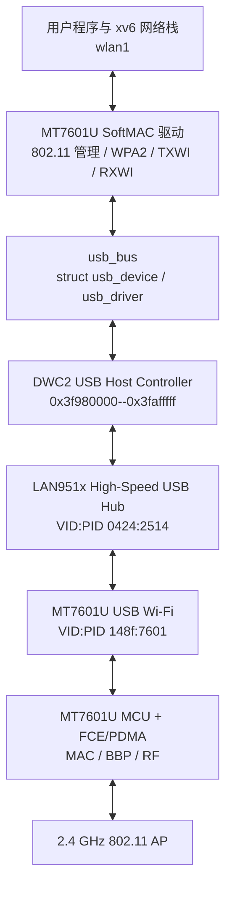

MT7601U 是 **SoftMAC** 网卡。USB 端点传输的是 MT76 描述符和 802.11 帧，
不是可以直接交给 xv6 IPv4 层的 Ethernet 帧。这与板载 BCM43455 FullMAC 不同：

| 项目 | BCM43455 | MT7601U |
|---|---|---|
| 总线 | SDIO | USB 2.0 High-Speed |
| 驱动 | `brcmfmac` | `mt7601u` |
| MAC 类型 | FullMAC | SoftMAC |
| 主机收到的数据 | 接近 Ethernet frame | RXINFO/RXWI + 802.11 frame |
| 扫描/关联 | 大部分由 firmware 完成 | 主机驱动负责 |
| 当前状态 | WPA2、DHCP、ping 已通 | 认证、关联、WPA2、CCMP key install、wlan1 已实机通过；DHCP/ping 待验证 |

---

## 2. 驱动分层和设备模型

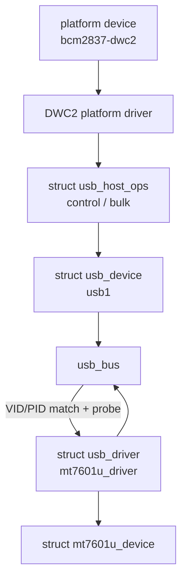

`kernel/usb.c` 提供最小 USB bus/device/driver 核心：

- `usb_bus_init()` 注册 `usb_bus`；
- `usb_device_register()` 发布枚举完成的 USB 设备；
- `usb_register_driver()` 注册 VID/PID 驱动；
- bus 的 `match()` 对照 `usb_device_id`；
- 匹配后调用 `mt7601u_probe()`；
- remove/unregister 时清理 `driver_data`。

`struct usb_device` 保存地址、EP0 最大包长、Bulk IN/OUT 端点、最大包长和每个
端点独立的 DATA0/DATA1 toggle。

### 2.1 Bulk DATA0/DATA1 同步

EP4 data RX、EP5 MCU response 和 EP8 TX 分别维护 toggle，不能共享。旧实现根据
`ceil(actual_bytes / max_packet)` 推算成功传输包含的 packet 数；如果 IN transfer
以一个整包后附加 zero-length packet 结束，这种推算会少算 ZLP，导致下一次请求
使用错误 PID。DWC2 随后报告：

```text
HCINT = 0x400        # DTERR / data-toggle error
```

当前实现按实际传输长度计算 packet 数；如果是短 IN transfer、且返回长度正好为
max-packet 的整数倍，则额外计入用于终止传输的 zero-length packet。不能直接把
同步通道完成后的 `HCTSIZ.DPID` 当作软件端点下一 PID，因为同一 host channel 会
被不同 endpoint 反复复用。若仍收到 DTERR，则只翻转发生错误的 IN endpoint
toggle 并重试一次，不影响另外一个 IN endpoint 或 OUT endpoint。典型恢复日志是：

```text
dwc2: channel 3 data-toggle error ...
dwc2: endpoint 4 IN toggle resync -> DATA0/1
```

NAK 与 DTERR 含义不同：NAK 表示设备暂时没有数据，不能翻转 toggle；DTERR 表示
主机使用了错误 DATA PID，本次 payload 没有被接受，可以调整 PID 后重试。

---

## 3. Raspberry Pi 3 的 USB 拓扑

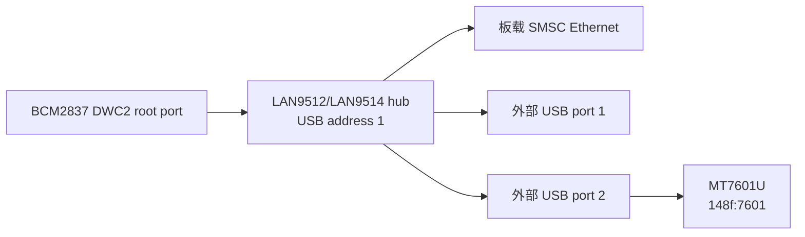

RPi3 的 DWC2 root port 首先看到的是 LAN951x hub，而不是 MT7601U。枚举代码
不能假定固定端口号，因此会读取所有下游端口状态，逐个 power、reset、读取
device descriptor，再按 VID/PID 找到 MT7601U。

MT7601U 是 High-Speed 设备。High-Speed child 通过 hub 时不需要 USB 2.0
split transaction；Full-Speed/Low-Speed child 才需要 hub Transaction Translator
参与 start-split/complete-split。

---

## 4. DWC2 启动和 USB 枚举时序

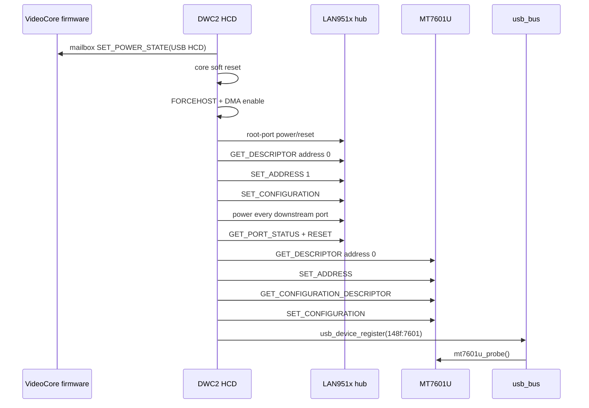

配置描述符解析得到当前硬件端点：

```text
Bulk IN  EP4：数据接收
Bulk IN  EP5：MCU command response
Bulk OUT EP8：firmware、MCU command、未来 TX data
```

驱动分别保存 EP4 和 EP5 的 DATA toggle，否则 MCU response 与无线数据交替接收
时会破坏 USB DATA0/DATA1 同步。

---

## 5. USB Control 与 Bulk 通信

### 5.1 Control transfer

标准或 vendor control request 都经过 EP0 的三个阶段：

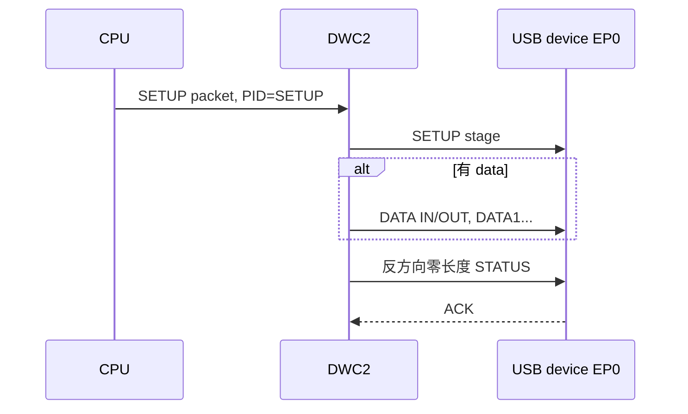

用途包括：

- USB `GET_DESCRIPTOR`、`SET_ADDRESS`、`SET_CONFIGURATION`；
- MT7601U vendor request 读取 `MT_ASIC_VERSION`、`MT_MAC_CSR0`；
- 读写 MAC/BBP/RF/FCE 控制寄存器；
- firmware IVB 启动命令。

### 5.2 Bulk transfer

Bulk 不保证固定延迟，但保证校验与重传，适合 firmware 和网络帧：

```text
Bulk OUT EP8：ARM RAM -> DWC2 DMA -> USB -> MT7601U FIFO
Bulk IN  EP4：MT7601U RX FIFO -> USB -> DWC2 DMA -> ARM RAM
Bulk IN  EP5：MT7601U MCU response -> ARM RAM
```

设备暂时没有数据时返回 NAK。当前 HCD 会停止并重新提交 host channel，保持同一
PID 和 DMA 起点；NAK 不是错误，也不能在 NAK 后错误地翻转 DATA toggle。

---

## 6. 第一层 DMA：DWC2 与 ARM RAM

DWC2 是 SoC bus master。CPU 传给 `HCDMA` 的不能是内核高虚拟地址：

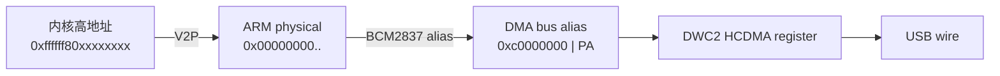

当前转换为：

```c
#define DWC2_DMA_BUS(a) (0xc0000000U | (uint32)V2P(a))
```

这里的 `0xc0000000` 是 RAM 的 VideoCore/DMA bus alias，不是 ARM 虚拟地址，
也不是外设 MMIO 地址。

### 缓存一致性

RPi3 没有为这条简化路径提供通用 coherent DMA API，因此驱动显式维护 cache：

| 方向 | 提交 DMA 前 | DMA 完成后 |
|---|---|---|
| CPU → device | `dc cvac` clean | 不需要 invalidate |
| device → CPU | clean+invalidate，交出 ownership | `dc ivac` invalidate |

每个范围按 64-byte cache line 对齐，并使用 `dsb sy` 保证 cache 操作和 DMA 寄存器
编程的顺序。若直接把高虚拟地址或脏 cache 数据写入 `HCDMA`，真实硬件会出现
descriptor 读取失败、全零数据或随机超时，而 QEMU 可能暂时掩盖该错误。

---

## 7. 第二层 DMA：MT7601U 内部 FCE/PDMA

DWC2 DMA 只负责“ARM RAM ↔ USB wire”。MT7601U 芯片内部还有自己的
Frame Control Engine/packet DMA：

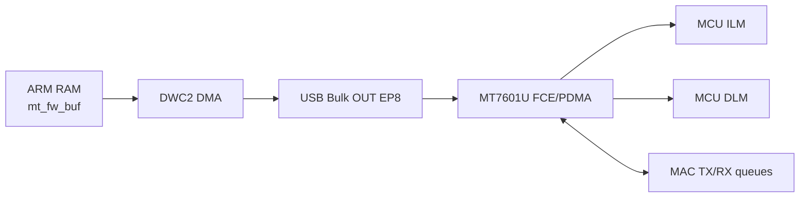

firmware chunk 的头部包含 MT76 TXINFO。驱动通过 vendor register request 设置：

- `MT_FCE_DMA_ADDR`：MT7601U 内部目的地址；
- `MT_FCE_DMA_LEN`：长度；
- `MT_TX_CPU_FROM_FCE_*`：FCE descriptor ring；
- `MT_FCE_PDMA_GLOBAL_CONF`：启动 packet DMA。

随后 Bulk OUT 把带 TXINFO 的数据送进 FCE。这里的 destination 是 MT7601U
内部 MCU RAM 地址，与 BCM2837 的 `0xc0000000` DMA bus alias 完全无关。

因此需要区分：

```text
DWC2 HCDMA address：BCM2837 bus address，指向 ARM RAM
FCE DMA destination：MT7601U 内部 address，指向 ILM/DLM/MAC queue
```

---

## 8. MT7601U firmware 启动

bootfs 文件名为：

```text
MT7601U.BIN
```

由 `make install-rpi3 WIFI_FIRMWARE_DIR=firmware` 安装。firmware header 包含
ILM 长度、DLM 长度、版本、build version 和时间。

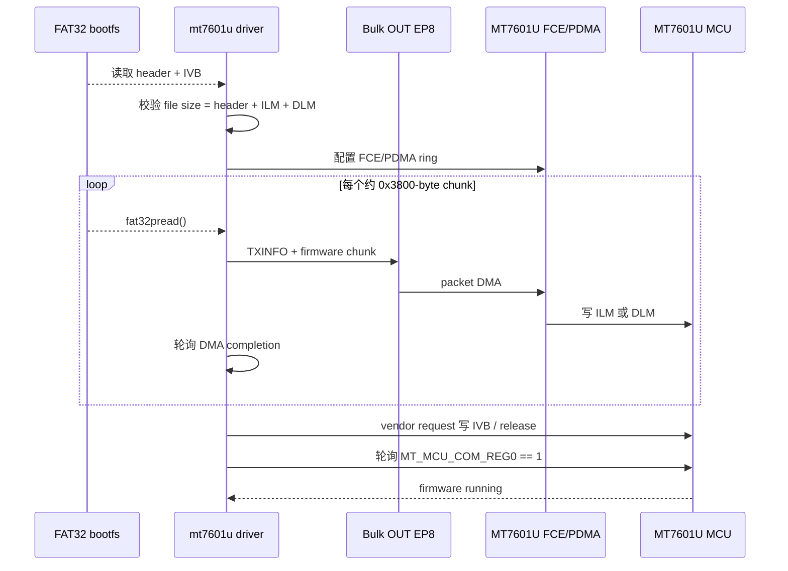

ILM 是 MCU instruction memory，DLM 是 data memory，IVB 提供启动向量。固件
每次设备上电后重新下载；它主要放在易失性 RAM，而不是永久烧录完整运行镜像。

---

## 9. eFuse/EEPROM 与芯片初始化

firmware 运行后，驱动读取 256-byte eFuse/EEPROM shadow：

- permanent MAC address；
- country/region；
- crystal frequency offset；
- RSSI offset；
- reference temperature；
- LNA gain 与射频校准参数。

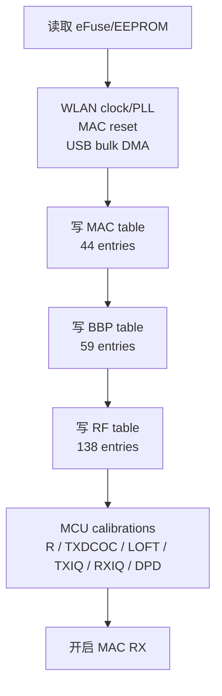

### MAC、BBP、RF 的含义

- **MAC**：802.11 帧队列、过滤、重试、TX/RX engine；
- **BBP**：baseband processor，处理调制、解调、增益、带宽；
- **RF**：射频 synthesizer、channel、频率修调与模拟前端；
- **MCU**：执行 firmware，响应 calibration/function commands。

MCU command 使用 EP8 发送带 command/sequence 的 TXINFO，通过 EP5 接收响应，
sequence 用于把响应与请求匹配。

---

## 10. 信道切换和扫描

MT7601U 只支持 2.4 GHz。当前驱动使用 Linux MT7601U 的 RF frequency plan，
写 RF bank 0 registers 17--20、BBP gain，并触发 VCO calibration。

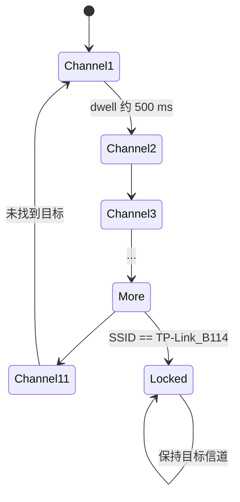

收到 Beacon/Probe Response 后解析：

- 802.11 frame control/subtype；
- BSSID；
- SSID IE；
- DS Parameter Set channel；
- Privacy capability；
- RSN IE（WPA2）；
- vendor WPA IE。

扫描表按 BSSID 去重；隐藏 SSID 后来通过 probe response 揭示时更新原条目。

---

## 11. 当前无线接收路径

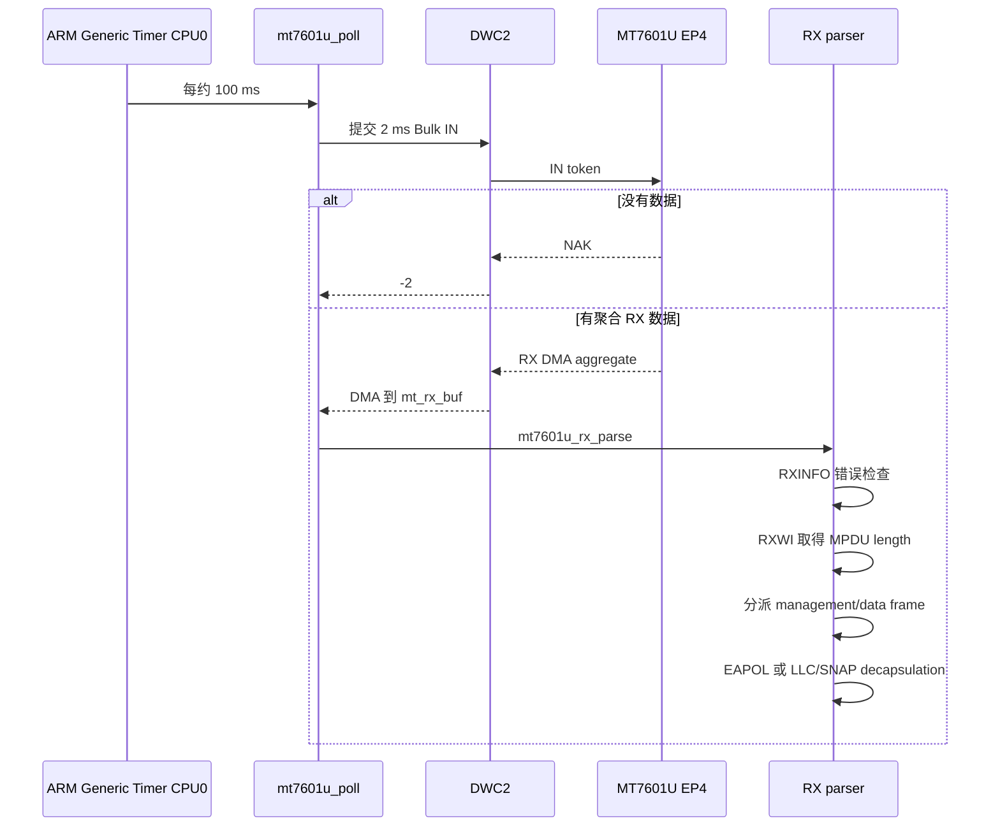

当前聚合段按以下逻辑拆解：

```text
4-byte DMA/RXINFO prefix
28-byte RXWI
MPDU (802.11 frame)
4-byte trailing info/padding
```

CRC、ICV 或 MIC error 的帧被丢弃。Management frame 进入扫描、认证和关联状态机；
Data frame 根据 Frame Control 判断普通/QoS header，并处理 RXINFO 的 `L2PAD`。
LLC/SNAP EtherType 为 `0x888e` 时进入 WPA2 EAPOL 状态机；其余已解密数据重建
Ethernet destination/source/type 后暂存，并在释放驱动锁后调用
`net_rx_dev(wlan1)`。

---

## 12. 管理帧、WPA2 和数据发送实现

### 12.1 TXINFO/TXWI 与 USB Bulk OUT

当前驱动已经实现 MT7601U packet-DMA 发送格式：

```text
4-byte TXINFO
20-byte TXWI
802.11 MPDU
zero padding to four-byte boundary
4-byte trailing zero
```

TXINFO 设置 WLAN destination port、DMA packet、management queue、raw 802.11
标记以及是否由硬件生成 IV。TXWI 设置 1 Mbit/s CCK basic rate、ACK request、
WCID 和 MPDU byte count。最终通过 Bulk OUT EP8 送入 MT7601U FCE/PDMA。

### 12.2 Authentication 与 Association 状态机

锁定 `TP-Link_B114` 后，驱动保存 Beacon 中的 BSSID、Capability 和完整 RSN IE，
并把 BSSID 写入 MAC BSSID/WCID 寄存器。状态机为：

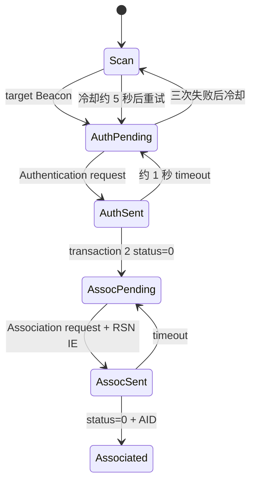

Association Request 中的 RSN IE 必须和目标 Beacon 中收到的 IE 一致，不能随意
重建，否则 AP 可能接受 802.11 Association，却在后续四次握手丢弃 M2。

### 12.3 WPA2 四次握手

MT7601U 是 SoftMAC，主机负责 WPA2 supplicant 逻辑：

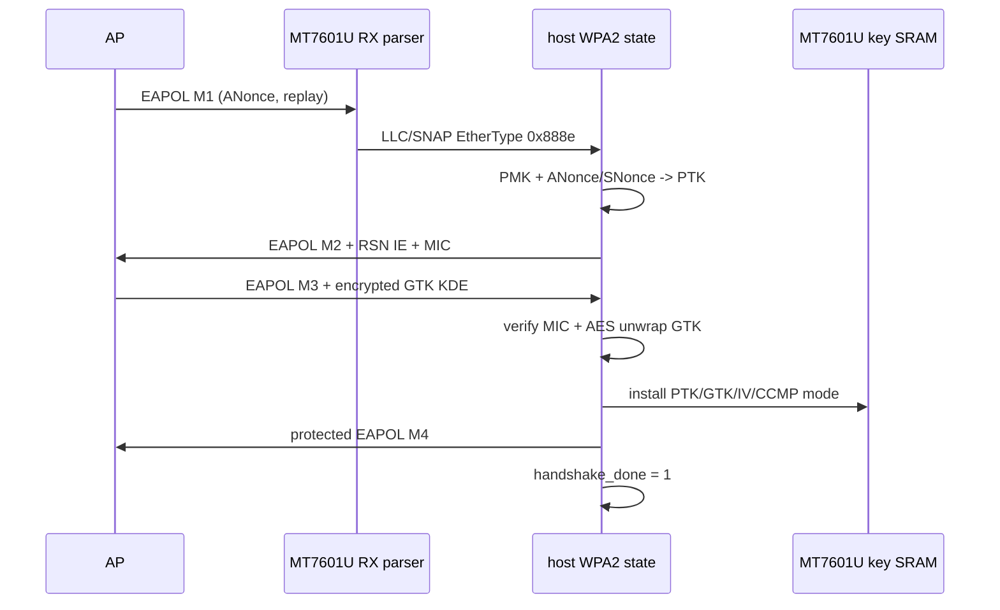

PBKDF2 的 4096 轮计算在 USB probe 阶段完成，不能放在 CPU0 timer hard-IRQ 收到
M1 的路径中。M1 到来后只做 SNonce、PTK、MIC 和短帧构造。M3 验证包括：

- 校验 EAPOL-Key MIC；
- 用 PTK 的 KEK 执行 RFC 3394 AES unwrap；
- 查找 RSN GTK KDE `00:0f:ac:01`；
- 保存 GTK index 和 16-byte GTK；
- 把 pairwise TK 写入 `MT_WCID_KEY(1)`；
- 把 GTK 写入 `MT_SKEY(0, gtk_index)`；
- 设置 WCID IV、pairwise attribute 与 shared-key AES-CCMP mode。

### 12.4 普通数据发送

完整发送路径现在为：


`start_xmit()` 从 Ethernet frame 取 destination/type/payload，构造 ToDS 802.11
Data header 和 LLC/SNAP。完成 Association 后，EAPOL M2 使用 AP WCID 1，同时
保留 WIV 标志表示尚无硬件密钥，因此 M2 不做链路层加密；安装密钥后 M4 和普通
数据继续使用 AP WCID 1，由硬件生成 CCMP IV/PN 并加密。当前固定 basic rate
和同步 Bulk OUT 已足以验证连通性；完整 rate control、TX status/ACK retry queue
仍是后续增强项。

新增逻辑与代码入口对应如下：

| 逻辑 | 主要函数/对象 |
|---|---|
| TXINFO/TXWI 封装 | `mt7601u_tx_raw()` |
| Authentication frame | `mt7601u_send_auth()` |
| Association + RSN IE | `mt7601u_send_assoc()` |
| LLC/SNAP data/EAPOL TX | `mt7601u_send_llc()` |
| EAPOL M2/M4 | `mt7601u_send_m2()`、`mt7601u_send_m4()` |
| M1/M3、MIC、GTK KDE | `mt7601u_rx_eapol()` |
| PTK/GTK 写入硬件 | `mt7601u_install_ccmp_keys()` |
| Management response state | `mt7601u_rx_mgmt()` |
| Data decapsulation | `mt7601u_rx_data()` |
| `wlan1` TX/poll | `mt7601u_net_xmit()`、`mt7601u_net_poll()` |
| IPv4 配置 | `sys_net_dhcp()`、`/bin/dhcp wlan1` |

当前实验配置在驱动 probe 时为 `TP-Link_B114`/`Minghua123` 预计算 PMK。后续应把
SSID/PSK 作为每设备连接请求传入 SoftMAC，而不是长期把凭据固化在内核镜像中。

---

## 13. 接收数据进入 xv6 网络栈

```mermaid
flowchart LR
    AIR["无线 802.11 data"]
    MAC["MT7601U MAC/BBP/RF"]
    RXDMA["内部 RX DMA aggregate"]
    EP4["Bulk IN EP4"]
    DWC2["DWC2 DMA"]
    RXWI["RXINFO/RXWI validation"]
    DEC["CCMP decrypt / replay check"]
    DECAP["802.11 -> Ethernet decap"]
    NETRX["net_rx_dev(wlan1)"]
    STACK["ARP / IPv4 / UDP / ICMP"]

    AIR --> MAC --> RXDMA --> EP4 --> DWC2 --> RXWI --> DEC --> DECAP --> NETRX --> STACK
```

PTK/GTK 安装后由 MT7601U 硬件完成 CCMP 解密和 PN/MIC 检查，RXINFO 提供
CRC/ICV/MIC/DECRYPT 状态。驱动去除普通或 QoS 802.11 header、可选 L2 padding
和 LLC/SNAP，按照 FromDS 地址规则重建 Ethernet header，再调用
`net_rx_dev(&wlan1, frame, length)`。当前只保留一个待投递帧槽，因此高吞吐或
突发流量还需要后续 RX queue。

---

## 14. CPU 中断：硬件能力与当前实现

### 14.1 硬件上应该发生什么

MT7601U 不会直接连接 Raspberry Pi 的 ARM IRQ 线。中断链路是：


严格来说，USB Bulk IN 由 host 主动轮询：驱动必须先提交 IN transaction/URB。
设备有数据时才返回 data；否则返回 NAK。一个预先 armed 的 host channel 在传输
完成后由 DWC2 产生 host-channel interrupt。

### 14.2 当前 xv6 实际行为

当前代码并没有启用这条 IRQ 路径：

```text
GINTMSK = 0
HCINT 由 channel_xfer()/mt7601u_poll() 主动读取
Generic Timer 每约 100 ms 在 CPU0 调用 mt7601u_poll()
Bulk IN 最多等待约 2 ms，没有数据则 NAK 返回
```

所以当前真实路径是：


这里触发 CPU 的是 ARM Generic Timer，不是 MT7601U/DWC2 USB completion IRQ。
网络硬件轮询被限制在 CPU0，避免多个 CPU 同时操作共享 DWC2 host channels。

### 14.3 改成真正 USB IRQ 所需步骤

1. 注册 DWC2 platform IRQ 到 Broadcom legacy interrupt controller；
2. 设置 `HAINTMSK` 和各 host channel `HCINTMSK`；
3. 设置 `GINTMSK.HCHINT`；
4. 设置 `GAHBCFG.GLBLINTRMSK`，同时保留 DMA enable；
5. 长期预提交/arm EP4 RX buffer；
6. IRQ top half 只读取/清除 HCINT、记录实际长度并把完成项入队；
7. bottom half/worker 负责 cache invalidate、RXWI 解析和网络栈投递；
8. NAK 后按 USB frame/microframe 重新调度，不能在 hard IRQ 中长时间自旋；
9. 为控制、MCU response、data RX/TX 分配独立 host channel 和 completion；
10. remove/unplug 时停止 DMA、屏蔽 IRQ、回收所有 buffer。

推荐的中断上下文边界：

```text
hard IRQ:
  acknowledge -> snapshot status -> complete queue -> return

deferred context:
  cache sync -> parse RX aggregate -> 802.11 decap -> net_rx_dev
```

---

## 15. 并发、锁与生命周期

`struct mt7601u_device.lock` 保护同步 Bulk RX、信道切换和 pause 状态。目前 BCM43455
执行 BCDC/WPA2/DHCP 控制流程时会暂停 MT7601U 扫描，防止两个轮询驱动同时在
硬中断上下文执行较长事务。

生命周期为：

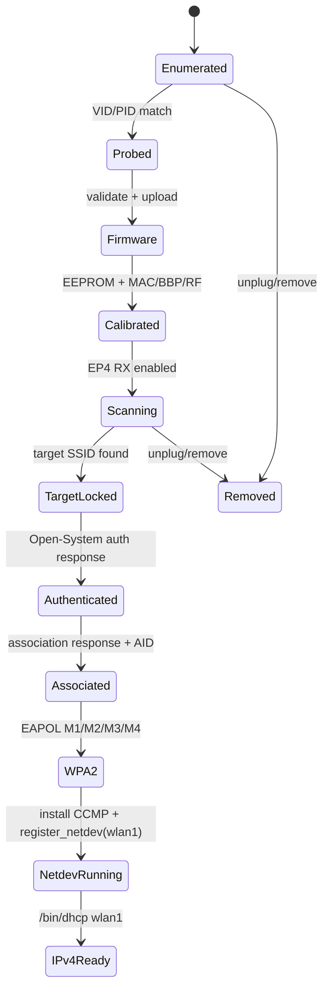

当前 unplug 热移除仍受同步 HCD 模型限制；完整实现需要 hub status-change IRQ、
取消 host channel、引用计数和等待中的 I/O completion 唤醒。

---

## 16. 启动日志与代码阶段对应关系

```text
dwc2: root device class=9 vid=424 pid=2514
```

DWC2 已枚举 LAN951x hub。

```text
dwc2: hub port=3 child class=0 vid=148f pid=7601
dwc2: MT7601U configured; handed to usb bus
```

外部端口发现 MT7601U，完成 descriptors/configuration 并发布到 `usb_bus`。

```text
mt7601u: firmware ... validated
mt7601u: ILM firmware upload ...
mt7601u: MCU firmware running
```

bootfs firmware 已经由 DWC2 DMA + USB Bulk OUT + 芯片 FCE DMA 写入 MCU RAM。

```text
mt7601u: EEPROM ...
mt7601u: permanent mac=...
mt7601u: MAC/BBP/RF bootstrap ready
```

校准参数和 MAC address 已读取，寄存器基础状态 ready。

```text
mt7601u: MAC register table initialized
mt7601u: BBP register table initialized
mt7601u: RF register table initialized
mt7601u: RF calibration complete
```

芯片数据面硬件已启动。

```text
mt7601u: AP ssid=... bssid=... channel=... WPA2
mt7601u: target TP-Link_B114 found ...
```

EP4 Bulk IN、DWC2 DMA、RX aggregate、RXWI 和 Beacon IE 解析均已工作。

```text
mt7601u: authentication request sent
mt7601u: Open-System authentication accepted
mt7601u: association request sent rsn=22 bytes
mt7601u: 802.11 associated aid=10; WPA2 handshake pending
```

这组日志已经在真实硬件出现，证明管理帧 TXINFO/TXWI、EP8 Bulk OUT、认证和
关联响应 RX 都正确。`aid=10` 表示 AP 已分配 Association ID，但此时还不能发送
普通加密 IP 数据。

真实硬件已经继续出现：

```text
mt7601u: received WPA2 EAPOL M1 key-info=...
mt7601u: sent WPA2 EAPOL M2 replay=...
mt7601u: sent WPA2 EAPOL M4
mt7601u: WPA2 four-way handshake complete
mt7601u: wlan1 registered mac=90:de:80:14:95:94
```

上述阶段完成后执行：

```sh
/bin/dhcp wlan1
ping google.com
```

DHCP syscall 根据接口名执行 `netdev_find("wlan1")` 和 `net_dhcp_dev()`，成功日志
包含 `dhcp: dev=wlan1 address=...` 与对应 gateway ARP。

---

## 17. 当前完成度

| 模块 | 状态 |
|---|---|
| DWC2 host mode、root port、LAN951x hub | 已完成 |
| USB descriptors/address/configuration | 已完成 |
| usb_bus/device/driver 与 VID/PID probe | 已完成 |
| Control transfer、Bulk IN/OUT、DATA toggle | 已完成基础同步版 |
| DWC2 DMA bus alias 与 cache maintenance | 已完成 |
| MT7601U ILM/DLM/IVB firmware 启动 | 已完成 |
| eFuse/EEPROM、permanent MAC | 已完成 |
| MAC/BBP/RF tables 与 MCU calibrations | 已完成 |
| EP4 RX aggregate、RXWI、Beacon parsing | 已完成 |
| 1--11 信道扫描、目标 SSID 锁定 | 已完成实验版 |
| Open-system authentication/association | 已完成，真实硬件验证到 AID=10 |
| WPA2 EAPOL M1/M2/M3/M4 | 已完成，真实硬件验证通过 |
| PTK/GTK/CCMP hardware key table | 密钥安装及 M4 已实机通过；普通加密数据待验证 |
| 普通 802.11 data TX/RX 与 Ethernet 转换 | 已实现基础同步版，待实机验证 |
| `register_netdev(wlan1)` / remove | 注册已实机验证；拔出注销待验证 |
| `/bin/dhcp wlan1` | 已实现，待实机验证 |
| DNS/ping over MT7601U | 依赖前述数据面实机验证 |
| DWC2 completion IRQ + deferred RX | 未完成，当前为 CPU0 timer polling |

---

## 18. 推荐的后续实现顺序

```text
实机验证 /bin/dhcp wlan1
  -> 验证 ARP 与普通 CCMP TX/RX
  -> DNS/ping
  -> TX status/ACK/retry + rate control
  -> RX/TX 多帧队列
  -> DWC2 host-channel IRQ
  -> asynchronous RX/TX queues
  -> hotplug/remove lifecycle
```

参考 Linux 上游 `drivers/net/wireless/mediatek/mt7601u/` 时，应移植寄存器表、
descriptor 格式和状态机语义，不能直接复制 Linux USB URB、workqueue、NAPI、
cfg80211/mac80211 API；这些需要映射到 xv6 的 USB host、锁、timer、进程与
`net_device` 模型。

---

## 19. 实机启动日志与完整加载调用链

本节把一次真实 Raspberry Pi 3 启动日志与当前源代码逐段对应起来。拆分后的文件
职责如下：

```text
kernel/dwc2.c       DWC2 Host、DMA、Hub/USB 枚举、USB device 发布
kernel/usb.c        usb_bus 的 device/driver 匹配与 probe 调度
kernel/mt7601u.c    MT7601U firmware、eFuse、MAC/BBP/RF、SoftMAC
kernel/usbnet.c     仅用于 CDC-ECM usb0，不参与 MT7601U wlan1
```

### 19.1 内核启动顺序为什么分成两个阶段

`main()` 中相关顺序是：

```text
device_init()
usb_bus_init()
dwc2_driver_init()
...
fat32init()
...
mt7601u_driver_init()
```

`dwc2_driver_init()` 必须先枚举设备，但此时 FAT32 尚未初始化，驱动还不能读取
`MT7601U.BIN`。因此 DWC2 先通过 `usb_device_register()` 把 `148f:7601` 保存为
`usb_bus` 上的设备；等 `fat32init()` 可以访问 bootfs 后，
`mt7601u_driver_init()` 才注册 `struct usb_driver`。`driver_register()` 会遍历已经
存在的 USB 设备，由 `usb_match()` 对比 VID/PID，匹配后调用 `mt7601u_probe()`。

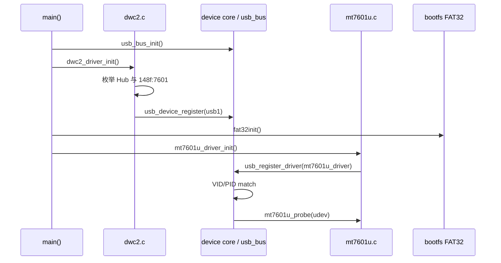

### 19.2 DWC2 上电和根 Hub 枚举

```text
dwc2: firmware USB HCD power on
dwc2: host hprt=100f hcfg=0 hfnum=170009c
dwc2: root device class=9 vid=424 pid=2514 configs=1 mps=64
```

对应 `dwc2_init()`：

1. `usb_firmware_power_on()` 通过 VideoCore property mailbox 打开 USB HCD 电源；
2. 复位 DWC2 core，选择 Host mode，并启用 DMA；
3. 给 root port 上电和复位；
4. 对地址 0 执行 `GET_DESCRIPTOR`，再用 `SET_ADDRESS` 分配地址 1；
5. `class=9` 表明根设备是 USB Hub；`0424:2514` 是树莓派板上的 LAN951x Hub；
6. `mps=64` 是 Hub 的 EP0 最大包长，不是网络 MTU。

`hprt=0x100f` 表明端口已供电、已连接并 enable；`hfnum` 是 DWC2 当前 USB
frame/microframe 状态快照，每次启动数值不同属于正常现象。

### 19.3 遍历 Hub 端口并发现 MT7601U

```text
dwc2: hub port 1 status=101 change=1
dwc2: hub port 1 after-reset status=503 speed=high
dwc2: hub port=1 child class=9 vid=424 pid=2514 mps=64
...
dwc2: hub port 3 status=101 change=1
dwc2: hub port 3 after-reset status=503 speed=high
dwc2: hub port=3 child class=0 vid=148f pid=7601 mps=64
```

DWC2 逐端口读取 Hub class `GET_STATUS`，对连接端口执行 `SET_FEATURE(PORT_RESET)`，
等待 `PORT_ENABLE`，随后重新从地址 0 读取子设备 descriptor。`status=0x503`
包含 connection、enable 和 high-speed 标志。端口 1 再次看到 `0424:2514`，而端口
3 的 `148f:7601` 命中 `is_mt7601()` 的 ID 表。

这里的 `class=0` 不是“未知设备”，而是 USB device descriptor 声明“设备类别由
interface descriptor 决定”。真正是否由 MT7601U 驱动接管，以 VID/PID 匹配为准。

### 19.4 配置 Bulk 端点并发布 USB device

```text
dwc2: MT7601U configured; bulk-in=4,5/512 bulk-out=8/512
dwc2: MT7601U handed to usb bus
```

`dwc2_init()` 读取完整 configuration descriptor，找到三个 High-Speed Bulk 端点：

| 端点 | 方向 | 最大包长 | 用途 |
|---|---:|---:|---|
| EP4 | IN | 512 | 无线数据、管理帧和 EAPOL RX |
| EP5 | IN | 512 | MCU command response |
| EP8 | OUT | 512 | firmware、MCU command、管理帧和数据 TX |

随后发送 `SET_CONFIGURATION`，填写 `struct usb_device usb_child`，并调用
`usb_device_register(&usb_child)`。从这一步开始，DWC2 只提供 `control()` 和
`bulk()` transport；无线策略由 `mt7601u.c` 负责。EP4、EP5、EP8 各自维护独立
DATA0/DATA1 toggle。

### 19.5 VID/PID 匹配和 probe 入口

```text
mt7601u: USB device 148f:7601 ASIC=76010001 MAC=76010500
mt7601u: driver WPA2-v3 (ZLP-aware toggle recovery)
```

`mt7601u_driver_init()` 注册 ID 表后，`usb_match()` 命中 `148f:7601`，设备核心调用
`mt7601u_probe()`。probe 首先通过 EP0 vendor control request 读取
`MT_ASIC_VERSION` 和 `MT_MAC_CSR0`：高 16 位 `0x7601` 验证芯片身份，后面的值是
芯片/MAC revision，而不是 firmware 版本。

### 19.6 验证并下载 MCU firmware

```text
mt7601u: firmware v0.1.0 build=7640 size=45412 validated
mt7601u: ILM firmware upload 14336/45316
mt7601u: ILM firmware upload 28672/45316
mt7601u: ILM firmware upload 43008/45316
mt7601u: ILM firmware upload 45316/45316
mt7601u: MCU firmware running
```

`mt7601u_validate_firmware()` 从 bootfs 打开 `MT7601U.BIN`，检查 header、ILM/DLM
长度和文件总长度。`size=45412` 包含 firmware header，而日志中的 `45316` 是去除
header/IVB 后需要分块写入的 ILM payload，所以两个数字不同是正常的。

`mt7601u_load_firmware()` 的数据路径是：

```text
bootfs MT7601U.BIN
  -> ARM staging buffer
  -> DWC2 HCDMA（BCM RAM bus alias）
  -> USB Bulk OUT EP8
  -> MT7601U FCE/PDMA
  -> 芯片 ILM/DLM RAM
  -> vendor request 写 IVB
  -> MCU_COM_REG0 == 1
```

14336 字节一批是当前 `MT_FW_CHUNK` 分块策略。每批写入前设置 FCE DMA 目标地址和
长度，Bulk OUT 完成后更新 CPU descriptor index，并等待芯片完成该批内部 DMA。
最后用 vendor request 提交 IVB，轮询 `MT_MCU_COM_REG0`，看到 1 才打印
`MCU firmware running`。

### 19.7 读取 eFuse/EEPROM 校准数据

```text
mt7601u: EEPROM ver=d fae=0 country=ff freq=96 rssi=0,0 temp=-7 lna=0
mt7601u: permanent mac=90:de:80:14:95:94
```

`mt7601u_read_eeprom()` 每次触发 eFuse controller 读取 16 字节，共读取 256 字节。
随后解析永久 MAC、country region、晶振频偏、RSSI offset、参考温度和 LNA gain。
这些值来自网卡本身，不来自 `MT7601U.BIN`。`country=ff` 表示该 eFuse 字段没有
提供有效地区码，需要驱动使用自己的监管域策略；`freq=96` 会覆盖 RF 初始化表中
中性的频偏值。

### 19.8 MAC、BBP、RF 与 MCU command channel 初始化

```text
mt7601u: MAC/BBP/RF bootstrap ready; rx-ep=4 data, 5 MCU
mt7601u: MCU command channel ready tx-ep=8 resp-ep=5
mt7601u: MAC register table initialized (44 entries)
mt7601u: BBP register table initialized (59 entries)
mt7601u: RF register table initialized (138 entries)
mt7601u: RF calibration complete; bulk endpoints ready
```

这些日志依次来自：

1. `mt7601u_basic_hw_init()`：等待 WLAN clock/PLL，复位 MAC/BBP，启用 USB
   RX/TX bulk DMA，写入永久 MAC，并写入初始 RF frequency offset；
2. `mt7601u_mcu_channel_init()`：通过 EP8 发送 MCU `FUN_SET` command，EP5 接收
   带 sequence number 的 response；
3. `mt7601u_full_hw_init()`：写 44 项 MAC 表、59 项 BBP 表、138 项 RF 表；
4. 通过 MCU command 执行 R、TXDCOC、LOFT、TXIQ、RXIQ、DPD calibration；
5. 打开 MAC RX 和宽松的接收 filter，使 SoftMAC 能接收 Beacon、Probe response、
   Authentication、Association 和 EAPOL 帧。

此时 USB transport、MCU 和射频数据通路已经启动，但还没有关联 AP，因此日志是：

```text
mt7601u: transport and MCU ready; SoftMAC initialization pending
```

probe 同时预先计算目标 `TP-Link_B114` 的 WPA2 PMK，初始化 `wlan1` 的
`struct net_device`，但不会立刻 `register_netdev()`。后续 CPU0 timer 周期调用
`mt7601u_poll()`，完成扫描、认证、关联和 WPA2 四次握手；握手完成后才注册
`wlan1`，防止未具备数据能力的接口被 DHCP 提前使用。

### 19.9 从 SoftMAC pending 到 wlan1 可用

完整后半段状态机是：

```text
SoftMAC pending
  -> 1--11 信道扫描、解析 Beacon/Probe response
  -> 找到 TP-Link_B114 的 BSSID/信道/RSN IE
  -> Open-System Authentication
  -> Association + AID
  -> WPA2 EAPOL M1/M2/M3/M4
  -> 安装 PTK/GTK
  -> register_netdev(wlan1)
  -> /bin/dhcp wlan1
```

附件日志中的认证/关联超时说明初始化已经成功，问题发生在后续 SoftMAC 管理帧阶段，
不是 firmware 或 RF 初始化失败。反复出现：

```text
dwc2: channel 3 data-toggle error ...
dwc2: endpoint 4 IN toggle resync -> DATA0/DATA1
```

说明 EP4 RX 与软件保存的 DATA PID 不一致。当前 HCD 检测 DTERR 后只翻转 EP4 的
toggle 并重试，不会污染 EP5 MCU response 或 EP8 TX 状态。日志最后重新出现
`Open-System authentication accepted` 和 `802.11 associated aid=10`，也证明恢复后
Bulk RX 仍能继续递交管理帧。不过频繁 resync 会丢失关键 Authentication、
Association 或 EAPOL 帧，因而仍应继续收紧短包/ZLP packet-count 和长期 RX
transaction 的 toggle 更新规则。

### 19.10 为什么初始化日志看起来重复了三次

给出的串口文本中，从 `USB device 148f:7601` 到
`transport and MCU ready` 完整重复了三次。按当前源码的正常单次启动路径，这不是
预期行为：

- `main()` 只调用一次 `mt7601u_driver_init()`；
- `driver_register()` 只遍历一次已注册设备；
- `bind()` 在 `dev->driver` 非空时拒绝再次 probe；
- `mt7601u_probe()` 成功加载 firmware 后设置 `mt7601u.used = 1`；
- 源码没有在 timer poll 中再次调用 probe。

因此单次、未复位内核不应连续执行三次完整 firmware load。更可能的来源依次是：

1. 串口终端或粘贴内容合并了三次启动记录；
2. SD 卡上的 kernel 与当前源码/符号文件不是同一版本；
3. 设备曾经历 unregister/register 或内核重新启动，但启动分隔日志没有一起保存；
4. 若确认是同一启动，则需要检查内存破坏是否把 `usb_child.dev.driver` 或
   `mt7601u.used` 清零。

可以在 `mt7601u_probe()` 入口临时打印 `probe_count`、`udev`、`dev.driver`、
`mt7601u.used`，并在 `mt7601u_remove()` 打印 remove 事件。若同一启动中
`probe_count > 1` 且没有 remove，便可直接定位为设备模型状态被覆盖，而不是正常
USB 重试。注意 firmware 分块上传日志本身只是同一次 probe 内的循环，不能解释
整段 ASIC/EEPROM/MAC/BBP/RF 日志重复。

### 19.11 修复关联后永久停在 handshake pending

曾观察到日志停止在：

```text
mt7601u: Open-System authentication accepted
mt7601u: association request sent rsn=22 bytes
mt7601u: 802.11 associated aid=10; WPA2 handshake pending
```

这不是 CPU 真正死机，而是 SoftMAC 状态机停滞。Association response 把
`link_state` 设置为 `MT_LINK_ASSOCIATED`，但旧版 `mt7601u_poll()` 只处理扫描、
认证请求和关联请求，没有处理“已经关联、但尚未收到 EAPOL M1”的超时。如果首批
M1 因 EP4 短包、DATA toggle resync 或轮询间隔而全部丢失，状态将永远不再变化。

WPA2-v4 增加了两项恢复逻辑：

1. 每收到一个结构有效的 EAPOL-Key frame，就把 `link_age` 清零；
2. 在 `MT_LINK_ASSOCIATED && !handshake_done` 状态等待 50 个 100 ms poll，约
   5 秒仍未推进握手时，清理临时 ANonce/SNonce/PTK，转回
   `MT_LINK_ASSOC_PENDING` 并重新发送 Association request。

预期恢复日志为：

```text
mt7601u: 802.11 associated aid=10; WPA2 handshake pending
mt7601u: WPA2 M1 timeout; reassociating
mt7601u: association request sent rsn=22 bytes
```

新的 Association response 会促使 AP 重新启动 WPA2 四次握手。这里不返回扫描或
重新选择信道，因为 BSSID、信道以及 Open-System Authentication 已经成功；只重做
关联比重新扫描更快。如果随后出现 `received WPA2 EAPOL M1`，每个有效 EAPOL 包又
会刷新 watchdog，从而不会在正常 M1/M2/M3/M4 交换期间误触发恢复。
