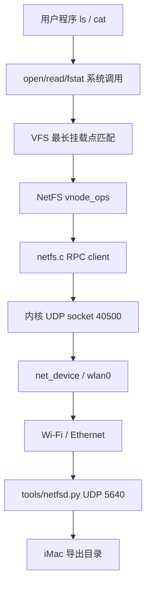

# NetFS：xv6 网络文件系统基础层

## 目标与当前范围

NetFS 把远端主机导出的目录接入现有 VFS，使用户程序继续使用普通的
`open/read/fstat/close` 和目录读取接口，而不需要使用一套 NetFS 专用系统调用。
第一版有意限定为**只读、无状态、单服务器 UDP RPC**：先打通远程 vnode、内核网络 RPC、
超时重传和 VFS 挂载路径，再逐步增加缓存一致性、写事务、租约和副本。

当前支持：

- `STAT`：取得文件类型、inode 号和大小；
- `READDIR`：按目录项序号枚举目录；
- `READ`：按 offset 分块读取普通文件；
- 每个 RPC 使用事务号 `xid`，超时 50 tick 后重发，最多三次；
- 服务端缓存最近 256 个 `(client, xid)` 回复，重复请求不会重复执行；
- 每个数据报最多携带 1200 字节数据，避免普通以太网 MTU 下的 IP 分片；
- 服务端对导出目录做规范化和越界检查，拒绝 `..` 或符号链接逃逸。

第一版不支持写入、删除、重命名、权限认证、加密、本地页缓存和离线访问。只允许一个
NetFS 挂载实例，远端文件名在目录枚举中暂时受 xv6 `DIRSIZ=14` 限制。

## 驱动与 VFS 结构



`mount(2)` 的 `source` 字段以前被内核忽略，现在会传给 `vfsmount()`。当文件系统类型为
`netfs` 时，`source` 解析为 `IPv4[:port]`。挂载只保存远端端点，不会立即访问网络，因而
可以在 Wi-Fi 完成关联和 DHCP 之前由 `init` 处理 `/etc/fstab`。第一次访问 `/mnt/net`
时才绑定内核 UDP 端口并发出 RPC。

为避免内核指针被误当成当前进程的用户虚拟地址，网络层新增三条内核缓冲区接口：

```c
net_udp_bind_kernel();
net_udp_send_kernel();
net_udp_recv_kernel_timeout();
```

内核绑定使用 owner 0，不会随着首次访问 NetFS 的用户进程退出而被
`net_udp_closeproc()` 回收。RPC 全局 sleeplock 使一次请求、回复和重试成为完整事务，也避免
多个进程共用 UDP 端口时拿走彼此的响应。它目前会串行化所有 NetFS 操作；未来改成多个
in-flight 请求时，应由 `xid -> completion` 表分发回复，而不是扩大这把锁的范围。

## 线协议

请求和回复都以 36 字节 packed header 开始，所有多字节整数使用 network byte order：

```text
magic="NFS1" | version | op | flags | xid | status
offset | length | ino | size | type | path_len
```

- 请求在 header 后附加 `path_len` 字节 UTF-8 绝对路径；这里的 `/` 是导出目录根。
- `READ` 回复附加文件数据，`READDIR` 回复附加单个名字。
- `status < 0` 表示远端错误。
- `STAT/READDIR/READ` 都是幂等操作，因此丢包后使用相同 `xid` 重发是安全的。

协议定义在 `kernel/netfs.h`，客户端在 `kernel/netfs.c`，参考服务端在
`tools/netfsd.py`。服务端不是可信边界的最终实现，只适合当前开发网络；在公网使用前必须
增加身份认证、消息完整性和加密。

## 配置与运行

新制作的 xv6 根文件系统会建立 `/mnt/net`，并在默认 `/etc/fstab` 加入：

```text
192.168.0.195:5640 /mnt/net netfs ro 0 0
```

已有 SD 卡上的 `/etc/fstab` 不会被 `init` 覆盖，需要手动加入该行并确保 `/mnt/net`
存在。服务器地址应按实际 iMac 地址修改。

在 iMac 启动只读服务端，例如导出一个专用目录：

```sh
mkdir -p /private/tmp/xv6-netfs
printf 'hello from netfs\n' > /private/tmp/xv6-netfs/hello.txt
python3 tools/netfsd.py --root /private/tmp/xv6-netfs --bind 0.0.0.0 --port 5640
```

macOS 防火墙需要允许 Python 接收 UDP 5640。Raspberry Pi 启动并完成 Wi-Fi/DHCP 后：

```sh
ls /mnt/net
cat /mnt/net/hello.txt
```

预期启动日志先显示配置和挂载，而第一次 `ls` 才产生网络请求：

```text
netfs: configured server 192.168.0.195:5640 read-only
vfs: mounted netfs at /mnt/net read-only
```

服务端未运行或网络尚未就绪时，访问会在重试完成后失败，并打印
`netfs: RPC timeout ...`；它不会影响原生根文件系统、`/boot` 或 `/proc`。

## 向分布式文件系统演进

当前协议把“远端文件系统接入 VFS”和“分布式一致性策略”分开。建议按以下依赖顺序演进：

1. 把单例状态改成每个 mount/superblock 私有状态，并支持多个服务端和 `umount`；
2. 引入稳定 file handle（对象 ID + generation），避免路径重命名带来的竞态；
3. 增加属性/数据缓存、版本号、失效通知和 lease 到期时间；
4. 写请求携带 client ID、transaction ID 和 sequence，使重试可去重；
5. 实现 create/write/fsync/rename 的提交与崩溃恢复语义；
6. 分离元数据与数据服务，加入副本、故障探测和 leader/consensus；
7. 增加双向认证、授权、完整性校验与加密传输；
8. 做断网重连、服务端重启、重复包、乱序包和部分写入故障注入测试。

这条路线保留现有 VFS API；上层程序无需随着后端从单机 NetFS 演进为分布式文件系统而改写。
