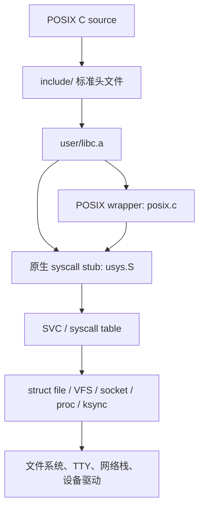

# xv6-aarch64 POSIX 源码兼容层

目标是让只依赖常见 POSIX 接口的 C 源码可以使用 xv6-aarch64 工具链重新编译，而不是兼容 Linux syscall 编号或直接运行 Linux/glibc 二进制。

## 分层结构



POSIX 兼容来自三部分：

1. `include/` 提供标准名称、类型、常量和函数原型；
2. `user/posix.c` 把标准 API 映射到现有 xv6 能力；
3. 内核补齐无法只靠 libc 包装实现的语义，例如 `lseek()` 和 `socket()` → `bind()` → `listen()` 生命周期。

## 已实现接口

### libc 与头文件

- `stddef.h`、`stdint.h`、`errno.h`
- `stdio.h`、`stdlib.h`、`string.h`
- `unistd.h`、`fcntl.h`、`sys/types.h`、`sys/stat.h`
- `time.h`
- `pthread.h`、`semaphore.h`
- `sys/socket.h`、`netinet/in.h`、`arpa/inet.h`
- `sys/epoll.h`（Linux 扩展，不属于 POSIX，但保留现有能力）

### 文件/VFS

- `open/read/write/close/fstat/stat`
- `lseek(SEEK_SET/SEEK_CUR/SEEK_END)`
- `O_CREAT` 到原生 `O_CREATE` 的兼容别名
- `S_ISREG/S_ISDIR/S_ISCHR`
- `sleep()` 使用 POSIX 秒语义；旧的 xv6 tick 语义已显式改名为 `sleep_ticks()`。

### 线程与同步

- `pthread_create()`、`pthread_join()`、`pthread_self()`、`pthread_equal()`、`pthread_exit()`
- `pthread_mutex_init/lock/unlock/destroy`
- `PTHREAD_MUTEX_INITIALIZER` 延迟初始化
- `sem_init/wait/post/destroy`

这些接口最终使用共享 `vmspace` 的 xv6 用户线程以及内核 `ksync` 对象。`pthread_join()` 同时回收用户栈和 POSIX 线程记录。

### 时间

- `clock_gettime(CLOCK_MONOTONIC)`
- `sleep()`、`usleep()`、`nanosleep()`

系统 tick 当前为 100 ms，因此 sleep 系列的实际分辨率也是 100 ms。`CLOCK_REALTIME` 尚未接入 RTC，返回 `ENOSYS`。

### 网络

TCP 服务端现在可以使用标准调用顺序：

```c
int fd = socket(AF_INET, SOCK_STREAM, 0);
bind(fd, (struct sockaddr *)&address, sizeof(address));
listen(fd, 4);
int client = accept(fd, 0, 0);
read(client, buffer, sizeof(buffer));
write(client, buffer, length);
close(client);
```

`socket()` 先建立统一 `struct file`；`bind()` 记录本地端口；`listen()` 才向 TCP 层建立 listener。监听 socket、已连接 socket、普通文件、PTY 和 pipe 因而能统一使用 fd、`read/write/close/fcntl/epoll`。

当前 TCP 栈还没有标准客户端 `connect()`，`accept()` 也还不能返回真实 peer 地址。

## 验证

`user/posixtest.c` 只包含标准风格头文件，验证：

- 文件创建、读写、`lseek()` 和 `fstat()`；
- POSIX semaphore；
- 两个 pthread 并发更新共享变量并返回 `void *` 结果；
- 静态初始化的 pthread mutex；
- `socket/bind/listen/close` 生命周期。

运行：

```sh
/bin/posixtest
```

预期：

```text
posixtest: PASS pid=... tid=... counter=1000
```

## 仍需补齐的关键语义

这仍是 POSIX 兼容层的第一阶段，不应宣称完整 POSIX：

- syscall 目前只返回 `-1`，没有向 libc 传递具体内核错误码；`errno` 入口已经建立，但尚不是线程局部存储。
- 尚无 `waitpid()`、`dup2()`、完整权限位、用户/组、符号链接和标准目录流 API。
- pthread 尚缺 condition variable、rwlock、detach、cancel、TLS key 和线程属性。
- 网络尚缺 TCP `connect()`、UDP socket fd、`getsockopt/setsockopt` 和 peer 地址。
- `NFILE`、`NOFILE`、同步对象表等其他内核资源仍有固定上限。
- 没有 glibc/musl 动态加载 ABI，因此 Linux ELF 二进制不能直接运行。

后续优先级建议是：线程局部 `errno` 与内核错误码、`waitpid/dup2`、pthread condition variable、目录流、TCP `connect()`，最后再逐步扩展 libc。
