# xv6-aarch64 Raspberry Pi 3 SDIO Wi-Fi 驱动架构

本文以当前工程代码为准，总结 Raspberry Pi 3 板载 BCM43430/BCM43455
Wi-Fi 从硬件控制器、总线枚举、固件装载、网络设备注册，到 WPA2、DHCP 和
Internet 数据收发的完整路径。

相关实现主要位于：

- `kernel/device.c`：bus/device/driver 核心；
- `kernel/arasan_sdio.c`：BCM2837 Arasan SDHCI host；
- `kernel/sdio.c`、`kernel/sdio.h`：最小 MMC/SDIO core；
- `kernel/brcmfmac.c`：Broadcom FullMAC 驱动；
- `kernel/wpa_crypto.c`：WPA2-PSK 密码学；
- `kernel/net.c`、`kernel/net.h`：`net_device`、Ethernet、ARP、IPv4、UDP、ICMP、DHCP；
- `kernel/sysnet.c`：用户态网络系统调用入口；
- `user/wifi.c`：读取 `/etc/wifi.conf` 并请求连接；
- `user/init.c`：开机自动执行 `/bin/wifi`。

---

## 1. 一张图看完整架构

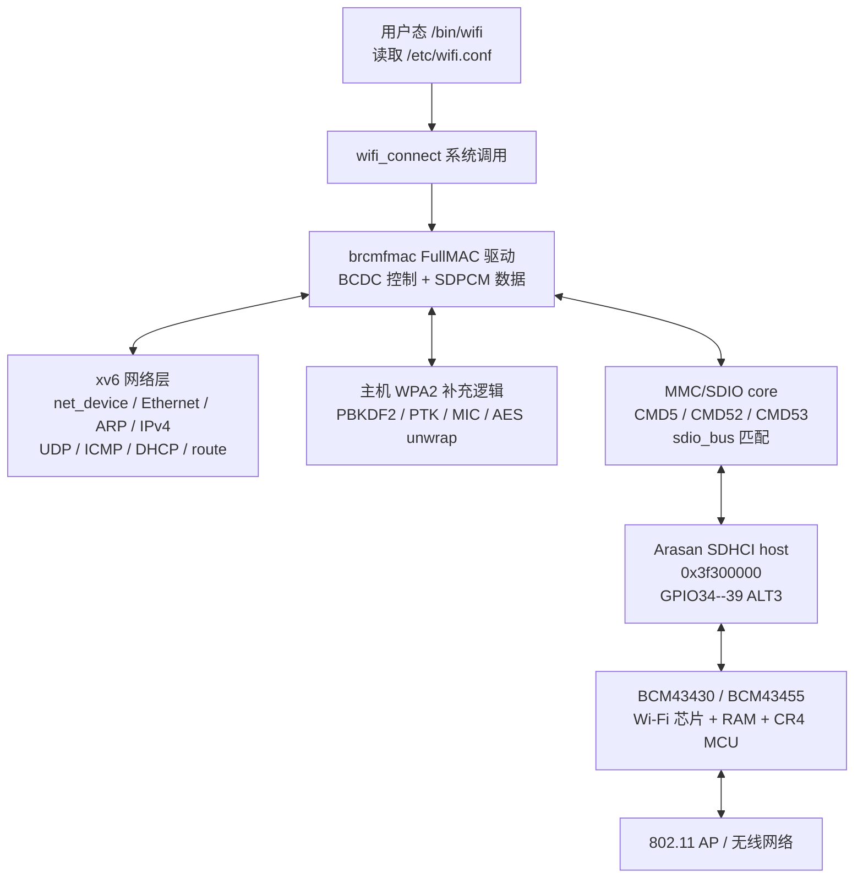

这里有两条容易混淆的边界：

1. **Arasan 是 SDIO host controller**，负责产生 CMD52/CMD53、时钟以及搬运
   数据；它不是 Wi-Fi 芯片。
2. **BCM43455 是 FullMAC Wi-Fi 芯片**，芯片内固件处理大部分 802.11 MAC
   工作；xv6 的 `brcmfmac` 是运行在 ARM CPU 上的主机驱动。

---

## 2. 硬件拓扑：SD 存储和 SDIO Wi-Fi 不是同一条链路

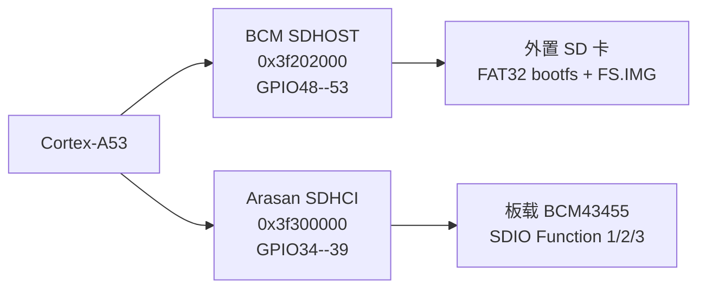

外置 SD 卡走 SD Memory 协议，由 `kernel/sdhost.c` 管理；板载 Wi-Fi 走
SDIO 协议，由 `kernel/arasan_sdio.c` 管理。把两者混到同一个 host 驱动会造成
GPIO、时钟和控制器所有权冲突。

---

## 3. Linux 风格的设备层级

当前实现不是把 Wi-Fi 驱动直接写死在 `main()`，而是通过逐层注册和匹配建立：

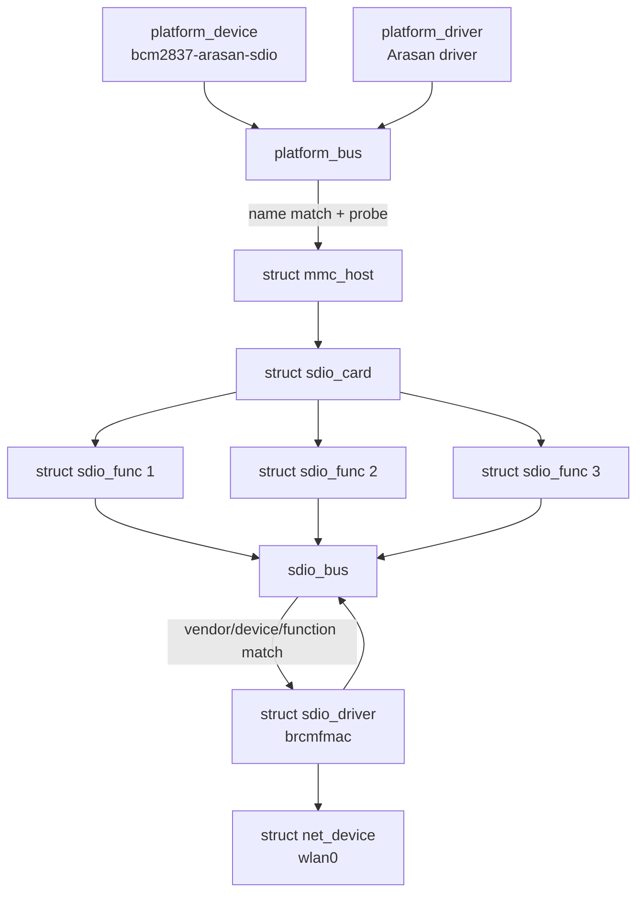

关键匹配条件为：

```text
vendor   = 0x02d0 (Broadcom)
device   = 0xa9a6 或 0xa9bf
function = 1
```

SDIO product ID 只用于初步匹配。驱动之后还会读取 Broadcom backplane 的
ChipCommon chip ID，以判断真实芯片及固件组合。

---

## 4. SDIO 枚举过程

`arasan_sdio_driver_init()` 注册 platform device/driver；probe 成功后建立
`mmc_host` 并调用 `mmc_add_host()`。SDIO core 随后执行：

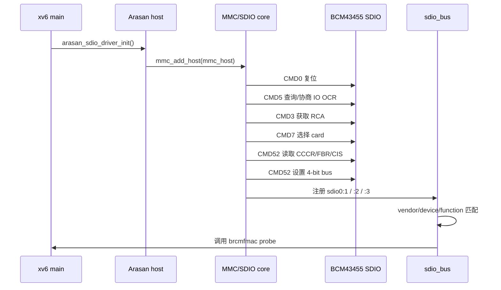

三种常用命令的职责：

| 命令 | 用途 |
|---|---|
| CMD5 | 识别 SDIO card、协商电压并等待 ready |
| CMD52 | 单字节读写 CCCR、FBR 和 function 寄存器 |
| CMD53 | 批量传输 backplane、固件及 SDPCM 帧 |

当前 SDIO core 的 CMD53 以单块/byte-mode 为主。短控制帧、固件下载和普通网络
帧已经可用；接近 2 KiB 的 legacy scan-results 响应尚需完整的 multi-block
CMD53 支持。因此连接流程不把 `BRCMF_C_SCAN_RESULTS` 当作前置条件，而让
FullMAC 固件根据 `SET_SSID` 自行扫描和加入目标网络。

---

## 5. Function 1 和 Function 2 的分工

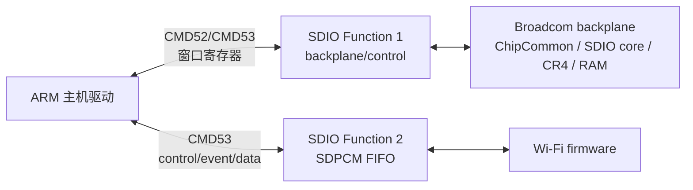

- **F1**：设置 backplane window，访问芯片核心寄存器与 RAM，下载固件、NVRAM
  并控制 CR4 reset。
- **F2**：固件启动后才 ready，是运行时 SDPCM FIFO，承载 BCDC 控制响应、事件、
  EAPOL 和普通 Ethernet 数据。
- **F3**：可以被枚举出来，但当前不作为独立网络设备绑定。

F2 不能在固件下载前强行启用；启动日志中的
`F2 deferred until firmware starts` 正是这一生命周期约束。

---

## 6. 固件、NVRAM 与 CLM 的启动流程

BCM43455 并不是从永久存储直接运行完整 Wi-Fi 固件。每次冷启动时，主机从
bootfs 读取并下载：

```text
BCM43455.BIN  芯片 CR4 执行代码
BCM43455.TXT  板级 NVRAM 参数、天线和校准配置
BCM43455.CLM  国家/信道/功率法规数据库
```

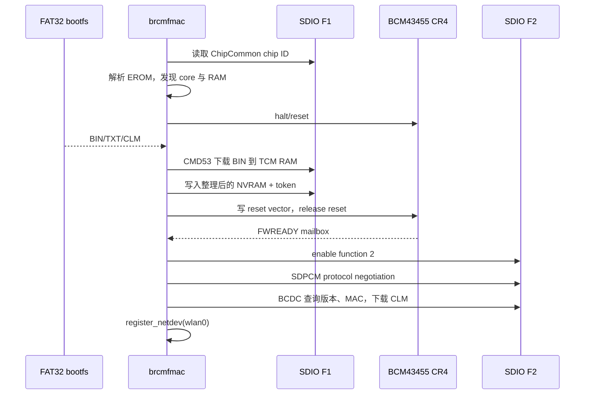

这解释了为什么 firmware 文件必须在 bootfs 可读后才能调用
`brcmfmac_driver_init()`。

---

## 7. SDPCM 与 BCDC

运行时数据不是裸 Ethernet 直接放入 CMD53，而是分层封装：

```text
CMD53 transfer
  └─ SDPCM header
       ├─ control channel
       │    └─ BCDC dcmd / iovar
       ├─ event channel
       │    └─ association/link/auth events
       └─ data channel
            └─ BCDC data header
                 └─ Ethernet frame
```

BCDC 控制命令使用递增 request ID。`brcmf_dcmd()` 发送请求后轮询 F2，直到
收到相同 ID 的 control response；event/data 帧可能插在控制响应之前，因此
`brcmf_rx_dispatch_locked()` 必须按 channel 分流，不能假定下一帧一定是回复。

---

## 8. 谁触发 Wi-Fi 连接

驱动 probe 只完成硬件和 `wlan0` 初始化，**不会自行选择用户网络**。
开机自动连接来自用户态：

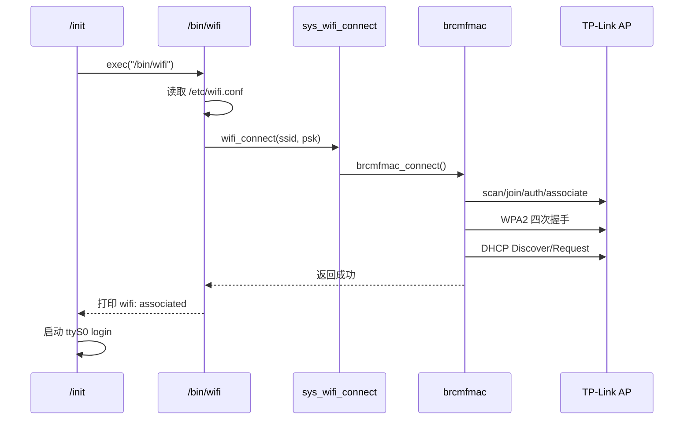

所以：

- `brcmfmac: ...` 是内核驱动输出；
- `wifi: associated` 是 `/bin/wifi` 输出；
- 删除 `user/init.c` 中的自动 `exec("/bin/wifi")` 后，驱动仍会初始化，但需要
  登录后手动运行 `/bin/wifi` 才会连接 AP。

---

## 9. WPA2-PSK 数据路径

当前固件对 `sup_wpa` 和 `SET_WSEC_PMK` 返回 unsupported，因此主机补充处理
EAPOL 四次握手：

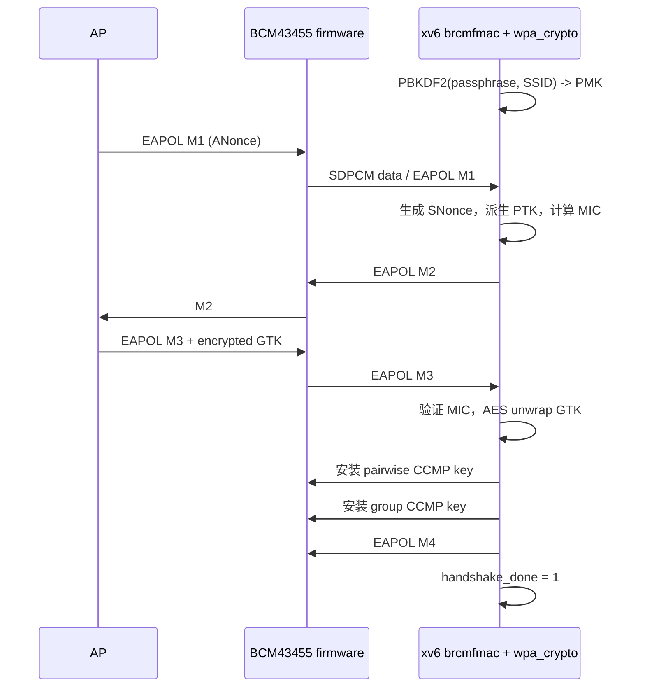

只有 `handshake_done` 后，普通 Ethernet 数据才允许通过 `start_xmit` 和 RX
delivery。M4 提交后还会保留约 500 ms 的接收窗口，让 AP 打开 controlled port，
再开始 DHCP。

---

## 10. DHCP、ARP、路由和 ping

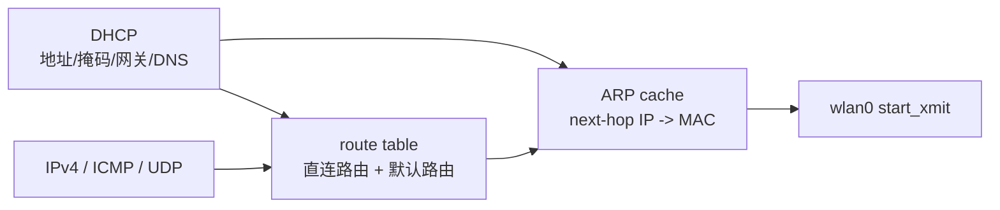

`net_dhcp_dev(wlan0)` 明确绑定目标设备，避免双网卡环境中误用最后注册的默认
设备。Discover 和 Request 都会重试三次。成功后加入：

- 本地子网直连路由；
- 通过 DHCP gateway 的默认路由；
- DHCP server/gateway 的 ARP 项；
- DNS server 地址。

之后 `ping google.com` 的路径为：DNS UDP 查询 → 路由选择 → gateway ARP →
ICMP Echo → `wlan0` → BCDC data → SDPCM → CMD53 → BCM43455。

---

## 11. 接收、发送与 IRQ/workqueue 模型

### 发送


### 接收

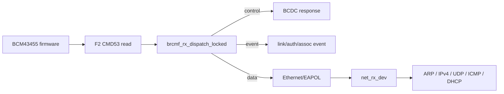

当前 xv6 使用 **SDIO DAT1 IRQ + 每设备私有NAPI/workqueue**：BCM43455 拉起 DAT1
后，Arasan 产生 legacy IRQ 62。顶半部屏蔽 card interrupt、设置 pending bit，
调用 `brcmfmac_sdio_irq()`，调度该设备的`napi`对象。顶半部
不执行 CMD53，也不进入网络协议栈。

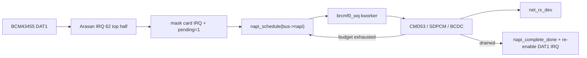

`brcmf0_wq` 属于具体 `brcmf_bus_state`，不再借用全局 `system_wq` 或网络公共
work。这避免 SDIO 慢速 CMD53 阻塞 DWC2、TCP timer 等其它下半部。每轮最多
处理16个SDPCM项；未排空时NAPI核心保持scheduled并重新投递，排空后才complete
并解除DAT1屏蔽。重复IRQ由scheduled/missed状态合并，不会无限堆积节点。

这里经历过两个中间实现：最早由 CPU0 的 10 ms Generic Timer 直接轮询；之后
IRQ 只设置 pending，Timer 再把全局 `net_deferred_work` 排队。现在数据接收完全
由 DAT1 IRQ 驱动，Timer 只推进 workqueue 的有序 delayed-work 时钟。

连接阶段另有每设备私有 `state_work`：`SET_SSID` 后每 50 ms 检查一次连接截止
时间，10 秒到期便设置 timeout；只有发现 Arasan card IRQ pending 时才补调度
NAPI，所以它是连接 watchdog，不是恢复周期性 SDIO 轮询。连接成功、失败或
设备移除时都会同步取消 delayed work。连接状态由设备 `bus->lock` 保护。

这与芯片内部固件自己的调度不是一回事：所有 `brcmf_*` C 函数都由 ARM CPU
执行；BCM43455 内部运行的是下载进去的 `.BIN` 固件。

---

## 12. 与 MT7601U USB Wi-Fi 的关系

MT7601U 属于 DWC2 USB SoftMAC 路径，不是 SDIO 总线设备。它的枚举、firmware、
DMA、host-channel IRQ、SoftMAC、WPA2 和 `wlan1` 数据面已迁移到专门文档：
[readme_usb_wifi_MT7601.md](readme_usb_wifi_MT7601.md)。本文件后续只描述板载
BCM43430/43455 SDIO FullMAC。

---

## 13. 初始化顺序与依赖

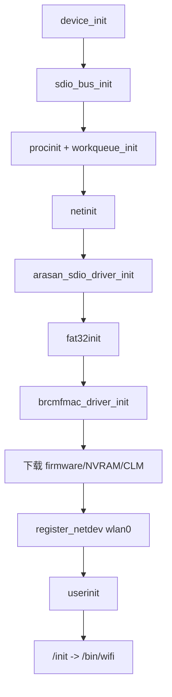

顺序不能随意交换：

- 没有 `sdio_bus_init()`，SDIO function 无法绑定驱动；
- 没有 `arasan_sdio_driver_init()`，不会枚举出 BCM43455；
- 没有 `fat32init()`，驱动读取不到 bootfs firmware；
- 没有 `netinit()`，不能注册 `wlan0`；
- `/bin/wifi` 必须等上述内核层全部 ready 后才能发起连接。

---

## 14. 当前能力与待完善项

### 已实现

- platform → MMC host → SDIO card/function → brcmfmac 的设备模型；
- Arasan 时钟、GPIO34--39、4-bit SDIO；
- CMD5、CMD52、CMD53；
- Broadcom backplane、EROM、TCM RAM 发现；
- BCM43430/BCM43455 firmware、NVRAM、CLM 加载；
- F1/F2 生命周期和 SDPCM/BCDC；
- `wlan0` 的 `register_netdev()` 与 remove/unregister；
- WPA2-PSK 主机四次握手补充路径；
- DHCP、ARP、DNS、路由和 Internet ping；
- SDIO DAT1 → Arasan IRQ 62 顶半部 → 每设备 `brcmf*_wq` 下半部；
- 私有 RX work、连接 watchdog delayed work 及同步取消生命周期；

### 后续改进

1. CMD53 block-mode/multi-block，完整支持大型控制响应；
2. 更完整的固件 flow-control/credit 管理；
3. 断线重连、漫游、扫描结果用户接口；
4. WPA3、开放网络和更多加密组合；
5. 网络配置工具与多网卡策略路由；
6. SDIO IRQ 风暴、丢中断和 remove 生命周期压力测试；
7. 增加 RX/TX 字节数、IRQ 合并、budget 用尽和队列延迟统计，再据此调优 budget；
8. 将连接主流程也改为完全异步状态机，移除用户系统调用中的 250 ms 等待循环。

---

## 15. 常用验证日志

驱动初始化成功：

```text
sdio: sdio0:1 vendor=2d0 device=a9a6 class=0
brcmfmac: firmware running; SDPCM transport ready
brcmfmac: wlan0 mac=...
brcmfmac: control plane ready
```

连接成功：

```text
brcmfmac: direct join target=TP-Link_B114
brcmfmac: 802.11 associated bssid=...
brcmfmac: WPA2 four-way handshake complete
dhcp: dev=wlan0 address=... gateway=... dns=...
brcmfmac: wlan0 IPv4 ready
wifi: associated
```

网络验证：

```sh
ping google.com
cat /proc/devices
```

`wifi: associated` 来自用户程序；它代表驱动连接与 DHCP 均已成功返回，而不只是
芯片完成初始化。

---

## 16. Function 1 backplane window 细节

BCM43455 内部的 ChipCommon、SDIO core、ARM CR4、D11 和 TCM RAM 位于
Broadcom backplane 地址空间。SDIO Function 1 只能通过一个 32 KiB aperture
访问它：

```text
target backplane address
        |
        +-- window = address & 0xffff8000
        |      写 F1 0x1000a / 0x1000b / 0x1000c
        |
        +-- CMD53 address = (address & 0x7fff) | 0x8000
```

跨越 32 KiB 边界的 firmware/NVRAM 传输必须重新设置 window，不能让一次
CMD53 直接跨过 aperture。真实芯片返回的 ChipCommon 值例如 `0x15264345`：

```text
chip = 0x4345
revision = 6
package = 2
```

SDIO product ID `0xa9a6` 和 ChipCommon chip ID 属于不同编号空间，不能直接比较。
驱动依据 backplane chip/revision 选择 BCM43430 或 BCM43455 firmware。

---

## 17. Firmware 启动七阶段与实机经验

当前 `brcmfmac` 的完整启动顺序为：

1. 从 ChipCommon `EROMPTR` 解析 DMP/AI EROM descriptors；
2. 定位 ChipCommon、SDIO、ARM CR4、D11 cores，并从 CR4 bank registers 计算
   TCM RAM；BCM4345/6 的 RAM base 为 `0x198000`；
3. 通过 AI wrapper `IOCTL`/`RESET_CTL` halt CR4，并保持无线 core reset；
4. FAT32 流式读取 `.BIN`，处理 32 KiB window 边界，写入 TCM 并验证 reset
   vector；
5. 把 `.TXT` 转换为 NUL 分隔 NVRAM，补双 NUL、四字节对齐及
   word-count/complement token，写入 RAM 尾部并验证；
6. 清 SDIO core interrupt，向 RAM 地址 0 写 reset vector，释放 CR4；
7. 写 SDPCM protocol version，等待 F2 ready 和 FWREADY/DEVREADY mailbox，
   配置 watermark 与 host interrupt mask。

典型成功日志：

```text
brcmfmac: EROM at ...
brcmfmac: core[...] id=83e ...
brcmfmac: core[...] id=829 ...
brcmfmac: TCM RAM base=198000 size=... bytes banks=...
brcmfmac: CR4 halted; wireless cores held in reset
brcmfmac: firmware download .../...
brcmfmac: firmware reset-vector=... verified
brcmfmac: NVRAM ... bytes written at ... token=...
brcmfmac: CR4 released reset-vector=...
brcmfmac: F2 ready mailbox=... protocol=4
brcmfmac: firmware running; SDPCM transport ready
```

实机曾在 512、256、128-byte CMD53 出现 data CRC error，驱动逐级减半后在
64-byte 稳定。因此当前 transfer limit 是运行时探测结果，不是 firmware 格式的
固定要求。未来完成 block-mode/multi-block 和 host timing 后应重新评估吞吐率。

旧版 `%x` 可能把最高位为 1 的 32-bit 值显示成带负号十六进制，例如
`-47c10e68` 的原始位模式是 `0xb83ef198`。写后校验成功时，这种显示不代表负
地址或 firmware 损坏。

---

## 18. BCDC 与 WPA2 的关键 ABI 陷阱

### BCDC GET 长度

早期实现把所有 GET iovar 的请求长度固定为整个 2048-byte buffer，加上 BCDC
header 后超过本地上限，导致请求在发送前被拒绝。正确长度是：

```text
strlen(iovar_name) + 1 + requested_result_capacity
```

### per-BSS iovar

`wpa_auth`、`sup_wpa` 等配置需要 bsscfg 编码：

```text
"bsscfg:wpa_auth\0" + uint32(bsscfgidx=0) + uint32(value)
"bsscfg:sup_wpa\0"  + uint32(bsscfgidx=0) + uint32(value)
```

### `wsec_pmk_t` 版本

BCM43455 firmware 7.45 使用传统 68-byte ABI：

```text
uint16 key_len
uint16 flags
uint8  key[64]
```

误用带 128-byte SAE 扩展的新结构会得到 `BCME_BADARG (-2)`。部分 firmware
同时不支持 `sup_wpa` 和明文 passphrase 形式的 `SET_WSEC_PMK`，所以当前实现
在主机端使用 `PBKDF2-HMAC-SHA1(passphrase, SSID, 4096)` 生成 32-byte PMK，
并在 firmware offload 不可用时完成 EAPOL 四次握手。

PMK、PTK、GTK 和 Wi-Fi 密码都属于敏感信息，不能打印到串口日志。

---

## 19. 编译、安装与分层排错

普通 `make` 只编译，不会写入 `/Volumes/bootfs`。构建产物为
`kernel/kernel8-xv6_wifi.img`。确认 SD 卡设备号和 FAT32 bootfs 挂载点后，
显式执行安装目标才会复制文件；指定 xv6 分区时还会将 `fs.img` 写入该分区：

```sh
diskutil list
make
make install-rpi3 RPI3_XV6_DEV=/dev/rdisk4s2 WIFI_FIRMWARE_DIR=firmware
sync
```

`RPI3_BOOTFS`、`RPI3_KERNEL_NAME` 和 `WIFI_FIRMWARE_DIR` 均可通过 Make 变量
覆盖。安装目标会复制并校验：

```text
kernel/kernel8-xv6_wifi.img -> /Volumes/bootfs/kernel8-xv6_wifi.img
fs.img                      -> /dev/rdisk4s2 (when RPI3_XV6_DEV is specified)
config.txt         -> config.txt
BCM43430/43455 BIN/TXT/CLM
```

按层次定位故障：

```text
1. arasan-sdio: probing GPIO34-39        host controller
2. sdio: sdio0:1 ...                    SDIO enumeration
3. ChipCommon / EROM / TCM              F1 backplane
4. firmware running / SDPCM ready       MCU firmware + F2
5. version / CLM / wlan0 MAC            BCDC control plane
6. associated / WPA2 handshake complete wireless security
7. DHCP / ARP / wlan0 IPv4 ready        IP configuration
8. ping google.com                       DNS + routed data path
```

QEMU `raspi3b` 不模拟 BCM43455，只能回归内核启动、总线核心以及“没有 SDIO
设备”的失败路径；firmware、WPA2 和 Internet 数据面必须在真实 RPi3 验证。

---

## 20. 代码导航

| 文件 | 职责 |
|---|---|
| `kernel/device.c`, `kernel/device.h` | bus/device/driver 注册与绑定 |
| `kernel/sdhost.c` | 外置 SD memory card、bootfs 与 FS.IMG |
| `kernel/arasan_sdio.c` | 板载 Wi-Fi 的 Arasan SDIO host |
| `kernel/sdio.c`, `kernel/sdio.h` | MMC/SDIO core、Function、CMD52/CMD53 |
| `kernel/brcmfmac.c` | backplane、firmware、SDPCM、BCDC、WPA2、收发 |
| `kernel/wpa_crypto.c` | PBKDF2、PTK、MIC、AES unwrap |
| `kernel/fat32.c` | bootfs firmware 和 FS.IMG 文件访问 |
| `kernel/net.c`, `kernel/net.h` | net_device、Ethernet、ARP、IPv4、DHCP、ICMP |
| `kernel/workqueue.c`, `kernel/workqueue.h` | 命名 workqueue、有序 delayed work 与 kworker |
| `kernel/proc.c`, `kernel/proc.h` | `kthread_create()` 和内核线程调度上下文 |
| `kernel/sysnet.c` | `wifi_connect` 系统调用 |
| `user/wifi.c` | `/bin/wifi` 配置与连接命令 |
| `user/ping.c` | Internet 连通性测试 |
| `user/init.c` | 开机自动执行 `/bin/wifi` |
| `Makefile` | 构建、FS.IMG、bootfs 与 firmware 安装 |

---

## 21. 从 Timer 轮询到 SDIO IRQ 下半部的实现演进

本节原来记录在通用 bug 文档中，现集中到 SDIO Wi-Fi 专题文档。

### 21.1 原始 Timer 轮询

最初没有使用 SDIO DAT1 中断，CPU0 每次 Generic Timer IRQ 都执行：

```text
timerintr()                         hard IRQ
  -> netdev_poll_all()
     -> brcmfmac_poll_device()
        -> CMD53 读取 BCM43455 F2
        -> SDPCM/BCDC/Ethernet 解析
        -> net_rx_dev()
```

为了改善 SSH 回显，硬件 Timer 曾从100 ms缩短到10 ms，每十次才增加一次 xv6
逻辑 `ticks`。它能降低等待时间，但无数据时仍检查设备，而且完整接收路径运行在
hard IRQ 中，不能睡眠并会拉长 Timer 中断。

### 21.2 SDIO IRQ + Timer deferred poll 过渡方案

加入 BCM2837 legacy IRQ 62、Arasan `CARD_INT` 和 SDIO CCCR function interrupt
后，芯片能够通过 DAT1 通知 CPU：

```text
BCM43455 F2 frame
  -> SDIO DAT1
  -> Arasan CARD_INT
  -> BCM2837 pending-2 bit 30 (IRQ 62)
  -> arasan_sdio_irq()
       mask CARD_INT
       clear host interrupt
       arasan_card_irq_pending = 1
  -> return from IRQ
```

第一版仍等下一次10 ms Timer 调用 `netdev_poll_all()`。它消除了无条件 CMD53
读取，但耗时处理仍处在 Timer hard IRQ 上下文，因此只是过渡方案。

### 21.3 当前每设备 NAPI/workqueue 方案

当前完整路径如下：

```text
SDIO IRQ 62                         hard IRQ top half
  -> arasan_sdio_irq()
       mask/ack CARD_INT
       pending = 1
       brcmfmac_sdio_irq()
          -> napi_schedule(&bus->napi)
          -> wakeup(brcmf0_wq)
  -> return from IRQ

scheduler
  -> brcmf0_wq kworker              process-context bottom half
       -> brcmf_napi_poll(budget=16)
            -> bounded CMD53 drain
            -> SDPCM/BCDC/EAPOL/Ethernet
            -> net_rx_dev()
            -> drained: napi_complete_done + ack/unmask CARD_INT
            -> budget exhausted: NAPI core requeues poll，IRQ保持屏蔽
       -> sleep(brcmf0_wq)
```

相同NAPI对象在scheduled时不会重复入队；若IRQ在poll运行期间到达，`missed`只
记录一次补跑。因此既不会漏掉burst，也不会为每个中断无限追加队列节点。

`netif_napi_add()`把`bus->napi`绑定到对应`net_device`、`brcmfN_wq`和poll回调，
weight为16；SDIO IRQ准备完成后调用`napi_enable()`，设备释放前调用
`napi_disable()`同步停止poll。Linux用每CPU softirq poll list承载NAPI，本实现用
每设备kworker承载，但保留schedule/complete、budget、missed及生命周期语义。

### 21.4 IRQ 62 和三层中断开关

SDIO 接收能产生 CPU IRQ，需要同时打开三层开关：

1. **SDIO card CCCR**：`sdio_claim_irq()` 用 CMD52 设置 `INT_ENABLE(0x04)` 的
   master bit 和 function 1 bit；remove 时由 `sdio_release_irq()` 清除。
2. **BCM43455 内部**：`SDIO_CORE_HOSTINTMASK` 控制 mailbox/frame 事件是否送到
   DAT1。
3. **Arasan + BCM2837**：`EMMC_IRPT_EN/IRPT_MASK` 打开 `CARD_INT`，legacy
   controller 打开 pending-2 bit 30，也就是 IRQ 62。

顶半部只做 mask、ack、pending 和 work 入队，不执行 CMD52/CMD53，不获取
`brcmf_bus.lock`，也不进入协议栈。

### 21.5 连接 watchdog delayed work

`BRCMF_C_SET_SSID` 发出后，设备私有 `state_work` 每50 ms检查一次连接状态，
10秒到期后设置 `connect_timedout`。watchdog 只有看到 Arasan card IRQ pending
时才补投递 RX，因此不是旧式周期轮询。

`connect_active`、`connect_timedout` 和 `connect_deadline` 由 `bus->lock` 保护。
重新 arm delayed work 与停止路径也通过该锁排序；成功、失败及 remove 均调用
`cancel_delayed_work_sync()`，避免回调在设备释放后执行或停止后再次入队。

### 21.6 workqueue、内核线程和锁

启动后相关队列类似：

```text
workqueue: system_wq worker=0 pid=1
workqueue: net_wq worker=0 pid=5
workqueue: brcmf0_wq worker=0 pid=6
workqueue: brcmf1_wq worker=0 pid=7
```

SDIO Wi-Fi 路径涉及的队列和工作项如下：

| 队列/工作项 | 类型 | 触发源 | 功能 |
|---|---|---|---|
| `brcmf0_wq` | 设备0专用 workqueue，1个worker | `brcmfmac_driver_init()` | 执行板载BCM43455的RX和连接watchdog |
| `brcmf1_wq` | 设备1预留专用 workqueue，1个worker | `brcmfmac_driver_init()` | 支持第二个brcmfmac设备实例，不与设备0共用状态 |
| `bus->napi` | 每设备NAPI，weight=16 | SDIO DAT1/Arasan IRQ 62 | 合并IRQ，按预算CMD53读取F2并解析SDPCM/BCDC/EAPOL/数据帧 |
| `bus->state_work` | 每设备 delayed work | `SET_SSID`连接阶段 | 每50 ms检查pending IRQ和10秒连接deadline |
| `net_wq` | 网络层专用 workqueue，1个worker | `netinit()` | 执行独立于网卡的TCP重传定时任务 |
| `tcp_retransmit_work` | delayed work | TCP存在未确认段 | 按所有连接中最早的`tx_deadline`运行 |
| `system_wq` | 通用队列，4个worker | `schedule_work()` | 通用fallback；当前BCM43455接收路径不使用 |

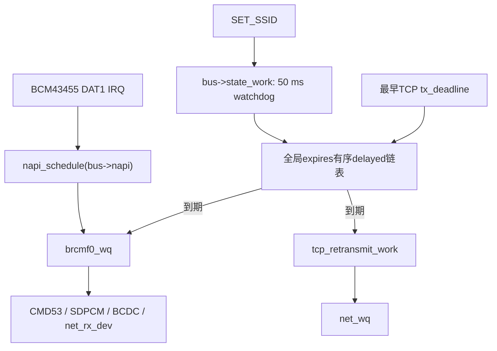

NAPI内嵌的普通work由硬件IRQ立即入设备队列；`state_work`和TCP work先进入
`kernel/workqueue.c` 的全局 `delayed_head`。该链表按 `expires` 递增排序，CPU0
每10 ms只移出已经到期的表头项目，并按项目的 `target` 投递到 `brcmf0_wq`、
`brcmf1_wq` 或 `net_wq`。因此时间排序与任务执行相互分离。

| 对象 | 上下文 | 作用 |
|---|---|---|
| Arasan IRQ top half | hard IRQ | mask/ack、记录 pending、调度NAPI |
| `brcmf0_wq.lock` | hard IRQ/进程 | 保护 work FIFO 和 pending/running/rerun |
| `brcmf0_wq` kworker | 内核进程 | CMD53、帧解析、WPA2 和网络栈投递 |
| `bus->lock` | worker/系统调用 | 串行化 SDPCM、BCDC 和连接状态 |
| Generic Timer | hard IRQ | 推进 ordered delayed-work 时钟 |

`kworker` 使用 xv6 进程槽、独立内核栈和 scheduler 上下文，但不返回 EL0；它是
内核线程，不是用户进程。不同设备的私有队列可以在不同 CPU 并发，同一设备的
work 不会并发执行。

### 21.7 构建与真机验证

```sh
make -j4 kernel/kernel8-xv6_wifi.img
make qemu
```

QEMU 只能验证内核、workqueue 和“没有 SDIO 设备”的启动路径。真实 RPi3 应看到：

```text
workqueue: brcmf0_wq worker=0 pid=...
brcmfmac: SDIO DAT1 IRQ receive enabled
brcmfmac: WPA2 four-way handshake complete
dhcp: address=... gateway=... dns=...
brcmfmac: wlan0 IPv4 ready
```

随后应持续运行 `ping` 和 SSH 交互，确认 IRQ 能立即收包，并确认 burst 处理后
`CARD_INT` 被正确重新打开，不会出现运行一段时间后停止接收。
# MMC host 请求串行化

用户态程序和内核 Wi-Fi worker 的调度优先级不是 SDIO 请求正确性的保证。当前 xv6 中普通用户
进程与新建 kworker 默认都属于 `SCHED_OTHER/nice 0`，而且 BCM43455 的 NAPI、状态 work 和控制
路径可以在不同 CPU 上并发运行。Arasan 控制器只有一套 `ARG1/CMDTM/INTERRUPT/DATA` 寄存器，
所以 CMD52/CMD53 事务必须以 **host** 为粒度串行，而不能只依赖每个 brcmf 设备自己的锁。

`struct mmc_host` 现在包含 `request_lock` sleeplock，MMC core 的 `mmc_request_sync()` 在完整命令/
数据事务外持有它。所有 CMD52 和 CMD53 都通过该入口，作用类似 Linux MMC core 的 host claim：

```text
brcmf control/state work ─┐
brcmf NAPI RX/TX         ├─ mmc_request_sync()
SDIO function control   ─┘       │
                                 └─ request_lock
                                      └─ Arasan ARG/CMD/IRQ/DATA registers
```

这里使用 sleeplock 而不是 spinlock，因为 Arasan request 会等待命令、数据和超时，持有期间不能
禁止调度。此前偶发的 `CMD52 failed status=df0001 irq=100` 中 bit 0 是 `CMD_INHIBIT`，可能由并发
请求覆盖寄存器或前一事务尚未结束造成；host 串行化消除了软件侧请求重叠。单次硬件超时仍可能
发生，届时应继续依据 ERROR/timeout 位诊断，不能归因于同时运行的普通用户程序。

启动探测发生在 `userinit()` 之前，此时 `myproc()` 为空，并且只有启动 CPU 会提交 MMC 请求；
`mmc_request_sync()` 在这个阶段直接执行 host request。进入用户进程、NAPI 和 workqueue 运行阶段
后才获取 sleeplock，避免现有 sleeplock 为记录 owner PID 而解引用空的 `myproc()`。
