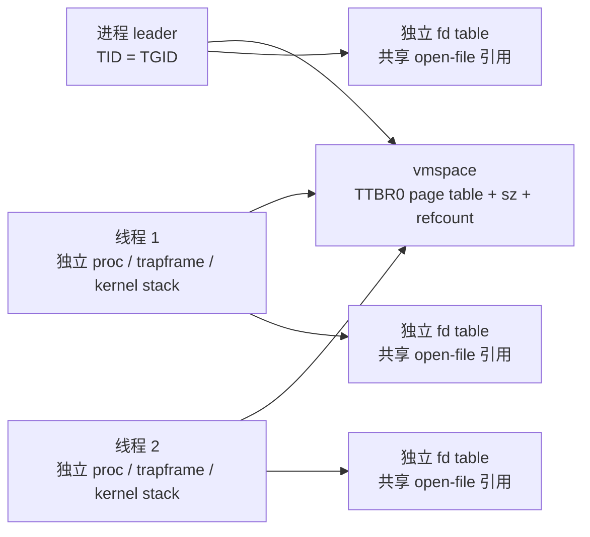
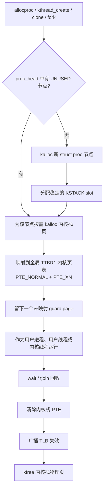

# xv6-aarch64 用户线程实现

当前版本在原有“一个 `struct proc` 对应一个独立地址空间”的基础上加入了真正可调度的用户线程。线程仍各有一个独立的 `struct proc`，因此每个线程都有独立内核栈、异常现场、调度状态、TID 和 CPU 亲和性；同一线程组通过引用计数 `struct vmspace` 共用 TTBR0 页表和进程地址空间大小。

进程表已经不再是静态的 `proc[64]`，内核也不再在启动时为 64 个槽位预分配内核栈。用户进程、用户线程和内核线程均按需扩展动态进程表，并在创建、回收时分配和释放内核栈物理页。因此这里的“无数量限制”是指没有 `NPROC` 这种编译期固定上限；实际可创建数量仍受可用物理内存和内核虚拟地址空间限制。

## 对象关系



`switchuvm()` 从当前线程的 `p->vm->pagetable` 写入 `TTBR0_EL1`。因为同组线程指向同一个 `vmspace`，它们能直接看到相同的代码、全局变量、堆和各线程栈；但各自的内核栈和 `trapframe` 不共享，所以能在多个 Cortex-A53 核上并行运行。

## 动态进程表与内核栈

旧实现的资源关系为：

```text
proc[64]
  ├─ 固定 64 个 struct proc
  └─ procinit() 启动时一次分配并映射 64 个内核栈页
```

新实现改为：



关键实现细节：

- `proc_head` 是只增长的动态链表，替代 `proc[NPROC]`；调度器、`wait()`、`wakeup()`、`kill()`、`/proc` 和 TTY 查找都遍历该链表。
- 新节点按高水位创建，并分配一个永不变化的 `kstack_slot`。节点成为 `UNUSED` 后可以再次复用。
- 每个内核栈仍是一页，虚拟地址由 `KSTACK(slot)` 得到；相邻栈之间保留一页未映射 guard page，用来捕获栈越界。
- 栈映射位于所有任务共享的 TTBR1 内核页表，标记为不可执行 `PTE_XN`。
- `freeproc()` 清除栈 PTE 后先执行跨核 TLB 广播失效，再归还物理页，防止其他 CPU 使用陈旧 TLB 访问已经复用的页面。
- `struct proc` 描述节点本身在达到新的并发高水位时分配，并故意保留在链表中。这样无需在所有无锁遍历者之间引入 RCU，就不会产生悬空 `next` 指针；占内存最多的是历史并发高水位，而不是无限持续增长。

动态内核线程和用户线程使用同一套 `allocproc()`/`freeproc()` 生命周期。两者的区别只在地址空间和入口：用户线程共享 `vmspace` 并从 EL0 入口运行，内核线程只设置内核入口函数；它们都拥有独立、按需分配的内核栈。

## 系统调用

| 调用 | 作用 |
|---|---|
| `clone(entry, arg, stack_top)` | 建立共享地址空间的新调度实体，令 `x0=arg`、`SP=stack_top`、`ELR=entry` |
| `texit(status)` | 只退出调用线程；leader 调用时仍执行进程整体退出 |
| `tjoin(tid, &status)` | 等待并回收同一线程组中的指定线程；`tid=0` 表示任意线程 |
| `gettid()` | 返回当前调度实体的 TID |
| `getpid()` | 返回线程组 ID，即进程 PID/TGID |

用户库提供更安全的包装：

```c
thread_t t;

void worker(void *arg)
{
  // 访问共享全局变量或堆时应使用 mutex/semaphore/atomic。
}

thread_create(&t, worker, arg);
thread_join(&t, &status);
```

`thread_create()` 自动分配并按 AArch64 ABI 的 16 字节要求对齐 16 KiB 用户栈；启动包装函数在用户函数返回后自动调用 `texit(0)`。`thread_join()` 在内核回收线程后才释放该栈，避免 use-after-free。

## 内存与多核一致性

`sbrk()` 修改共享 `vmspace` 时持有 `vmspace.lock`。页表扩展或收缩后调用的 `flush_tlb()` 使用：

```asm
dsb ishst
tlbi vmalle1is
dsb ish
isb
```

`VMALLE1IS` 是 inner-shareable 广播失效，因此会覆盖同时运行这些线程的全部 Cortex-A53 核，不需要再发送软件 IPI。收缩地址空间时实现顺序为“清 PTE → 广播 TLB 失效 → `kfree` 物理页”，不会让另一个 CPU 用陈旧 TLB 访问已经归还给分配器的页面。

用户态 K&R 分配器也增加了基于 AArch64 `LDAXR/STXR` 的互斥保护；`morecore()` 使用锁内辅助释放函数，避免递归获取堆锁。

## 生命周期

- `fork()` 仍复制完整地址空间，子进程获得新 TGID 和新 `vmspace`。
- `exec()` 只允许在线程组仅剩调用者时执行，防止其他线程继续运行已经替换的页表。
- 普通线程退出成为 zombie，由 `tjoin()` 回收；其 fork 出的子进程会重新交给 `init`。
- leader 的 `exit()` 会先终止并回收同组线程，再按原 xv6 进程退出路径通知父进程。
- `kill(pid)` 以 TGID 为目标，标记并唤醒线程组全部成员。
- `ps` 现在同时显示 `TID` 和 `TGID`。

## 文件描述符语义

当前 `clone()` 会像 `fork()` 一样复制文件描述符引用：底层 `struct file`（包括文件偏移）共享，但每个线程的描述符数组及 `cwd` 引用独立。也就是说，一个线程 `close(fd)` 不会自动清空其他线程同编号的 fd；这与 Linux `CLONE_FILES | CLONE_FS` 的完全共享语义不同。后续若要做到 pthread 级兼容，应把 `ofile[]` 与 `cwd` 再抽成独立引用计数对象。

## 验证

构建：

```sh
make -j4 fs.img kernel/kernel8-xv6_wifi.img
```

启动后执行：

```sh
/bin/forktest
/bin/threadtest
```

`forktest` 同时建立并回收 128 个子进程，明确越过旧的 64 槽位上限；`threadtest` 创建两个线程，用内核同步对象保护共享计数器，并允许调度到不同 CPU。成功结果为：

```text
dynamic fork test OK
threadtest: PASS counter=2000 tgid=...
```

两个线程同时 `printf` 时字符可能交错，这是当前 console 输出粒度造成的显示现象，不表示共享内存或调度错误。
