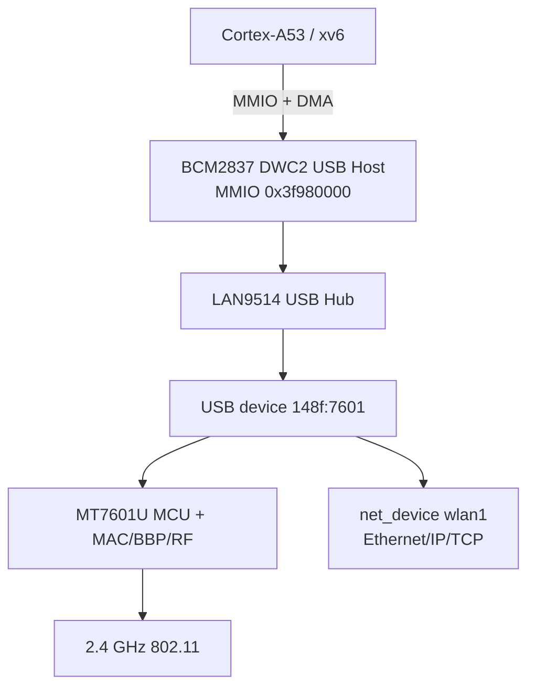
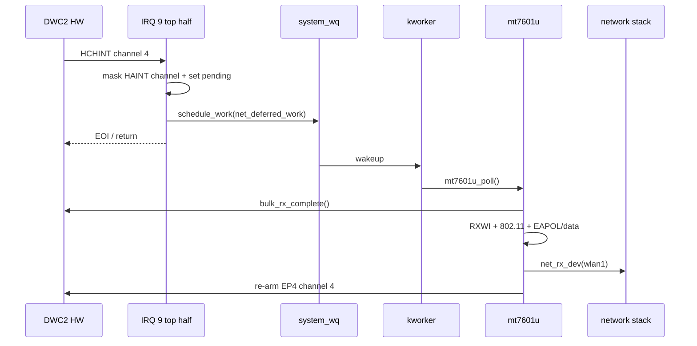

# xv6-aarch64 Raspberry Pi 3 DWC2 USB 与 MT7601U Wi-Fi

本文专门说明 Raspberry Pi 3 上 MT7601U USB Wi-Fi 的硬件拓扑、DWC2 host
controller、USB 枚举、DMA、firmware、SoftMAC、WPA2、收发数据和 IRQ/workqueue
下半部。BCM43430/43455 板载 SDIO FullMAC 请看
[readme_sdio_wifi.md](readme_sdio_wifi.md)。通用问题修复记录请看
[readme_bug_fix.md](readme_bug_fix.md)。

## 1. 总体架构

MT7601U 不是直接挂在 CPU 总线上的网卡。RPi3 的 USB 路径是：



驱动分为三层：

| 层 | 代码 | 职责 |
|---|---|---|
| DWC2 HCD | `kernel/dwc2.c` | root hub、hub port、control/bulk、DMA、host channel IRQ |
| USB core | `kernel/usb.c/.h` | `usb_device`、ID 匹配、driver probe/remove |
| MT7601U | `kernel/mt7601u.c` | firmware、eFuse、MAC/BBP/RF、SoftMAC、WPA2、`wlan1` |

## 2. 为什么它既是 USB 设备又是 Wi-Fi 设备

USB 只解决主机与 MT7601U 芯片之间的传输：枚举、endpoint、Bulk IN/OUT、DMA
和完成通知。802.11 扫描、认证、关联、加密和无线帧解析属于上层 MT7601U 驱动。

```text
DWC2 识别 148f:7601
  -> usb_device
  -> usb_bus 匹配 mt7601u_driver
  -> mt7601u_probe()
  -> SoftMAC 初始化
  -> 关联完成
  -> register_netdev(wlan1)
```

它不能按 CDC-ECM 网卡处理，因为 MT7601U 暴露的是厂商专用接口，不会直接提供
标准 Ethernet USB class。

## 3. DWC2 与外置 hub 枚举

`dwc2_driver_init()` 注册 platform driver。probe 依次完成：

1. 通过 firmware property mailbox 打开 USB HCD 电源；
2. 初始化 DWC2 host mode 和 root port；
3. 读取 root device descriptor；
4. 识别 LAN9514 hub；
5. 对每个外部 port 执行状态读取、上电和 reset；
6. 为子设备分配地址并读取 descriptor/configuration；
7. 找到 `VID=0x148f, PID=0x7601`；
8. 解析两个 Bulk IN 和一个 Bulk OUT endpoint；
9. 调用 USB bus 的 driver matching。

典型日志：

```text
dwc2: root device class=9 vid=424 pid=2514 configs=1 mps=64
dwc2: hub port=3 child class=0 vid=148f pid=7601 mps=64
dwc2: MT7601U configured; bulk-in=4,5/512 bulk-out=8/512
dwc2: MT7601U handed to usb bus
```

endpoint 分工：

| Endpoint | 方向 | 用途 |
|---|---|---|
| EP4 | device → host | 802.11 RX/data/mgmt/EAPOL |
| EP5 | device → host | MCU command response |
| EP8 | host → device | firmware、MCU command、TX frame |

## 4. MT7601U firmware 为什么每次启动都下载

`MT7601U.BIN` 是芯片 MCU 的运行程序。设备主要把永久校准信息和 MAC 地址放在
eFuse/EEPROM，MCU RAM 属于易失存储，因此每次上电都要重新下载 firmware。这与
Linux `mt7601u` 驱动的基本模型一致。

驱动从 bootfs 读取：

```text
MT7601U.BIN
```

下载步骤：

```text
解析 firmware header
  -> 分离 IVB / ILM / DLM
  -> Bulk OUT 发送分块数据
  -> FCE/PDMA 把数据放入 MCU RAM
  -> 设置启动向量
  -> 等待 MT_MCU_COM_REG0 == 1
```

成功日志：

```text
mt7601u: firmware v0.1.0 ... validated
mt7601u: ILM firmware upload ...
mt7601u: MCU firmware running
```

## 5. eFuse、MAC、BBP 与 RF 初始化

MCU 启动后，`mt7601u_read_eeprom()` 通过 `MT_EFUSE_CTRL` 每16字节读取一次校准
数据，得到：

- permanent MAC；
- country/regulatory 信息；
- frequency offset；
- RSSI/LNA/temperature 参数。

随后依次执行：

```text
basic_hw_init
  -> WLAN clock/PLL
  -> USB DMA
  -> permanent MAC registers

mcu_channel_init
  -> EP8 command
  -> EP5 response

full_hw_init
  -> MAC register table
  -> BBP register table
  -> RF register table
  -> R/TXDCOC/LOFT/TXIQ/RXIQ/DPD calibration
```

MT7601U 的 MAC、BBP、RF 是不同硬件部分：MAC 处理802.11帧和队列；BBP处理数字
基带；RF控制模拟射频、信道、增益和频率校准。

## 6. SoftMAC 工作模型

BCM43455 是 FullMAC，关联控制主要通过 BCDC 命令交给 firmware。MT7601U 是
SoftMAC，ARM CPU 驱动必须处理更多802.11逻辑：

```text
扫描信道
  -> 解析 beacon/probe response
  -> 选择目标 BSSID/channel
  -> Open-System authentication
  -> association request + RSN IE
  -> WPA2 EAPOL M1/M2/M3/M4
  -> 安装 PTK/GTK/CCMP key
  -> register_netdev(wlan1)
```

当前目标网络由驱动配置为 `TP-Link_B114`。关联完成日志包括：

```text
mt7601u: Open-System authentication accepted
mt7601u: 802.11 associated ... WPA2 handshake pending
mt7601u: sent WPA2 EAPOL M2
mt7601u: sent WPA2 EAPOL M4
mt7601u: WPA2 four-way handshake complete
mt7601u: wlan1 registered mac=...
```

## 7. TX 数据路径

网络层调用 `mt7601u_net_xmit()` 后：

```text
Ethernet frame
  -> LLC/SNAP
  -> 802.11 data header
  -> TXWI
  -> USB DMA header/padding
  -> EP8 Bulk OUT
  -> DWC2 host channel
  -> MT7601U MAC/BBP/RF
  -> wireless medium
```

管理帧、EAPOL 与普通 IP 数据最终都通过 Bulk OUT，但使用不同 WCID、加密状态和
802.11 frame control。`usb_lock` 串行化 DWC2 channel/register/DMA 状态；
`mt7601u.lock` 保护 SoftMAC 状态、密钥、扫描表和 TX/RX buffer 使用。

## 8. RX 数据路径与 DMA

EP4 RX buffer 会长期预提交：

```text
mt7601u_poll()
  -> bulk_rx_arm(EP4, mt_rx_buf)
  -> DWC2 channel 4 programmed
  -> MT7601U 返回 USB packet
  -> DMA 写入 RAM
  -> host-channel IRQ
  -> bottom half bulk_rx_complete()
  -> mt7601u_rx_parse()
```

DWC2 是 bus master。CPU 使用 ARM physical address，而 DWC2 DMA 需要 VideoCore
bus alias：

```c
#define DWC2_DMA_BUS(a) (0xc0000000U | (uint32)V2P(a))
```

`0xc0000000` 不是新的 RAM，也不是 CPU 虚拟地址；它是同一片 RAM 面向
VideoCore-side bus master 的 coherent/uncached alias。DMA 前后必须执行正确的
cache clean/invalidate，避免 CPU cache 与 DMA 内存内容不一致。

`HCTSIZ` 的剩余字节数用于计算实际接收长度。短包是合法完成，DATA0/DATA1
toggle 只有在成功传输后更新。

## 9. DWC2 host-channel IRQ 9

DWC2 初始化打开：

```text
HCINTMSK(channel) = XFERCOMPL | CHHLTD | NAK | error bits
HAINTMSK          = active asynchronous channels
GINTMSK.HCHINT    = 1
GAHBCFG.DMA_EN    = 1
GAHBCFG.GLBLINTRMSK = 1
```

BCM2837 legacy IRQ 9 到达后，`dwc2_irq()` 只执行顶半部：

```c
channels = rd(HAINT) & rd(HAINTMSK);
wr(HAINTMSK, rd(HAINTMSK) & ~channels);
dwc2_irq_pending |= channels;
net_deferred_schedule(0);
```

它不清除每个 channel 的 `HCINT`，因为下半部还要读取 `HCINT/HCTSIZ`、区分
XFERCOMPL/NAK/error并计算 DMA 实际长度。临时关闭对应 `HAINTMSK` 可避免 level
interrupt 在完成项尚未消费时重复进入。

当前 channel 分工：

| Channel | 用途 |
|---|---|
| channel 2 | CDC RX（如果存在 CDC Ethernet） |
| channel 4 | MT7601U EP4 异步 Bulk IN |
| 其他同步 channel | control、枚举、MCU response、Bulk OUT |

## 10. workqueue 下半部

旧实现每2 ms同步轮询 `HCINT`，后来改为 IRQ pending + 10 ms Timer poll。当前实现
使用真正的 `system_wq/kworker`：



因此耗时的 cache maintenance、RXWI解析、802.11状态机和网络栈不在 hard IRQ
中执行。10 ms Timer 仍排周期 work，用于扫描 dwell、认证/关联/EAPOL watchdog；
Timer 本身不再直接执行驱动。

相关通用实现位于：

- `kernel/workqueue.c/.h`：FIFO、`schedule_work()`、`kworker`；
- `kernel/proc.c/.h`：`kthread_create()`；
- `kernel/net.c`：`net_deferred_work`；
- `kernel/timer.c`：只排周期维护 work。

## 11. NAK、错误与重新调度

Bulk IN 没有数据时，USB 设备可返回 NAK。NAK不是设备故障，也不应在 hard IRQ
中长时间循环。下半部消费完成状态后，在后续 USB frame 重新 arm buffer。

常见错误位：

```text
STALL / XACTERR / BBLERR / FRMOVRUN / DATATGLERR
```

错误恢复需要保持以下状态一致：

- host channel 已 halt；
- `HCINT` 已清除；
- `HAINTMSK` 恢复；
- DATA PID toggle 没有被错误推进；
- DMA buffer cache 状态正确；
- EP4 buffer 再次 arm。

早期出现的 `intr=0x400`、TX result `-2` 和 DHCP无 offer，通常与 channel halt、
toggle、ZLP、DMA长度或错误恢复不完整有关，而不是 DHCP协议本身。

## 12. 设备与驱动生命周期

```text
platform device bcm2837-dwc2
  -> dwc2 platform driver
  -> usb_bus
  -> usb_device 148f:7601
  -> mt7601u_driver.probe
  -> net_device wlan1
```

remove/unplug 的正确顺序应是：

```text
阻止新的 work
  -> mask DWC2 IRQ/channel
  -> cancel_work_sync / flush_work
  -> halt DMA
  -> unregister_netdev(wlan1)
  -> usb driver remove
  -> 释放设备私有状态
```

当前硬件热拔生命周期仍需要强化。活跃 DMA 时直接拔出设备可能使 worker访问失效的
`usb_device`，因此真机测试阶段应先停止接口，再拔设备。

## 13. 锁与并发

| 锁 | 类型 | 保护内容 |
|---|---|---|
| `usb_lock` | spinlock | DWC2 register、host channel、DMA、toggle |
| `mt7601u.lock` | spinlock | SoftMAC link state、scan、密钥和设备私有状态 |
| `system_wq.lock` | spinlock | work FIFO、pending/running |
| `net_deferred_lock` | spinlock | 累积的周期 tick |
| `p->lock` | spinlock | kworker 的 RUNNABLE/SLEEPING/RUNNING 状态 |

IRQ 顶半部不能获取可能被下半部长期持有的设备锁。它只写 controller pending 并
排 work。进入网络栈前还应释放 `usb_lock`/设备锁，因为 ARP/TCP ACK 可能同步走
TX 路径重新进入同一驱动。

## 14. 与 Linux 的关系

共同点：

- DWC2 HCD 与 USB device driver 分层；
- VID/PID 匹配 `probe/remove`；
- firmware 每次上电下载；
- eFuse/EEPROM提供校准与 MAC；
- SoftMAC由host处理扫描、关联和加密；
- RX buffer预提交，IRQ只报告完成；
- 下半部有 budget/重新调度思想。

不同点：Linux通常使用成熟的 USB URB、completion、tasklet/workqueue，以及
mac80211/cfg80211 网络子系统。当前 xv6 把这些功能压缩在 `dwc2.c`、
`mt7601u.c` 和一个全局 `system_wq` 中，还没有 URB对象、每endpoint请求队列、
mac80211 rate control、完整 regulatory和可靠热拔。

## 15. 当前状态与验证

已经在真机观察到：

- USB hub 和 `148f:7601` 枚举；
- firmware下载、MCU启动；
- eFuse/MAC读取；
- MAC/BBP/RF初始化和校准；
- AP扫描；
- Open-System authentication；
- association；
- WPA2四次握手；
- `wlan1`注册。

仍需重点验证 DWC2 IRQ 9 模式下的数据面稳定性：

```sh
/bin/dhcp wlan1
ping 192.168.0.1
ping google.com
```

执行前确认默认路由已经指向 `wlan1`；当前 xv6 `ping` 不实现 Linux 的 `-I`
接口选择参数。

预期启动日志：

```text
workqueue: system_wq kworker pid=1
dwc2: host-channel IRQ enabled
dwc2: MT7601U configured; bulk-in=4,5/512 bulk-out=8/512
mt7601u: EP4 receive uses DWC2 host-channel IRQ
```

QEMU `raspi3b` 没有真实 LAN9514/MT7601U，只能验证无设备启动和 IRQ代码构建，
不能代替真实 Bulk IN completion、DHCP、ping与持续流量测试。

## 16. 后续改进

1. 把全局 `net_deferred_work` 拆成 MT7601U 私有 `rx_work` 和 `state_work`；
2. 为每个 endpoint 建立类似 Linux URB 的 request/completion 队列；
3. 控制、MCU response、RX、TX使用独立 host channel；
4. RX建立多个预提交 buffer，减少 re-arm 空窗；
5. 增加 delayed work，取消空闲时每10 ms唤醒全局 worker；
6. 完整实现 unplug、`cancel_work_sync()`、DMA halt和资源回收；
7. 增加 RX/TX统计、IRQ/NAK/error计数和 `/proc/net/dev`；
8. 抽象 mac80211式 SoftMAC层，避免加密、扫描和802.11解析绑定单一芯片；
9. 增加 rate control、重传、power save和 regulatory domain；
10. 对长时间 DHCP、ping、SSH与双网卡路由进行压力测试。

## 17. 代码导航

| 文件 | 入口/职责 |
|---|---|
| `kernel/dwc2.c` | `dwc2_driver_init()`、枚举、Bulk、DMA、`dwc2_irq()` |
| `kernel/usb.c/.h` | USB bus、device/driver、host ops |
| `kernel/mt7601u.c` | `mt7601u_probe()`、firmware、SoftMAC、RX/TX |
| `kernel/workqueue.c/.h` | `system_wq`、`schedule_work()`、kworker |
| `kernel/net.c` | `net_deferred_worker()`、`wlan1`网络投递 |
| `kernel/bcm2837.c` | legacy USB IRQ 9 enable/pending |
| `kernel/trap.c` | IRQ 9分发到 `dwc2_irq()` |
| `kernel/memlayout.h` | DWC2 MMIO与 IRQ号 |
| `Makefile` | kernel对象、firmware与bootfs安装 |

更早的逐步移植日志仍保存在
[readme_mt7601u_usb.md](readme_mt7601u_usb.md)，本文作为当前代码结构与工作原理的
集中说明。
