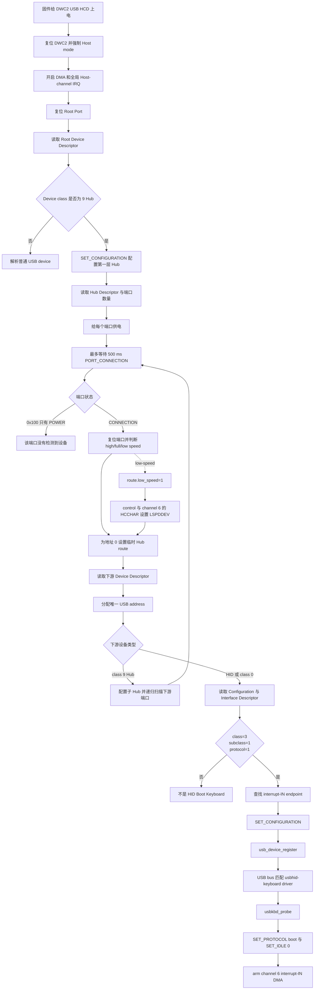
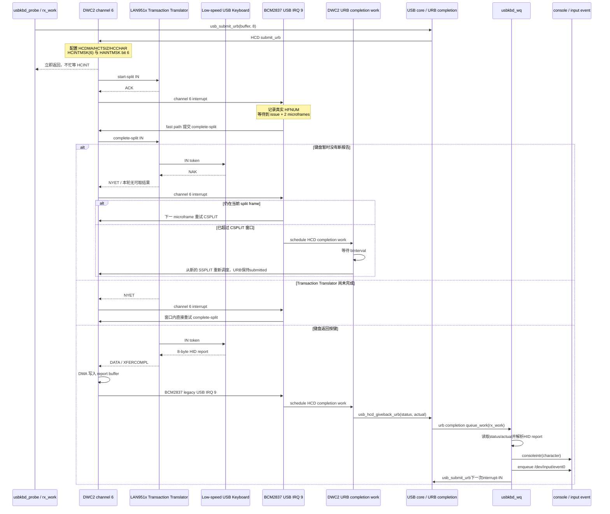
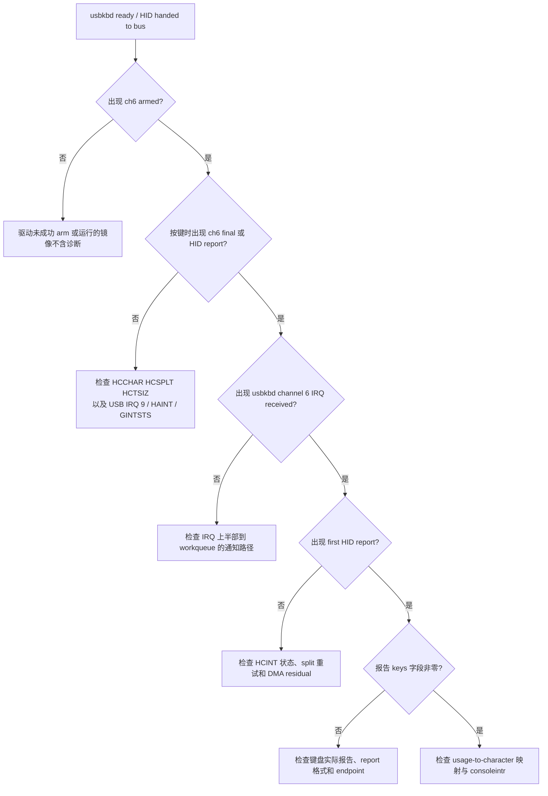
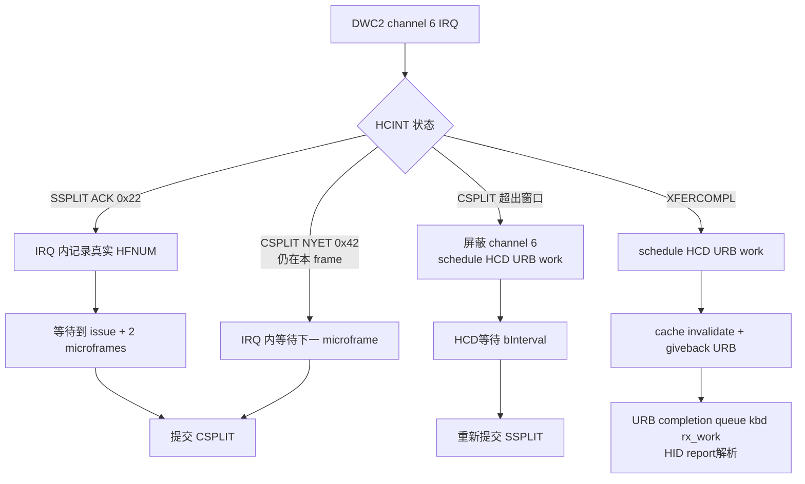

# Raspberry Pi 3 USB 键盘驱动

## 驱动路径

```text
USB keyboard
  -> LAN951x high-speed hub
  -> DWC2 host controller
  -> USB bus: struct usb_device
  -> HID boot keyboard class driver
  -> consoleintr()
  -> xv6 console/TTY line discipline
  -> /dev/ttyS0 or foreground shell read()
```

键盘输入并不直接写用户进程缓冲区。`usbkbd.c` 把 HID usage code
转换成字符后调用 `consoleintr()`，因此串口已有的回显、退格、Ctrl+C、
阻塞读和唤醒语义会被复用。

同一份 HID report 也会生成原始按键事件并进入 `/dev/input/event0`。
因此它同时具有两种用途：

```text
HID report -> consoleintr()          -> shell/登录输入，回显到 Mini UART
           -> /dev/input/event0 队列 -> 用户程序读取原始按下/释放事件
```

xv6 没有 Linux 的 devtmpfs/udev，字符设备驱动注册本身不会自动创建文件
系统节点。`init` 因而显式创建 `/dev/input` 和 major 4 的 `event0`。事件
记录为 8 字节：`uint16 type`、`uint16 HID usage code`、`int value`；当前
`type=1` 表示按键，`value=1/0` 分别表示按下/释放。

## 枚举与绑定

`main()` 在 DWC2 枚举之前注册 `usbhid-keyboard` USB driver。DWC2 扫描
LAN951x 下游端口，读取 device/configuration/interface/endpoint 描述符。
匹配条件是：

- interface class 3：HID；
- subclass 1：Boot Interface；
- protocol 1：Keyboard；
- 至少一个 interrupt-IN endpoint。

配置完成后，USB core 按 class/subclass/protocol 将设备绑定到
`usbkbd_probe()`。probe 发送 `SET_PROTOCOL(boot)` 与 `SET_IDLE(0)`，然后
为该设备分配私有 `usbkbd_state` 和 interrupt-IN URB，再用
`usb_submit_urb()`异步 arm DWC2 channel 6。后续由 URB 的 `context` 找回
所属键盘，不再依赖全局静态键盘状态。

## Linux 风格 URB 与每设备状态

USB core 现提供一组精简的 Linux 风格接口：

```c
struct urb *usb_alloc_urb(void);
void usb_fill_int_urb(...);
int  usb_submit_urb(struct urb *urb);
void usb_hcd_giveback_urb(struct urb *urb, int status, int actual);
void usb_kill_urb(struct urb *urb);
void usb_free_urb(struct urb *urb);
```

`struct urb`保存设备、endpoint、interval、DMA buffer、请求长度、实际长度、
完成状态、完成函数和`context`。所有权规则为：

```text
USB class driver
  -> usb_submit_urb()
  -> USB core 将URB标记为SUBMITTED
  -> DWC2 HCD取得URB并启动channel 6 DMA
  -> SSPLIT/CSPLIT中间调度仍由HCD处理
  -> 最终完成或错误
  -> usb_hcd_giveback_urb(status, actual_length)
  -> URB所有权归还class driver
  -> urb->complete(urb)
  -> completion通过urb->context取得usbkbd_state
  -> queue_work(kbd->rx_work)
  -> 解析报告并重新usb_submit_urb()
```

键盘状态由`usbkbd_probe()`用`kalloc()`逐设备分配，并保存在
`udev->dev.driver_data`；`struct urb`也属于这份设备私有状态。当前
`/dev/input/event0`仍选择第一个键盘作为primary device，但传输、完成回调、
work和生命周期已经不是全局键盘单例。

拔出或HCD移除时使用同步取消顺序：

```text
usbkbd_remove()
  -> active=0, disconnected=1
  -> 从primary keyboard中摘除并唤醒阻塞read
  -> usb_kill_urb()
       -> DWC2停止channel 6 DMA、屏蔽HCINT/HAINT
       -> cancel_work_sync(HCD completion work)
       -> 等待正在运行的URB completion返回
  -> cancel_work_sync(kbd->rx_work)
  -> 等待/dev/input/event0 reader退出
  -> usb_free_urb()
  -> kfree(kbd)
```

因此`usb_kill_urb()`返回后，不会再有DWC2 completion使用这份URB；
`cancel_work_sync()`返回后，也不会再有键盘下半部访问设备私有内存。这对应
Linux `usb_kill_urb()`在`disconnect()`中的基本生命周期保证。

### 实际查找与配置顺序

键盘不是靠 VID/PID 白名单识别，而是按 USB class/interface 描述符发现。
地址 0 枚举和配置顺序如下：

```text
GET_DESCRIPTOR(Device, 8 bytes)
  -> 获得 bMaxPacketSize0（低速设备通常为 8）
GET_DESCRIPTOR(Device, 18 bytes)
  -> 获得 class、VID、PID
SET_ADDRESS
  -> 为设备分配唯一地址并保存 parent-hub/port/speed route
GET_DESCRIPTOR(Configuration, 9 bytes)
  -> 获得 wTotalLength 与 configuration value
GET_DESCRIPTOR(Configuration, wTotalLength)
  -> 遍历 interface 和 endpoint
  -> 选择 class=3, subclass=1, protocol=1 的 Boot Keyboard interface
  -> 在同一 interface 内选择 interrupt-IN endpoint
SET_CONFIGURATION
usb_device_register()
  -> USB bus 匹配 usbhid-keyboard
SET_PROTOCOL(boot)
SET_IDLE(0)
  -> 只有按键状态改变时返回报告
usb_fill_int_urb()
usb_submit_urb()
```

不能在找到 HID interface 后继续无条件扫描并使用后面的 endpoint；复合设备
可能同时包含鼠标、厂商接口等。当前枚举器用 `current_interface` 限定 endpoint
必须属于已选中的 Boot Keyboard interface。

### 枚举与配置流程图



本次真机日志对应的关键分支是：第一层 port 1 发现第二层 Hub；递归扫描后，
第一层 port 3 出现 `status=0x301/0x303`，因此它是低速设备，必须走图中的
`route.low_speed` 和 `HCCHAR.LSPDDEV` 分支。

## DWC2 interrupt-IN

这里的 “interrupt endpoint” 是 USB 传输类型，不表示键盘直接拉起 ARM
IRQ。主机必须向 endpoint 发起 IN token。当前实现先异步 arm DWC2 host
channel 6；传输状态变化后由 DWC2 产生 USB IRQ 9。具有 microframe 截止时间
的 SSPLIT/CSPLIT 中间状态由 DWC2 IRQ 快速路径推进；最终完整报告或错误由
DWC2 completion work 归还URB，再由URB completion进入`usbkbd_wq`。CPU不再
用Timer周期调用键盘poll函数。DMA
接收的是标准 8 字节 boot report：

```text
byte 0     modifier bitmap (Ctrl/Shift/Alt/GUI)
byte 1     reserved
byte 2..7  最多六个同时按下的 usage code
```

驱动将本次报告和上次报告比较，只为新按下的键产生字符，避免按住一个键
时把同一报告无限重复注入。当前支持字母、数字、常用符号、Enter、Tab、
Backspace、Esc、Ctrl、Shift、Caps Lock 和方向键。

### 按键报告到终端字符

`usbkbd_rx_work()`收到8字节报告后执行两次比较：

1. 本次`keys[2..7]`中存在、上次不存在的usage，产生按下事件并查`keymap`；
2. 上次存在、本次不存在的usage，向`/dev/input/event0`产生释放事件；
3. Shift/Caps Lock选择普通或大写映射，Ctrl+字母转换为控制字符；
4. 普通字符、Backspace、Enter及方向键转义序列统一送入`consoleintr()`；
5. console/TTY行规程负责回显、行缓冲、Ctrl+C及唤醒前台读进程。

真机已经收到：

```text
usbkbd: first HID report mod=0 keys=10,0,0,0,0,0
```

日志使用十六进制输出，所以`keys=10`表示HID usage `0x10`，对应字母`m`；
`mod=0`表示没有Ctrl/Shift/Alt/GUI修饰键。这条日志证明从低速键盘、Hub TT、
DWC2 DMA/IRQ、workqueue到HID解析的整条接收路径已经成功。该日志只打印第一
份有效报告，后续每个按键不在IRQ路径逐条打印，以免再次破坏USB时序。

## 改造前：CPU 定时轮询方式

早期版本虽然 endpoint 类型叫作 `interrupt-IN`，CPU 处理方式仍然是
轮询，并不是由 BCM2837 legacy USB IRQ 9 驱动。调用链如下：

```text
ARM Generic Timer 定时中断
  -> workqueue_timer_tick()
  -> keyboard.poll_work 到期
  -> poll_work 加入专用 usbkbd_wq
  -> usbkbd_wq 内核线程调用 usbkbd_poll()
  -> udev->ops->interrupt()
  -> dwc2_usb_interrupt()
  -> channel_xfer(channel 6)
  -> CPU 循环读取 HCINT(6)
  -> 收到 HID report、NAK、错误或超时
  -> usbkbd_poll() 解析按键
  -> queue_delayed_work(..., 1) 安排下一轮
```

因此旧实现有两层 CPU 软件轮询：

1. `queue_delayed_work()` 每隔一个 xv6 tick 唤醒 `usbkbd_poll()`，由 CPU
   定期启动一次 interrupt-IN 事务；
2. `channel_xfer()` 启动 host channel 6 后忙等读取 `HCINT(6)`，直到本次
   事务完成、NAK、出错或超时。

```text
第一层：Timer -> delayed_work -> usbkbd_poll()
第二层：channel_xfer() -> while -> rd(HCINT(6))
```

这里仍需区分 USB 总线协议和 CPU 执行方式：USB 键盘不能主动向主机发送
报文，主机必须产生 IN token；但是这些 IN token 可以由 DWC2 硬件调度，
完成后再使用 IRQ 通知 CPU。旧实现没有使用后面这种异步完成方式。

## 当前代码：DWC2 IRQ 驱动方式

当前版本已经改为：

```text
usbkbd_probe()
  -> 首次 arm 长期 interrupt-IN DMA 请求
  -> 返回，不等待传输

DWC2 硬件调度 IN token
  -> 低速键盘经 LAN951x TT 执行 SSPLIT/CSPLIT
  -> 键盘有数据时 DMA 写入 HID report
  -> HCINT(6).XFERCOMPL
  -> BCM2837 legacy USB IRQ 9

dwc2_irq()                         hard IRQ / HCD 快速路径
  -> SSPLIT ACK: 记录 IRQ 时 HFNUM
  -> 到 issue+2 microframes 时提交 CSPLIT
  -> 窗口内 NYET: 下一 microframe 重试 CSPLIT
  -> XFERCOMPL/超出窗口/错误: 屏蔽 channel 6
  -> schedule_work(DWC2 URB completion work)

DWC2 completion work               HCD可调度上下文
  -> 读取HCINT/HCTSIZ和DMA实际长度
  -> NAK/本轮无数据时按bInterval重新调度，URB保持submitted
  -> 最终完成时usb_hcd_giveback_urb()

usbkbd_irq_complete()              URB completion
  -> 通过urb->context取得usbkbd_state
  -> queue_work(kbd->rx_work)

usbkbd_wq                          进程上下文下半部
  -> 读取URB结果、解析HID report、consoleintr()
  -> 重新usb_submit_urb()，arm新的SSPLIT/interrupt-IN请求
```

具体代码变化如下：

- 删除 `keyboard.poll_work`、`usbkbd_poll()` 及周期性
  `queue_delayed_work()`；
- 增加每设备`kbd->rx_work`，只有对应URB completion才会调度；
- 增加通用URB core以及host ops `submit_urb()`和`kill_urb()`；
- DWC2 `submit_urb()`配置DMA、`HCTSIZ(6)`、`HCCHAR(6)`后立即返回，
  不再循环读取 `HCINT(6)`；
- `HCINTMSK(6)` 打开 XFERCOMPL、CHHLTD、NAK、ACK、NYET 和错误事件，
  `HAINTMSK` 打开 bit 6；
- `dwc2_irq()` 对有 microframe 截止时间的 SSPLIT ACK 和窗口内 NYET 直接推进
  channel 6，避免普通 kworker 的毫秒级调度延迟；
- 最终完成、超出split窗口或错误才屏蔽channel 6，并调度DWC2自己的URB
  completion work；
- HCD完成处理调用`usb_hcd_giveback_urb()`；键盘的URB completion仅排入
  `rx_work`；
- `rx_work`读取`urb->status/actual_length`，解析成功报告并重新提交URB。

若出现 `IRQ-driven boot keyboard ready` 但按键无响应，检查后续诊断：
`ch6 armed` 表示 DMA/channel 已启动；`ch6 final` 与
`usbkbd: channel 6 IRQ received` 表示host-channel请求已由HCD完成并通过URB
completion排入键盘下半部；
`first HID report` 表示 DMA report 已收到。若只有 armed，没有 final/report，问题在
DWC2 channel/IRQ 路径；若有 irq 但没有 report，则看 `HCINT`/`HCTSIZ` 及
下半部的重试/错误输出。

full/low-speed 键盘在 LAN951x Hub 后需要 start-split/complete-split。
start-split ACK 和有效调度窗口内的 complete-split NYET 由 HCD IRQ 快速路径
处理，不会被当成完整 HID report，也不会先经过普通 workqueue。

workqueue 自己的链表、`pending/running/rerun` 已由 `wq->lock` 保护；
`usbkbd_state.lock` 保护设备的 `active` 和生命周期状态。IRQ 上半部不解析
HID、不调用 console、不访问文件系统；为了满足 split microframe 时序，它会
在HCD内最多短暂等待500 us并重启channel。DMA cache invalidate和
`bInterval`等待在DWC2 completion work中完成；HID解析、`consoleintr()`与
新一轮URB提交在`usbkbd_wq`中完成。

### IRQ 接收时序图



## Hub split transaction

树莓派 3 的外置 USB 口在 LAN951x 高速 Hub 后面，而普通键盘通常是
full-speed/low-speed。DWC2 不能直接向这种设备发送普通事务，必须执行：

```text
start-split -> LAN951x transaction translator
            -> full/low-speed keyboard transaction
complete-split <- transaction result
```

`dwc2.c` 保存 USB address 到 hub-address/port 的路由，并通过 `HCSPLT`
设置 `SPLTENA`、`HUBADDR`、`PRTADDR`、`COMPSPLT`。Hub 返回 NYET 时只重试
complete-split，不重复发送 start-split 数据；但只允许在所属 USB frame 的
有效周期窗口内重试。超过窗口后必须结束本轮，等待 `bInterval`，再以新的
start-split 开始下一次键盘轮询。

路由还记录端口速度。对于 `status` 含 `HUB_PORT_LOW_SPEED` 的键盘，所有
枚举 control channel 和后续 interrupt-IN channel 都必须在 `HCCHAR` 设置
`LSPDDEV`；否则 LAN951x 会在低速设备的 SETUP start-split 上返回 STALL，
典型日志是 `intr=0x0a`、`control setup failed req=6 addr=0`。

split-IN 的 complete-split 如果返回 NAK，表示下游设备已经结束这一次 USB
事务但暂时没有数据。不能只反复提交 COMPSPLT；同步 control 路径必须把
状态切回 start-split，在下一帧开始一笔新事务。否则会在读取低速设备
descriptor 时耗尽等待期限，表现为 `control data failed ... result=-2`。

低速设备的 EP0 最大包长为 8 字节。读取 18 字节 Device Descriptor 时，
数据阶段需要多个 split-IN 事务；每个包都要单独完成 SSPLIT/CSPLIT，并在
完整收到一个包后切换 DATA PID。`channel_xfer()` 因此将多包 split 请求按
`mps` 分段提交，并在调试输出中报告每次 CSPLIT 实际收到的字节数。若只
收到描述符前 8 字节，后续 VID/PID 字段仍为零，不能据此认为枚举成功。

复合 HID 设备可能有多个 interface。枚举器先查找 Boot Keyboard interface，
之后只从该 interface 收集 class/subclass/protocol 和 interrupt-IN endpoint；
不会再被同一配置中的鼠标或其他 HID interface 覆盖。
键盘完成 USB bus 注册和驱动 probe 后，DWC2 初始化会直接返回，不会再把
键盘交给 CDC-ECM 网络层读取配置描述符。

Pi 3/LAN951x 的实际日志还可能呈现两层 Hub。枚举器会在发现 class 9
设备后配置子 Hub、读取 Hub descriptor、给下游端口供电和复位，并继续
搜索 HID Boot Keyboard。递归深度限制为两层，所有下游设备使用独立 USB
address；full/low-speed 子设备的 address 同时记录父 Hub address 和 port，
供后续 control 与 interrupt-IN split transaction 使用。

```text
DWC2
  -> root LAN951x hub
      +-> nested hub -> USB Ethernet
      +-> low-speed HID boot keyboard
```

对应诊断日志为 `scanning nested hub`、`nested hub N port M status` 和
`nested ... child class/vid/pid/address`。

端口上电后不会只读取一次状态。第一层和嵌套 Hub 都会在复位枚举前等待
最多 500 ms 的 `PORT_CONNECTION`/去抖，以兼容冷启动较慢的 Hub、无线
键盘接收器和低速键盘。如果等待后仍为 `status=0x100`，含义是控制器只
看到 `PORT_POWER`，没有检测到设备的电气连接；此时 HID 和 channel 6
IRQ 尚未参与。

## 本次真机排查记录

这次排查使用的设备拓扑为：

```text
DWC2 root port
  -> LAN951x hub (VID:PID 0424:2514)
      +-> port 1: nested hub, USB address 2
      |    -> USB Ethernet function (0424:7800)
      +-> port 3: low-speed HID keyboard receiver (2a7a:8a47)
```

过程记录如下。每一步只把串口日志实际证明的内容当作结论；`ACK` 不等于
下游设备数据已成功返回，`ready` 也不等于已经收到按键报告。

| 阶段 | 观察到的现象 | 分析与处理 | 结果 |
| --- | --- | --- | --- |
| 1. 找到键盘端口 | 外部 hub port 3 为 `status=0x301`，reset 后 `status=0x303 speed=low` | 识别为低速设备，控制传输必须记录 parent hub/port/速度并走 split transaction | 低速键盘端口及路由已识别 |
| 2. 低速设备 SETUP 失败 | 早期 `control setup failed req=6 addr=0`，曾出现 `intr=0x0a` | 低速路由还必须设置 `HCCHAR.LSPDDEV`；同步 `channel_xfer()` 根据 USB 地址路由设置该位 | SETUP 后续可以继续，旧 STALL 不再是主要阻塞点 |
| 3. split-IN 超时 | GET_DESCRIPTOR 的数据阶段返回 `-2` | 对照 Linux DWC2，split NAK 后应清除 `complete_split` 并重新发起 SSPLIT；NYET 则继续当前 CSPLIT | 日志出现 SSPLIT ACK 和 CSPLIT 完成，排查进入数据长度阶段 |
| 4. 设备描述符字段为零 | 原先枚举日志出现 `class=0 vid=0 pid=0` | 低速 EP0 MPS 为 8，18 字节描述符不能作为单个跨多个 split packet 的请求处理；按 MPS 分包，每个完整数据包切换 DATA PID，并检查 descriptor 长度/type/VID | 日志成功读到 `vid=2a7a pid=8a47 mps=8` |
| 5. HID interface 被拒 | 曾报告 `USB HID device is not a boot keyboard` | 先查找 Boot Keyboard interface，再只从这个 interface 收集 class/subclass/protocol 和其 interrupt-IN endpoint，避免复合 HID 的其他 interface 覆盖结果 | 后续日志成功到达键盘 probe |
| 6. 绑定后额外 STALL | 键盘 ready 后仍出现 `req=6 addr=4` 和 `intr=0x0a` | HID 绑定后错误地继续走 CDC-ECM 网络探测，导致向键盘发起不相关的配置描述符请求 | HID 初始化后直接返回；后续日志显示 `HID keyboard handed to usb bus` |
| 7. channel 6 重复 NYET | 按键无响应；IRQ 日志为 `phase=1 hcint=0x42`，`hcsplt` 带 `COMPSPLT`，`hctsiz=0x80008` | `0x42` 是 `CHHLTD|NYET`。旧状态机把每个 NYET 都当成“TT 仍在工作”，因此永久重发 CSPLIT；但 interrupt split 的 complete 阶段只能在本次周期调度窗口内重试 | 记录 SSPLIT ACK 的 `HFNUM.FRNUM`；同一 USB frame 内最多重试 3 次 CSPLIT。跨 frame 仍为 NYET 时结束本轮、清除 `complete_split`，等待 endpoint `bInterval` 后重新发 SSPLIT |
| 8. kworker 错过 CSPLIT 窗口 | 新日志中 SSPLIT IRQ 的 `age=0/1`，但随后保存的 `ssack` 比 `issue` 晚几十个 microframe | IRQ 上半部只屏蔽 channel 6，然后依赖普通 kworker 处理 ACK；启动及多核调度期间 worker 可能晚数毫秒运行，而 CSPLIT 必须在同一 USB frame 内提交 | SSPLIT ACK 和同一窗口内的 CSPLIT NYET 重试改由 DWC2 IRQ 快速状态机处理；只把完整 HID report 或本轮无数据结果交给 `usbkbd_wq` |
| 9. IRQ 诊断自身破坏时序 | 快速状态机启用后仍出现跨 frame；日志中 `issue/ssack` 一度正确，但处理仍迟到 | `printf("dwc2 ch6 ...")` 位于快速状态机之前；115200 波特率输出一行需要数毫秒，远超过 125 us microframe，是典型的 timing-sensitive Heisenbug | ACK/窗口内 NYET 不再打印；先执行 IRQ 快速状态机。只有最终完成、无数据或错误退出窗口后才限量打印 `dwc2 ch6 final ...` |

关键寄存器样本可以解码为：

| 样本 | 含义 |
| --- | --- |
| `HCCHAR=0x010e8808` | device address 4、endpoint 1、Interrupt-IN、low-speed、MPS 8 |
| `HCSPLT=0x8001c083` | SPLITENA、COMPSPLT、XACTPOS=ALL、Hub address 1、port 3 |
| `HCINT=0x22` | `CHHLTD | ACK`，SSPLIT已被TT接受 |
| `HCINT=0x42` | `CHHLTD | NYET`，CSPLIT暂时没有完成结果 |
| `HCINT=0x03` | `CHHLTD | XFERCOMPL`，DMA中已有完整传输结果 |

### 当前中断/报告诊断步骤

近期在 `dwc2.c` 加入了限量日志。日志需要来自包含这些改动的镜像；仅有
`ready` / `handed to usb bus` 的旧输出不能判定 IRQ 到达情况。



日志标志含义：

- `dwc2: ch6 armed ...`：channel 6 的 HCSPLT、HCCHAR、HCTSIZ、HCINTMSK、
  HAINTMSK 和 GINTMSK 已配置并启动；不是“键盘数据已到”。
- `dwc2: ch6 final ...`：只有不再需要满足当前CSPLIT实时期限时才打印；`p=1`
  表示当前是complete-split，`int`是HCINT，`uf`是IRQ采样的microframe，
  `issue`是本次channel enable时的counter，`age`是发出到IRQ的microframe
  距离，`ssack`是最近一次SSPLIT ACK的counter。中间ACK/NYET不打印。
- `usbkbd: channel 6 IRQ received`：HCD已经归还URB，键盘completion已把工作
  提交给`usbkbd_wq`。
- `usbkbd: first HID report ...`：workqueue 已处理完成的传输并读取 DMA
  report；`keys` 六个字段是 HID usage code。
- `consoleintr()`：只有 report 中出现新的、受支持的按键 usage 后才会调用；
  modifier-only 或全零报告不应产生字符。

测试时应在开机完成后按下并松开一个字母键，保留从 `ch6 armed` 开始的
完整输出。若只有 `armed` 而没有 `ch6 final`/report，先调查 host-channel 中断产生/
路由；若有 IRQ 但无 report，依据 `HCINT`、`HCSPLT`、`HCTSIZ` 检查 split
状态机或 DMA；若 `first HID report` 有非零 usage 但终端不回显，再调查
键码映射、workqueue 和 console 输入路径。

补充：`HCINT=0x42` 的重复日志代表 channel halted 并收到 NYET，不是完整
HID report。`HCSPLT.COMPSPLT=1` 表示当前尝试的是 complete-split。仅增加
固定 125/250 us 延迟并不能解决问题，因为它没有给 CSPLIT 设置调度窗口
终点。修复后的规则与 Linux DWC2 周期 split 处理一致：SSPLIT ACK 后只在
所属 frame 内继续 CSPLIT；超过窗口就将本次无数据轮询结束，按 `bInterval`
开始下一次 SSPLIT。等待期间会释放 `usb_lock`，不会让空闲键盘阻塞其他 USB
channel。排错阶段曾使用 `dwc2 ch6 p=... int=... uf=... issue=... age=...
ssack=...` 比较 channel enable、SSPLIT ACK 和 NYET 的counter；最终版本已把
这类中间日志移出实时路径，只保留不会影响CSPLIT期限的 `ch6 final`。

进一步采样出现了 `p=0 int=0x22` 与 `p=1 int=0x42` 交替，但同时暴露出
worker 延迟：SSPLIT 从 issue 到 IRQ 只经过 0--1 microframe，而 worker 写入
`ssack` 时已过去数十个 microframe。为此，中间 split 调度不再经过进程调度器：



当前快速路径最多忙等 500 us，并只负责 DWC2 split 的硬件时序，不解析 HID、
不进入 console，也不执行文件系统操作。更完整的 HCD 可再启用 SOF/microframe
调度器，以定时事件替代 IRQ 内的短忙等；在现有 xv6 HCD 中，快速状态机避免了
普通 100 ms tick 和 kworker 调度精度不足的问题。

调试这条路径时必须避免在 SSPLIT ACK 和 CSPLIT NYET 的实时分支中直接输出
串口。115200 8N1 每字符约 86.8 us，一条几十字符的日志会消耗多个 USB frame。
因此最终版本只输出 `ch6 armed` 一次，并在 split 调度已经结束后输出限量的
`ch6 final`；中间事务如需跟踪，应写入内存 trace ring，稍后由进程上下文打印。

## 真机测试

构建并同步 TFTP 镜像：

```sh
make
```

启动时预期看到类似：

```text
dwc2: hub port=3 child class=0 vid=xxxx pid=xxxx mps=8
usbkbd: IRQ-driven boot keyboard ready ep=1 mps=8 interval=10
dwc2: HID keyboard handed to usb bus
```

进入登录或 shell 后测试字母、Shift、Caps Lock、Backspace、Enter 和
Ctrl+C。若只看到上面三行但按键无反应，按“当前中断/报告诊断步骤”收集
channel 6 IRQ 与 report 日志。若出现 `child descriptor failed`，记录对应
端口 speed、HCINT、HCTSIZ 和 HCSPLT；这通常表示枚举阶段 split transaction
仍需针对该 Hub/键盘组合调整。

设备节点检查：

```sh
ls /dev/input
cat /proc/devices
```

应看到 `event0`，以及字符设备 `4 input/event0`。注意 `ls /dev` 只显示
`input` 子目录，不会直接把子目录内的 `event0` 展开显示。

## 当前边界

当前 DWC2 枚举器仍以“选择一个受支持的外置 USB function”为主，USB
键盘与 MT7601U 同时插入时尚未完整发布为两个独立 `usb_device`。下一步
应把 `usb_child` 改成按 hub port 分配的设备数组，并为每个设备独立保存
地址、toggle、host channel/completion 与拔出生命周期。
