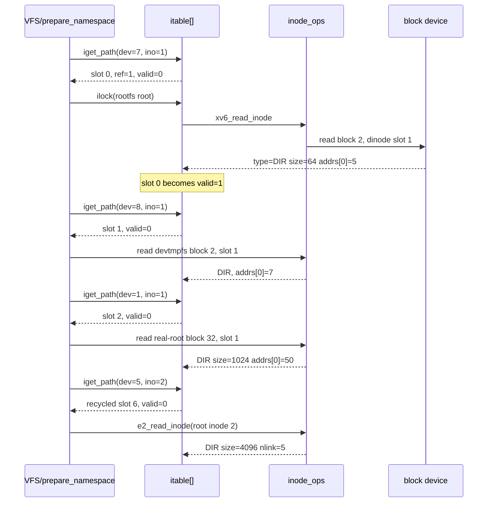
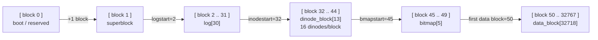
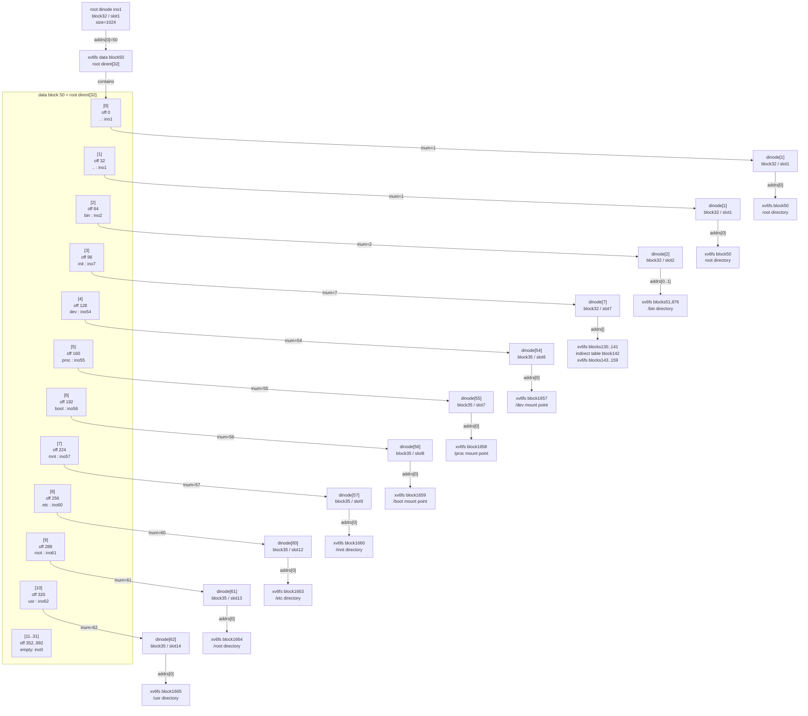
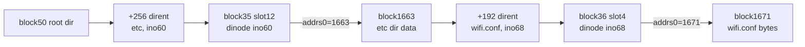
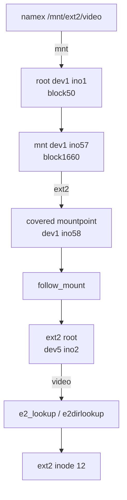

# xv6 AArch64 VFS 中间层

> **现状说明（统一 VFS）**：VFS 已改成 Linux 式的统一结构——每个文件系统一张
> `inode_ops` 函数表、一个 `super_block`、一张挂载表、一条路径解析。下面
> “统一 VFS” 一节描述当前设计；其后标注为 *[历史]* 的小节（路径前缀挂载表、
> `vnode_ops`、`FD_VNODE`、`findmount()`、`fs_native_covers()`、`mount_ext2_root()`）
> 记录的是第一版实现，代码里已经删除，保留下来说明演进过程。书中对应章节：
> 第 6.6 节（命名空间引导）、第 6.7 节（VFS 中间层）、第 9 章（ext2 接入 VFS）。

## 统一 VFS（当前设计）

### 为什么要改

第一版 VFS 在原生路径解析外面再包一层：`vfs.c` 有一张路径前缀挂载表，
`sys_open()` 先 `findmount()` 做最长前缀匹配，命中就交给按路径的 `vnode_ops`，
得到 `FD_VNODE`；不命中才走 `namei()`。结果是两张挂载表（`vfs.c` 的路径前缀表、
`fs.c` 的 inode 层挂载表）、两种打开文件、两条路径解析。ext2 的目录不是 xv6 inode，
进不了 `fs.c` 的挂载表，于是 ext2 当根时不能 MS_MOVE、不能 chroot，只能
`mount_ext2_root()` 直接挂 `/`，再靠 `fs_native_covers()` 让 `/dev` 绕过 ext2。

### 与 Linux 的对应

| xv6 | 作用 | Linux |
|---|---|---|
| `struct super_block`（`supers[NSUPER]`，按 dev 索引） | 文件系统实例：类型、函数表、根 inode 号、只读、是否走日志、是否按路径 | `struct super_block` |
| `struct inode_ops` | 每种文件系统一张函数表 | `inode_operations` + `file_operations` |
| `struct inode`（`itable`，增加 `iop`、`path`、`fsdata`，`size` 为 64 位） | 内存中的文件对象 | `struct inode` |
| `struct fsmount`（`fs.c` 的 `mtab`） | 唯一的挂载表 | `struct mount` |
| `namex()` → `ip->iop->lookup()` | 逐级解析路径 | `link_path_walk()` → `->lookup` |
| `pathfs_iops`（`vfs.c`） | 按路径工作的小文件系统的通用实现 | `simple_*` / libfs |

没有 dentry 缓存；读写操作和目录操作放在同一张表里。

### 核心结构（kernel/vfs.h）

```c
struct inode_ops {
  int  (*read_inode)(struct inode*);          // ilock() 首次加锁时
  void (*evict)(struct inode*);               // iput() 最后一个引用时
  struct inode *(*lookup)(struct inode *dp, char *name);   // dp 已加锁
  struct inode *(*create)(struct inode *dp, char *name, short type, short major, short minor);
                                              // 消耗 dp 的引用，返回加锁的 inode
  int  (*unlink)(struct inode*, char*);       // 目录不加锁传入
  int  (*link)(struct inode*, char*, struct inode*);
  int  (*rename)(struct inode*, char*, struct inode*, char*);
  int  (*read)(struct inode*, int user_dst, uint64 dst, uint64 off, uint n);
  int  (*write)(struct inode*, int user_src, uint64 src, uint64 off, uint n);
  int  (*truncate)(struct inode*, uint64);
  int  (*open)(struct inode*, int omode);     // 可选
  int  (*fsync)(struct inode*);
};

struct super_block { int used; int dev; char type[12]; struct inode_ops *iop;
  uint rootino; int readonly; int logged; int pathbased; void *priv; };
```

### 设备号 = 文件系统实例

| dev | 实例 | 类型 / 函数表 | rootino |
|---|---|---|---|
| 1 | xv6 根分区（ROOTDEV） | xv6fs / `xv6_iops`，logged | 1 |
| 7 | rootfs（ram0） | xv6fs / `xv6_iops` | 1 |
| 8 | devtmpfs（ram1） | xv6fs / `xv6_iops` | 1 |
| 3–6 | mmcblk0p1–p4 上的 ext2（通常 p3 = 5） | ext2 / `ext2_iops` | 2 |
| 20 | `PROCFS_DEV` | procfs / `pathfs_iops`，只读 | hash("/") |
| 21 | `FATFS_DEV` | fat32 / `pathfs_iops` | hash("/") |
| 22 | `NETFS_DEV` | netfs / `pathfs_iops`，只读 | hash("/") |

登记者：`fs_readsuper()`（xv6fs）、`ext2_register_super(dev, ro)`（ext2）、`vfsmount()`（按路径的文件系统）。

### inode 缓存的三个钩子（fs.c）

- `iget_path(dev, inum, path)` / `iget(dev, inum)`：设 `ip->iop = getsuper(dev)->iop`；按路径的文件系统还比较 `ip->path`，哈希冲突不会认错对象。
- `ilock()`：`valid==0` 时调用 `iop->read_inode()`；失败（对象已消失）时呈现为空的、已删除的普通文件。
- `iput()`：最后一个引用时调用 `iop->evict()`（xv6fs 释放 nlink==0 的 inode；ext2 释放 `e2.open[]` 引用并回收孤儿）。

### 路径解析与挂载

- `namex()` 每一级调用 `ip->iop->lookup()`，穿越挂载点仍由 `follow_mount()` / `follow_dotdot()` 完成。
- `isfsroot(ip)` 比较 `ip->inum == getsuper(ip->dev)->rootino`；`fs_dev_root(dev) = iget_path(dev, rootino, "/")`。
- 只有一张挂载表：`prepare_namespace()` 的根、devtmpfs 与 `/etc/fstab` 里的 procfs、FAT32、ext2 都是 `fs_mount()` 登记的一项。同一个 dev 不能挂两次。
- `/proc/mounts` 就是 `fs_mounts_format()`，`ro`/`rw` 取自 `super_block`。

示例（inode 号示意）：

```text
namei("/mnt/ext2/d/a.txt")
  (dev 1, ino 1) -xv6_lookup-> mnt -> ext2 (dev 1, ino 26)
  follow_mount -> (dev 5, ino 2) -e2_lookup-> d -> a.txt
namei("/proc/1/status")
  (dev 1) proc -> follow_mount -> (dev 20, hash "/") -pfs_lookup-> "/1" -> "/1/status"
```

### 三类实现

- **xv6fs `xv6_iops`**（fs.c）：`xv6_lookup`=dirlookup，`xv6_create`（原 `create()` 主体），`xv6_unlink`、`xv6_link`，
  `xv6_rename`（新增：只支持普通文件、同一事务内加新名再清旧项、目标已存在则拒绝），`xv6_read/write`（readi/writei + 4 GiB 检查），
  `xv6_truncate`（只支持截到 0），`xv6_fsync`（`sdflush()`）。
- **ext2 `ext2_iops`**（ext2.c）：`e2_read_inode` 在 `e2.open[]` 占一个引用，`e2_evict` 调 `ext2release()`（孤儿此时回收）；
  `e2_lookup/create/unlink/rename/read/write/truncate/fsync`。原按路径代码拆成 `create_core/mkdir_core/unlink_core/rename_core/readdir_core`，
  路径外壳只留给 `ext2read`/`ext2readdir` 旧系统调用。锁顺序：inode 锁 → `e2.lock`（`e2_create` 放掉 `e2.lock` 后再刷新父目录）。
  不支持设备节点和硬链接。
- **按路径 `pathfs_iops`**（vfs.c）：`ip->path` 记对象路径，inum = 31 位 FNV 哈希（非 0）；`pathjoin()` 处理 `.`/`..`；
  后端表 `fat32_pops`、`proc_pops`、`netfs_pops`。FAT32 只能追加：`pfs_open()` 要求写打开时文件长度为 0（新建或已 `O_TRUNC`），
  用 `fat32openwrite()` 取得写句柄存进 `ip->fsdata`。

### 系统调用层

- 只有 `FD_INODE`；`FD_VNODE`、`vnode`、`vfsopen/vfsread/vfsstat/...` 全部删除。
- `fileread`/`filepread`/`exec` 的 `srcread` → `iop->read`；`struct execsrc` 只剩 `ip`。
- 写：`inode_write()`——`sb->logged`（xv6fs）每批几块一个日志事务，其他文件系统整段交给 `iop->write`。
- `sys_open()`：普通文件先查只读，`O_TRUNC` → `iop->truncate(ip,0)`，再调用可选的 `iop->open`。
- 目录：非 xv6 目录经 `vfs_dir_read()` 合成 xv6 `struct dirent` 流（名字截断到 14 字符显示）。
- `fs_create/fs_unlink/fs_link/fs_rename`：检查可写与操作是否存在；`link`/`rename` 跨设备拒绝；`unlink`/`rename` 遇挂载点拒绝（EBUSY）。
- `sys_chdir()`：只剩 `namei()` → 检查目录 → 换 `p->cwd`、更新 `cwdpath`。`abspath()` 保留。
- 路径分量上限 `NAMEMAX` = 128（`param.h`），xv6fs 磁盘上仍是 14 字符。

### `inode_operations` 与 `file_operations`：当前实现和 Linux 的关系

Linux 把“目录名字如何变成 inode”和“打开后如何操作 file”分成两层：

```text
pathname -> dentry -> inode->i_op              lookup/create/unlink/rename
open     -> struct file->f_op                  read/write/mmap/fsync/release
```

`inode_operations` 属于 inode，描述目录和元数据操作；`file_operations` 属于一次
`open()` 产生的 open-file-description，可以保存独立偏移和 `private_data`。多个 fd 经
`dup()` 可以引用同一 `struct file`，而多个独立 `open()` 可以引用同一 inode、拥有不同
file 状态。

当前 xv6 普通文件还处在过渡状态：`struct inode_ops` 同时包含
`lookup/create/unlink/rename` 和 `read/write/truncate/fsync`，`struct file` 保存 inode 与
偏移，`fileread/filewrite` 直接调用 `f->ip->iop->read/write`。字符设备和块设备已经有
独立的 `kernel/device.h:struct file_operations`，`sys_open()` 建立 `FD_DEVICE` 后由
`chrdev_open/read/write/release` 分派，驱动可使用 `f->private_data`。因此启动跟踪会明确打印：

```text
dispatch=inode_ops(read/write)   普通文件、目录
dispatch=file_operations        /dev 下的设备文件
```

下一步完全按 Linux 拆分时，应给普通 inode 增加默认 `i_fop`，在 `sys_open()` 时复制到
`file->f_op`；届时目录操作仍走 `i_op`，已打开文件的数据操作只走 `f_op`。

### 从 MBR、superblock、根 inode 到文件读写的完整链路

当前没有真正的 `struct dentry` 或 dentry cache。“根 dentry 加载”在本实现中对应的是：
`fsmount.mp` 保存被覆盖目录 inode，`super_block.rootino` 标识被挂载文件系统的根，
`fs_dev_root()` 用 `(dev, rootino)` 从 inode cache 取得根 inode。日志因此使用
`dentry-like`，避免误认为已经存在 Linux dentry 对象。

```text
main
  -> sd_driver_init
  -> rootdev_init
       -> sdsector(0)                         读取 MBR
       -> 解析四个 16-byte primary entries
       -> blkdev_register(mmcblk0pN)          分区成为块设备
       -> setup_raw_root
            读取 partition_start + 2 扇区    xv6fs block 1
            检查 FSMAGIC/FSSIZE
       -> blkdev_register(ROOTDEV, "root")

first process: prepare_namespace
  -> 建立临时 ram0 rootfs
  -> mount_root("/dev/root", "/root")
       -> fsinit(ROOTDEV)
            -> fs_readsuper
                 bread(dev, 1)                buffer cache 读取 superblock
                 sbs[dev] = on-disk superblock
                 fs_super_register(... xv6_iops, ROOTINO=1)
            -> initlog                         日志恢复
       -> fs_mount
            mtab: covered /root inode -> (dev, rootino)
  -> kchdir("/root")
  -> devtmpfs mount
  -> fs_move_mount("/root", "/")
  -> fs_set_root                              实盘根成为命名空间 /

open("/etc/fstab")
  -> sys_open
  -> namei/namex
       rootdir() -> fs_root
       ip->iop->lookup("etc")
       ip->iop->lookup("fstab")
  -> ilock
       valid == 0 -> ip->iop->read_inode
  -> filealloc + fdalloc
       file->ip = inode
       file->off = 0

read(fd)
  -> sys_read
  -> fileread
  -> inode sleeplock
  -> inode_ops.read(ip, off)
       xv6fs: xv6_read -> readi -> bmap -> bread -> blk_rw -> sdsector
       ext2:  e2_read  -> ext2readino -> ext2 block mapping -> sdsector
  -> file->off += bytes

write(fd)
  -> sys_write
  -> filewrite -> inode_write
  -> begin_op/end_op（仅 super_block.logged，例如 xv6fs）
  -> inode_ops.write
       xv6fs: writei -> bmap/balloc -> log_write -> commit -> sdflush
       ext2:  ext2writeino -> ordered data write + xjournal metadata commit
```

### `FS_TRACE`：超级块、inode cache 和路径查找完整跟踪

文件系统教学日志由一个编译参数统一控制，默认关闭：

```sh
# 正常内核，不包含热路径日志
make FS_TRACE=0

# 调试内核；修改参数后应 clean，避免复用另一组 CFLAGS 生成的 .o
make clean
make FS_TRACE=1
```

`FS_TRACE=1` 会输出 `fs-trace:` 前缀。它会显著增加串口输出并改变时序，只应在分析
文件系统时启用。camera、Wi-Fi 等设备数据本身不属于这组日志。

加载 xv6fs 磁盘超级块时逐项打印：

| 字段 | 含义 |
|---|---|
| `magic` | 格式标识，必须等于 `FSMAGIC` |
| `size` | 文件系统总块数，包含元数据和数据区 |
| `nblocks` | 可用于文件内容的数据块数量 |
| `ninodes` | 磁盘 inode 容量 |
| `nlog` | 日志区域块数 |
| `logstart` | 日志区域首块 |
| `inodestart` | 磁盘 inode 表首块 |
| `bmapstart` | 空闲块位图首块 |

随后 `register_super` 打印内存 `struct super_block` 的每个成员：`used/dev/type/iop/rootino`、
`readonly/logged/pathbased/priv`。前者是 xv6fs 的磁盘布局，后者是统一 VFS 挂载实例，
两者不是同一个对象。

根 inode 第一次由 `iget_path()` 放入 `itable[]` 时只有身份字段：`dev/ino/ref=1/valid=0/iop`。
第一次 `ilock()` 才执行 `iop->read_inode()`，随后打印完整内存 inode：

- 通用字段 `dev/ino/ref/valid/iop/path/type/major/minor/nlink/size`；
- `addrs[0..11]`：xv6fs 的 12 个直接数据块入口；
- `addrs[12]`：xv6fs 的一级间接块入口；
- `fsdata[0..3]`：统一 inode 留给具体文件系统的私有缓存字段。

ext2/FAT32 等后端不把磁盘块树放进 xv6fs 的 `addrs[]`，因此这些后端的 `addrs[]` 为零
并不表示文件没有内容；它们通过各自的 inode 实现和 `fsdata[]` 查找数据。

执行 `ls /` 时，日志可以按下面的因果链阅读：

```text
user ls("/")
  -> open("/")
     -> namei                         公共路径查找入口
        -> namex                      选择绝对路径的 namespace root
           -> rootdir                 fs_root 增加引用
           -> skipelem                "/" 没有子分量，直接返回 root inode
     -> ilock                         命中/装入 inode 元数据
     -> sys_open                      建立 file 和 fd，off=0
  -> fstat(fd)                        读取根 inode 的 type/ino/size
  -> read(fd, struct dirent) 循环
     -> fileread
        -> inode_ops->read             xv6fs 根目录被当作 dirent 文件读取
  -> 对每个 dirent 调用 stat("/<name>")
     -> namei -> namex -> skipelem
     -> inode_ops->lookup
        -> dirlookup                   从根目录 offset=0 开始扫描 dirent
           -> readi                    读取目录数据块
           -> iget                     命中时增加 ref；未命中时占用 itable 槽
     -> ilock -> read_inode             首次访问该子 inode 时加载磁盘元数据
     -> stati                           返回给用户 ls
```

对应的关键日志含义：

- `namei/namex begin`：一次完整路径解析开始；
- `rootdir`：绝对路径从当前命名空间根开始，而不是通过名为 `/` 的磁盘目录项查找；
- `skipelem`：切出一个路径分量，并显示剩余字符串；
- `dispatch lookup through inode_ops`：按当前目录所属文件系统选择 lookup 实现；
- `dirlookup: dirent`：xv6fs 逐个检查磁盘目录项；
- `iget_path: cache hit/miss`：查找或建立内存 inode 外壳；
- `ilock: metadata cache hit/miss`：判断是否需要从磁盘装入 inode 内容；
- `follow_mount/follow_dotdot`：跨入挂载文件系统，或从挂载根处理 `..`；
- `sys_open`：路径 inode 转成进程 fd；
- `file_read/file_write`：显示 inode 操作表读写的偏移、请求量和结果。

因为 `ls` 会对目录中的每一项再次执行 `stat()`，所以一次 `ls /` 会看到多轮
`namei → namex → lookup → dirlookup → iget → ilock`，这是预期行为，不是重复查找故障。

#### 一次 RPi3 启动日志的实际对象关系

这次 `FS_TRACE=1` 日志中出现了七个文件系统实例。`dev` 是内核块设备/伪设备号，
不是 SD 卡分区号本身：

| dev | 文件系统 | 命名空间位置 | 磁盘格式 superblock | 内存 VFS superblock |
|---:|---|---|---|---|
| 7 | 临时 rootfs（xv6fs） | 切换根之前的 `/` | RAM 块设备中的 xv6 superblock：`size=32, nblocks=27, ninodes=16, inodestart=2, bmapstart=4` | `rootino=1, logged=1, pathbased=0` |
| 8 | devtmpfs（xv6fs） | `/dev` | RAM 块设备中的 xv6 superblock：`size=64, nblocks=57, ninodes=48, inodestart=2, bmapstart=6` | `rootino=1, logged=1, pathbased=0` |
| 1 | 实际 xv6fs 根 | 最终 `/`，来自 `mmcblk0p2` | `magic=0x10203040, size=32768, nblocks=32718, ninodes=200, nlog=30, logstart=2, inodestart=32, bmapstart=45` | `rootino=1, logged=1, pathbased=0` |
| 20 | procfs | `/proc` | 无磁盘 superblock | `rootino=pathhash("/")=705468254, readonly=1, pathbased=1` |
| 21 | FAT32 | `/boot` | FAT32 BPB/FSInfo；本段 trace 没有重复打印 BPB 数值 | `rootino=pathhash("/")=705468254, readonly=0, pathbased=1` |
| 5 | ext2 | `/mnt/ext2`，对应 ext2 分区块设备 | 分区偏移 1024 字节处的 ext2 superblock | `rootino=2, readonly=0, pathbased=0` |
| 22 | netfs | `/mnt/net` | 无本地磁盘 superblock | `rootino=pathhash("/")=705468254, readonly=1, pathbased=1` |

```mermaid
flowchart TB
  SD[SD card / mmcblk0]
  P1[p1 FAT32 bootfs]
  P2[p2 raw xv6fs]
  P3[p3 ext2]
  R7[dev 7 temporary rootfs in RAM]
  R8[dev 8 devtmpfs in RAM]
  SB1[dev 1 VFS super_block\nxv6fs rootino 1]
  SB5[dev 5 VFS super_block\next2 rootino 2]
  SB20[dev 20 procfs\npath-based]
  SB21[dev 21 FAT32\npath-based]
  SB22[dev 22 netfs\npath-based]

  SD --> P1 --> SB21
  SD --> P2 --> SB1
  SD --> P3 --> SB5
  R7 -->|early namespace root| OLDROOT[/root mount cover]
  SB1 -->|move mount| ROOT[final /]
  R8 --> DEV[/dev]
  SB20 --> PROC[/proc]
  SB21 --> BOOT[/boot]
  SB5 --> EXT[/mnt/ext2]
  SB22 --> NET[/mnt/net]
```

这里有两种“超级块”，必须区分：磁盘 superblock/BPB 描述某种文件系统自己的
磁盘布局；`struct super_block` 是 VFS 的统一内存对象，保存 `dev/type/iop/rootino` 和
挂载属性。procfs/netfs 没有前者，但仍然有后者。

日志中的 `itable` 填充顺序为：



`itable[n]` 不是 inode 的固定位置。当前实现更接近“正在使用的 inode 表”：当
`ref` 变成 0，该槽可以马上被另一个 `(dev, ino)` 复用。因此日志里 dev 8 root 多次在
`itable[1]` 重新加载是正常的回收结果，并不表示磁盘上存在多个 root inode。

这次日志还暴露了一个诊断问题：ext2 root 使用的 `itable[6]` 以前装过 xv6fs inode 57，
所以曾打印出 `addrs[0]=1660`。`e2_read_inode()` 并不使用公共 `addrs[]`，该数值是回收槽
遗留值，不是 ext2 root 的真实块指针。现在 `iget_path()` 复用槽时会清零公共元数据、
`addrs[]` 和 `fsdata[]`；sleeplock 保持不动，因为它只在 `iinit()` 初始化一次。

#### 路径名如何落到具体磁盘位置

xv6fs 的计算规则是：

```text
磁盘 inode 所在块 = inodestart + inum / IPB
块内 dinode 槽位 = inum % IPB
IPB = 1024 / sizeof(struct dinode) = 16

文件逻辑块 0..11 -> inode.addrs[0..11]
文件逻辑块 12 以后 -> addrs[12] 指向的一级间接块

SD 物理扇区 = 分区起始 LBA + xv6fs块号 * (1024 / 512)
              = p2_start + xv6fs块号 * 2
```

日志没有包含本次 SD 卡 `p2_start` 的数值，所以不能从这份文本安全地写死最终 LBA；
但块号和上面的换算关系已经完整。例如 root 目录数据块 50 位于
`p2_start + 100` 与 `p2_start + 101` 两个 512 字节扇区。

```mermaid
flowchart LR
  PATH[/etc/wifi.conf]
  RINO[root inode 1\ndinode block 32 slot 1]
  RDATA[root directory\ndata block 50]
  ETCENT[dirent offset 256\netc -> inode 60]
  ETCINO[inode 60\ndinode block 35 slot 12]
  ETCDATA[etc directory\ndata block 1663]
  WENT[dirent offset 192\nwifi.conf -> inode 68]
  WINO[inode 68\ndinode block 36 slot 4]
  WDATA[file data block 1671\n33 bytes]

  PATH --> RINO --> RDATA --> ETCENT --> ETCINO --> ETCDATA --> WENT --> WINO --> WDATA
```

几个日志中已经能完全还原的例子：

| 路径 | 目录项查找 | inode 磁盘位置 | 文件数据块 |
|---|---|---|---|
| `/etc/fstab` | root block 50: `etc`@256→ino60；block 1663: `fstab`@160→ino67 | ino60=`block35/slot12`；ino67=`block36/slot3` | 1670 |
| `/etc/wifi.conf` | root block 50: `etc`@256→ino60；block 1663: `wifi.conf`@192→ino68 | ino68=`block36/slot4` | 1671 |
| `/bin/login` | root block 50: `bin`@64→ino2；bin block 51: `login`@288→ino10 | ino2=`block32/slot2`；ino10=`block32/slot10` | 199、200、201、202… |
| `/bin/wifi` | root block 50: `bin`@64→ino2；bin block 51: `wifi`@768→ino25 | ino25=`block33/slot9` | 533、534、535、536… |
| `/mnt/ext2/video` | root `mnt`@224→ino57；block1660 `ext2`@64→ino58；随后穿越 mount | xv6 mountpoint ino58=`block35/slot10`；ext2 root=ino2；目标创建为 ext2 ino12 | 由 ext2 group descriptor、inode table 和 `i_block[15]` 计算，不使用 xv6 `bmap()` |

#### 按日志中的三个 xv6fs 根实例分开表示

日志中有三个使用 xv6fs 磁盘格式的根 inode。它们不是三个同时可见的 `/`：dev7 是
启动早期的临时 rootfs，dev8 是稍后挂到 `/dev` 的 devtmpfs，dev1 才是最后移动到 `/`
的 SD 卡 xv6fs。下面分别画出它们，避免把不同设备上相同的 `ino=1` 混在一起。

注意，log、inode table、bitmap 和 data 并不是“装在 superblock 里面”；superblock
保存这些区域的起点和容量，下面的数组方格表示它所描述的同一块设备地址空间。

##### 1. dev7：临时 rootfs（ram0）

| superblock 字段 | 值 |
|---|---:|
| `magic` | `0x10203040` |
| `size / nblocks / ninodes` | `32 / 27 / 16` |
| `nlog / logstart` | `0 / 2` |
| `inodestart / bmapstart` | `2 / 4` |
| VFS root | `rootino=1, logged=1, pathbased=0` |

```text
dev7 / ram0 block[]
┌─────────┬─────────┬─────────────────┬───────────┬────────────────┐
│ block 0 │ block 1 │   block 2..3    │  block 4  │  block 5..31  │
│  boot   │  super  │ inode_table[2]  │ bitmap[1] │    data[27]    │
└─────────┴────┬────┴────────┬────────┴───────────┴────────┬───────┘
               │             │                             │
               │             ├─ block2/slot1: root ino1 ───┼─ addrs[0]=5 ─→ block5: / dirent[]
               │             ├─ block2/slot2: dev  ino2 ───┼─ addrs[0]=6 ─→ block6: /dev dirent[]
               │             ├─ block2/slot3: console ino3 │                 T_DEVICE, no data
               │             ├─ block2/slot4: /root ino4 ──┼─ addrs[0]=7 ─→ block7: /root mountpoint
               │             └─ block2/slot5: /dev/root ino5                 T_DEVICE, no data
               │                                           └─ data[] 从 block5 开始
               ├─ rootino=1 ─→ block2/slot1
               └─ nlog=0；logstart=2 不占用额外磁盘块

物理块号从左向右递增 →

nlog=0：不存在位于 block1 与 block2 之间的日志块；logstart=2 只是空日志区的起点值。
```

dev7 只在启动早期作为临时 `/`。最终根挂载完成且 devtmpfs 覆盖 `/dev` 后，用户看到的
`/dev/console` 已经位于下面的 dev8，而不是 dev7 的 block6。完整路径只在 dev8 小节画
一次，避免把启动早期节点和最终可见节点混在同一张图里。

##### 2. dev8：devtmpfs（ram1，挂载为 `/dev`）

| superblock 字段 | 值 |
|---|---:|
| `magic` | `0x10203040` |
| `size / nblocks / ninodes` | `64 / 57 / 48` |
| `nlog / logstart` | `0 / 2` |
| `inodestart / bmapstart` | `2 / 6` |
| VFS root | `rootino=1, logged=1, pathbased=0` |

```text
dev8 / ram1 block[]
┌─────────┬─────────┬─────────────────┬───────────┬────────────────┐
│ block 0 │ block 1 │   block 2..5    │  block 6  │  block 7..63  │
│  boot   │  super  │ inode_table[4]  │ bitmap[1] │    data[57]    │
└─────────┴────┬────┴────────┬────────┴───────────┴────────┬───────┘
               │             │                             │
               │             ├─ block2/slot1: root  ino1 ──┼─ addrs[0]=7 ─→ block7: /dev dirent[]
               │             ├─ block2/slot5: input ino5 ──┼─ addrs[0]=8 ─→ block8: /dev/input dirent[]
               │             └─ block2/slot6: event0 ino6  │                 T_DEVICE, no data
               │                                           └─ data[] 从 block7 开始
               ├─ rootino=1 ─→ block2/slot1
               └─ nlog=0；logstart=2 不占用额外磁盘块

物理块号从左向右递增 →

nlog=0：不存在独立日志块；block2 立即就是 inode table 的第一个块。
```

dev8 的根 inode 是 `block2/slot1`，`addrs[0]=7`。下面只用一张图画当前系统执行
`open("/dev/console")` 时，从最终根文件系统、挂载点、目录项和 inode 一直到驱动的
完整链路。图中的 “dentry-like” 是磁盘 `struct dirent` 加路径解析中的临时名字关系；
当前 xv6 **没有 Linux 的 `struct dentry` 和 dentry cache**。

```mermaid
flowchart LR
  PATH["open(/dev/console)"]

  subgraph DEV1["dev1：最终 xv6fs 根"]
    direction TB
    SB1["super_block<br/>rootino=1"]
    I1["inode table<br/>block32 / slot1<br/>root ino1, addrs[0]=50"]
    B50["data block50：/ dirent[]<br/>[4] off128<br/>dev : ino54"]
    I54["inode table<br/>block35 / slot6<br/>/dev ino54, addrs[0]=1657"]
    B1657["data block1657<br/>原 /dev 目录 / mountpoint"]
    SB1 -->|"rootino"| I1
    I1 -->|"addrs[0]"| B50
    B50 -->|"dirent[4].inum=54<br/>dentry-like: dev → inode54"| I54
    I54 -->|"addrs[0]"| B1657
  end

  subgraph MOUNT["VFS mount table"]
    FM["follow_mount()<br/>covered=(dev1,ino54)<br/>mounted=(dev8,rootino1)"]
  end

  subgraph DEV8["dev8：挂载到 /dev 的 devtmpfs"]
    direction TB
    SB8["super_block<br/>rootino=1"]
    DI1["inode table<br/>block2 / slot1<br/>root ino1, addrs[0]=7"]
    B7["data block7：/dev dirent[]<br/>[2] off64<br/>console : ino2"]
    DI2["inode table<br/>block2 / slot2<br/>console ino2, T_DEVICE<br/>major=1 minor=0"]
    NODATA["没有普通文件 data block<br/>设备 inode 不使用 addrs[] 保存内容"]
    SB8 -->|"rootino"| DI1
    DI1 -->|"addrs[0]"| B7
    B7 -->|"dirent[2].inum=2<br/>dentry-like: console → inode2"| DI2
    DI2 -.-> NODATA
  end

  subgraph DRIVER["字符设备数据路径"]
    direction TB
    OPEN["sys_open<br/>FD_DEVICE, major=1"]
    FOPS["register_chrdev(CONSOLE)<br/>file_operations"]
    RW["consoleread / consolewrite"]
    UART["Mini UART + console input queue<br/>真正的字符数据"]
    OPEN --> FOPS --> RW --> UART
  end

  PATH --> SB1
  B1657 --> FM --> SB8
  DI2 -->|"设备分派"| OPEN
```



这里目录的 data block 是 block50、block1657 和 block7；最后的 console inode 本身
没有文件数据块。对 `/dev/console` 的 `read/write` 不会通过 `bmap()` 读取磁盘，而是
根据 `major=1` 找到 `register_chrdev()` 注册的 `file_operations`，再进入
`consoleread()` / `consolewrite()`。

block7 中其余非空根目录项仍然按 32 字节连续排列；它们都是设备 inode，因而没有
文件数据块：

| block7 索引 / 偏移 | 目录项 | inode 磁盘位置 |
|---|---|---|
| `[2] / 64` | `console : ino2` | block2 / slot2 |
| `[3] / 96` | `tty : ino3` | block2 / slot3 |
| `[4] / 128` | `ttyS0 : ino4` | block2 / slot4 |
| `[6] / 192` | `video0 : ino7` | block2 / slot7 |
| `[7] / 224` | `sdroot : ino8` | block2 / slot8 |
| `[8] / 256` | `mmcblk0 : ino9` | block2 / slot9 |
| `[9] / 288` | `mmcblk0p1 : ino10` | block2 / slot10 |
| `[10] / 320` | `mmcblk0p2 : ino11` | block2 / slot11 |
| `[11] / 352` | `mmcblk0p3 : ino12` | block2 / slot12 |
| `[12] / 384` | `ram0 : ino13` | block2 / slot13 |
| `[13] / 416` | `ram1 : ino14` | block2 / slot14 |

`ram1` 是最后创建的节点，所以现有日志先显示查找 `ram1` 失败、分配 ino14；创建完成后
它位于下一个 32 字节槽 `off416`。日志打印的 `devtmpfs: initialized on ram1, 12 nodes`
按注册设备名计数，其中 `input/event0` 虽然创建一个目录和一个设备 inode，仍算一个设备名。

##### 3. dev1：`itable[2] = (dev=1, ino=1)` 对应的最终 xv6fs 根

日志里的 `itable[2]` 只是这一次启动中选中的**内存 inode cache 槽位**。真正稳定的身份是
`(dev=1, ino=1)`：`dev=1` 是 raw xv6 根块设备，`ino=1` 是该文件系统的 root inode。
它们经过下面三层对象才最终落到目录内容：

```mermaid
flowchart LR
  SB[block 1\nxv6fs disk superblock]
  DIN[block 32, slot 1\non-disk dinode ino 1]
  IC[itable slot 2\nin-memory inode cache]
  DB[block 50\nroot directory data]
  DE[32-byte dirent stream\ninum + name]

  SB -->|inodestart=32, IPB=16| DIN
  DIN -->|ilock/read_inode copies metadata| IC
  IC -->|addrs[0]=50| DB
  DB --> DE
```

磁盘 superblock 的值可以还原出整个 xv6fs 布局：

| 字段 | 本次值 | 含义和推导 |
|---|---:|---|
| `magic` | `0x10203040` | xv6fs 格式标识；不匹配就不能按 xv6fs 挂载 |
| `size` | 32768 | 文件系统共 32768 个 1 KiB 块，即 32 MiB |
| `nblocks` | 32718 | 可供文件内容使用的数据块数 |
| `ninodes` | 200 | 最多 200 个磁盘 inode |
| `nlog` / `logstart` | 30 / 2 | block 2..31 是日志区 |
| `inodestart` | 32 | inode table 从 block 32 开始；每块 16 个 `dinode` |
| `bmapstart` | 45 | block 45..49 是块分配 bitmap |

因此实际布局是：

```text
block 0       boot/reserved
block 1       superblock
block 2..31   log（30 blocks）
block 32..44  inode table（13 blocks，16 dinodes/block）
block 45..49  allocation bitmap
block 50..    data blocks；block 50 恰好是根目录的第一个数据块
```

下面用数组方格表示分区内的块号。箭头表示磁盘地址递增，不表示文件内容引用；
从 inode 到 data block 的引用关系在下一张图中单独表示：



```text
xv6fs block[]
┌─────────┬─────────┬────────────────┬──────────────────┬────────────────┬─────────────────────┐
│    0    │    1    │     2..31      │      32..44      │     45..49     │      50..32767      │
│  boot   │  super  │    log[30]     │ inode_table[13]  │   bitmap[5]    │ data_block[32718]   │
└────┬────┴────┬────┴───────┬────────┴────────┬─────────┴───────┬────────┴──────────┬──────────┘
     └─────────┴────────────┴─────────────────┴─────────────────┴───────────────────┘
                                  物理块号递增 →
```

root dinode 的日志值是 `type=T_DIR, nlink=8, size=1024, addrs[0]=50`。`size=1024`
表示根目录是一个完整的 1 KiB 目录文件，共可容纳 `1024/32=32` 个目录槽；日志中只有
前 11 个槽非空，其余槽的 `inum=0`。每个目录项本身只保存 `ushort inum + char name[30]`，
它并不直接保存目标数据块号；必须再用 `inum` 到 inode table 读取目标 `dinode`。

下表把本次运行日志中的每个非空根目录项都展开到实际 xv6fs 块。`dirent` 一栏的偏移
是 block 50 内的字节偏移；`dinode` 一栏是目标 inode 的磁盘位置；最后一栏是目标对象
自己的数据块。`dev/proc/boot` 后续会被其它文件系统覆盖，但表中仍列出它们作为 xv6fs
mount point 时占用的原始块。

| 根目录名 | dirent 位置 | 目标 inode | dinode 位置 | xv6fs 数据块 |
|---|---:|---:|---|---|
| `.` | block50 + 0 | 1 | block32 / slot1 | block50（仍是根目录） |
| `..` | block50 + 32 | 1 | block32 / slot1 | block50；根的父仍指向自身 |
| `bin` | block50 + 64 | 2 | block32 / slot2 | block51、876（`/bin` 目录流） |
| `init` | block50 + 96 | 7 | block32 / slot7 | direct block130..141；block142 是一级间接表，指向 block143..159 |
| `dev` | block50 + 128 | 54 | block35 / slot6 | block1657；随后被 devtmpfs 的 dev8/ino1 覆盖 |
| `proc` | block50 + 160 | 55 | block35 / slot7 | block1658；随后被 procfs 覆盖 |
| `boot` | block50 + 192 | 56 | block35 / slot8 | block1659；随后被 FAT32 bootfs 覆盖 |
| `mnt` | block50 + 224 | 57 | block35 / slot9 | block1660，内含 `ext2→ino58`、`net→ino59` |
| `etc` | block50 + 256 | 60 | block35 / slot12 | block1663 |
| `root` | block50 + 288 | 61 | block35 / slot13 | block1664 |
| `usr` | block50 + 320 | 62 | block35 / slot14 | block1665，内含 `bin→ino63` |

根目录 block50 本身又是一个 `dirent[32]` 数组。下面每个上层方格是一个 32 字节
目录项，纵向箭头依次表示“目录项取得 inode 号 → inode table 取得 `addrs[]` → 找到数据块”：



把数组下标写成公式就是：

```text
root_dirent[i] 的位置 = block 50 * 1024 + i * 32
root_dirent[i].inum   = 目标 inode 号
inode_block           = 32 + inum / 16
inode_slot            = inum % 16
target_data_block     = dinode[inode_slot].addrs[0..12]
```

这里 block1657..1665 的顺序来自启动时的实际创建顺序：内核先为 devtmpfs 建立 `/dev`
mount point；随后 `init` 依次建立 `/proc`、`/boot`、`/mnt`、`/mnt/ext2`、`/mnt/net`、
`/etc`、`/root`、`/usr`、`/usr/bin`。因此 inode 58/59 和 data block1661/1662 属于
`/mnt/ext2`、`/mnt/net`，inode 63 和 block1666 属于 `/usr/bin`，它们不是根目录的直接项。

以当前分区文档中的 `p2_start=208896` 为例，xv6 block 与 SD 物理扇区的关系是：

```text
first_sector(block) = 208896 + block * 2
partition_byte      = block * 1024
absolute_byte       = 208896 * 512 + block * 1024
```

所以 root dinode 所在 block32 对应 LBA 208960..208961；root dir block50 对应
LBA 208996..208997。目录项 `etc` 的绝对位置是 block50 起点再加 256 字节，即
`partition + 51456` 字节。读取到 `ino=60` 后，再定位 block35/slot12：该 dinode 位于
分区内 `35*1024 + 12*64 = 36608` 字节；它的 `addrs[0]=1663`，所以 `/etc` 目录内容
位于 LBA 212222..212223。



如果使用旧卡布局（例如 p2 从 LBA 1064960 开始），只替换公式里的 `p2_start`；
xv6fs 内部 block32、block50、block1663 等编号不变。也就是说，superblock 和 inode
记录的是**分区内块号**，块设备层才把它加上分区起始 LBA。

##### 4. 其它挂载文件系统的根不能套用 xv6fs 块数组

日志还登记了 procfs、FAT32、ext2 和 netfs 的文件系统根，但只有 dev7/dev8/dev1 使用
上面那种 xv6fs superblock。它们必须分开理解：

| dev | 根 | 自己的存储布局 | 是否有 xv6 log/bitmap/data |
|---:|---|---|---|
| 20 procfs | `rootino=hash("/")` | 运行时动态生成 | 否；没有本地磁盘块 |
| 21 FAT32 | `rootino=hash("/")` | BPB、FAT、cluster data | 否；没有 xv6 inode table/log |
| 5 ext2 | `rootino=2` | ext2 superblock、group descriptor、block bitmap、inode bitmap、inode table、data | 没有 xv6 log；VFS `logged=0`，自定义 xjournal 在 ext2 布局之外处理元数据事务 |
| 22 netfs | `rootino=hash("/")` | 远端服务器对象 | 否；没有本地磁盘块 |


这张 ext2 图只表达区域关系；准确块号必须由 ext2 superblock 的 `block_size`、
`blocks_per_group`、`inodes_per_group` 和各 group descriptor 计算，不能使用 xv6fs 的
`inodestart=32` 或 `bmapstart=45`。

日志里的 `/mnt/ext2/video` 查找跨越两个不同块格式：前半段仍从 dev1 的 xv6fs 块读取
mount point，`follow_mount()` 后才切换到 dev5 的 ext2 inode/block 算法：



其他后端到物理介质的规则不同：FAT32 根据目录项取得首 cluster，再按
`data_lba + (cluster-2)*sectors_per_cluster + sector_in_cluster` 定位；ext2 先用
`(ino-1)/inodes_per_group` 找 block group，从 group descriptor 取 inode-table block，
再通过 inode 的 12 个直接、一级、二级和三级间接入口定位数据块；procfs/netfs 没有
对应的本地 SD 数据块。

### mount(2)

`vfsmount(source, target, fstype, flags)`：先登记 `super_block`（procfs 强制只读；netfs 必须只读；ext2 用起点等于
`e2.part_lba` 的分区块设备号），再 `begin_op` → `namei(target)` → `fs_mount()`。成功打印
`vfs: mounted <type> at <target> read-write|read-only`，失败打印 `vfs: cannot mount <type> at <target> (busy or already mounted)`。
`vfsinit()` 只初始化 netfs，打印 `vfs: one mount table for all filesystems`。

### 根文件系统：xv6fs 与 ext2 走同一条路

```text
prepare_namespace()
  1. rootfs (ram0) 成为 /，建 /dev /dev/console /root
  2. devtmpfs_init() (ram1)
  3. kmknod("/dev/root", BLOCKDEV, rootdev)      rootdev = 1（xv6fs）或 BLKDEV_MMC_PART(n)（ext2）
     mount_root("/dev/root", "/root")
       node_to_blkdev -> dev
       ext2: 核对 blkdev start == ext2_part_lba(); ext2_register_super(dev, 0)
       xv6fs: fsinit(dev)                       （读超级块、恢复日志、登记 super_block）
       fs_mount(/root, dev)
     kchdir("/root"); 新根上没有 dev 就建（ext2 经 e2_create）
     devtmpfs_mount("dev")                      → /root/dev
  4. fs_move_mount(".", "/")  (MS_MOVE);  fs_set_root(cwd)  (chroot)
```

ext2 根启动日志：

```text
VFS: Mounted root (ext2 filesystem) on device 5 (/dev/root = mmcblk0p3).
devtmpfs: mounted
VFS: root moved over rootfs, chroot done; running /init
```

ext2 为根时 fstab 里 `ext2 /mnt/ext2` 一行会失败（同一文件系统不能挂两次），属预期。

### 改动的文件

`kernel/vfs.h`（重写）、`kernel/vfs.c`（重建：pathfs + procfs/FAT32/netfs 后端 + `vfsmount`）、`kernel/fs.c`
（`supers[]`、钩子、`xv6_iops`、通用 `fs_*`、`vfs_dir_read`）、`kernel/ext2.c`（`*_core` + `ext2_iops` + `ext2_register_super`）、
`kernel/file.h`（`struct inode` 新字段，删 `FD_VNODE`）、`kernel/file.c`、`kernel/sysfile.c`、`kernel/exec.c`、
`kernel/do_mounts.c`（`mount_root` 支持两种类型，删 `mount_ext2_root`）、`kernel/defs.h`、`kernel/param.h`（`NAMEMAX`）。

### 测试状态

QEMU 上通过：
- xv6fs 根：`ls /`、`/proc`、`cat /proc/mounts`（单表）、`/mnt/ext2` 上建文件/写/mkdir/rm、xv6fs 上 `mv`。
- ext2 根：`/root` → MS_MOVE → chroot，devtmpfs 挂在 ext2 的 `/dev`（内核建出该目录），`stressfs`；之后 `e2fsck` 干净。

尚未解决 / 未测：
- 新内核跑完整 `usertests`（xv6fs 根）时：`rwsbrk` 报 `open(rwsbrk) failed`（原因未明，可能是回归）；
  `copyout` 报 `open(README) failed`（fs.img 里没有 README，可能本来就失败，未核实）；`forkforkfork` 超过 8 分钟像是挂住。
  需要和旧内核对比确认。（`opentest` 在新旧内核上都失败，属既有问题。）
- FAT32 写入（测试用 bootfs 为空）、netfs 未测；未在真机上验证。

---

*以下为第一版（路径前缀表 + vnode）的设计记录，标注 [历史] 的内容已不在代码中。*

## 目标 [历史]

原来的 ext2 驱动只能通过 `ext2read`、`ext2readdir` 两个专用系统调用访问，普通的
`open/read/fstat/close` 完全不知道 ext2。现在增加 `kernel/vfs.c`，把非原生文件系统包装成
vnode，并在统一文件描述符层分派操作。

当前挂载布局：

```text
/
├── 原生 xv6 inode filesystem    读写
├── /proc                        procfs，只读
└── /mnt/ext2                    ext2，普通文件读写
```

挂载点是内核路径路由，不要求 xv6 根目录中事先创建真实的 `mnt/ext2` inode。

## 数据结构 [历史]

```text
struct file
  ├── FD_INODE  -> struct inode       原生 xv6 filesystem
  ├── FD_DEVICE -> struct inode       设备
  ├── FD_PIPE   -> struct pipe
  └── FD_VNODE  -> struct vnode       VFS filesystem
                         │
                         └── vnode_ops
                              ├── stat
                              ├── read
                              ├── write/create/truncate
                              ├── mkdir/unlink/rename
                              ├── fsync
                              └── readdir
```

`sys_open()` 先调用 `vfsopen()`：

- 路径不属于 VFS mount 时返回 0，继续执行原来的 `namei()`；
- 路径属于 `/mnt/ext2` 且存在时返回 vnode；创建普通文件时由 ext2 backend 分配 inode；
- 路径属于 mount 但操作不受支持时返回错误，不会错误地回落到 xv6 root。

`fileread()`、`filestat()` 和 `fileclose()` 根据 `FD_VNODE` 调用对应 VFS 操作。ext2 目录项会
转换成 xv6 的 `struct dirent`，所以原来的 `ls` 可以工作；普通文件内容经内核页缓冲后
`copyout` 到用户地址，所以原来的 `cat` 也可以工作。

## 使用

真实 SD 卡存在兼容的 ext2 分区时：

```text
$ ls /mnt/ext2
$ cat /mnt/ext2/path/to/file
$ echo hello > /mnt/ext2/new.txt
$ edit /mnt/ext2/new.txt
```

也可以继续使用兼容命令：

```text
$ ext2ls /
$ ext2cat /path/to/file
```

## 文件接口 [历史]

文件描述符偏移已经扩展为 64 位。ext2 vnode 支持 `pread/pwrite/ftruncate/fsync/fdatasync`，
并支持 `mkdir/unlink/rename`。`pread/pwrite` 不修改共享 open-file offset，适合 WAL 和数据库页
访问；普通 `read/write/lseek` 继续使用共享 offset。原生 xv6fs 的磁盘格式仍是 32 位大小，
因此只有 ext2 vnode 能实际使用超过 4 GiB 的偏移。

## 限制 [历史]

- ext2 rename 目前不覆盖已经存在的目标，尚未实现 POSIX 的原子替换语义。
- `chdir()` 和 `exec()` 仍使用原生 inode 路径，暂时不能把 VFS 目录设为 cwd，也不能直接
  执行 ext2 上的程序。
- xv6 原生目录格式的文件名只有 14 字节；ext2 长文件名在通用 `ls` 中会被截断。专用
  `ext2ls` 仍可显示完整文件名。
- ext2 驱动支持三级间接块和稀疏大文件，但仍拒绝 ext4 extents 等不兼容 feature。
- 已实现最小 `mount(2)`；ext2/FAT32 可读写，procfs/netfs 只读；尚未实现 `umount`、
  dentry cache、权限检查和符号链接。

下一步可以把原生 xv6 inode 也包装成 vnode，使 `exec/chdir/link/unlink/mkdir` 全部经过
VFS，并为 ext2 补齐目录创建、删除、rename 与一致的权限检查。

## procfs

VFS 还提供动态生成的只读 `/proc`：

```text
$ ls /proc
1              1 1001 0
2              1 1002 0

$ ls /proc/2
status         2 2002 128

$ cat /proc/2/status
Name:   sh
Pid:    2
State:  sleeping
VmSize: 16384 bytes
Killed: 0
```

`/proc` 没有对应的磁盘数据块。打开目录时，procfs 扫描 `proc[NPROC]` 并为当前有效进程生成
PID 目录；读取 `status` 时持有目标进程的锁并生成当时的状态快照。进程退出后，对应路径立即
失效。`init` 会创建可见的 `/proc`、`/mnt`、`/mnt/ext2` 挂载点目录，但这些目录下面的
内容由 VFS 后端覆盖，而不是写入 xv6 磁盘文件系统。

procfs 还提供内存诊断文件：

```sh
cat /proc/meminfo   # RAM统计、内核与ramdisk范围、实际MMIO映射
cat /proc/iomem     # Linux风格的物理地址资源树
```

`/proc/iomem` 列出 BCM system timer、legacy interrupt controller、property mailbox、GPIO、
PL011、AUX/Mini UART、Arasan EMMC、DWC2 USB host 和 BCM ARM-local interrupt/timer 区间。
Linux 通常把详细硬件地址资源放在 `/proc/iomem`，而 `/proc/meminfo` 主要显示统计信息；本实现
同时按调试需求在 meminfo 中给出 MMIO 的 PA→内核 VA 映射摘要。

## 启动挂载与 `/etc`

启动过程改成接近嵌入式 Linux 的“内核提供驱动，用户态 init 决定挂载”模式：

```text
kernel main
  -> fat32init()/rootdev_init()   FAT32 驱动初始化；扫描 MBR，选出 xv6 根分区并挂起 bootfs
  -> ext2init()                   探测 ext2 分区
  -> vfsinit()                    初始化空的 mount table
  -> userinit()
       -> /init
            -> 创建 /etc 和挂载点
            -> 读取 /etc/fstab
            -> mount(2)
                 -> vfsmount()
                      -> mount table
            -> /sh
```

路径查找使用最长挂载点匹配，因此 `/proc/2/status` 会得到相对路径 `/2/status` 并交给
procfs，而普通路径继续进入原生 xv6 inode 文件系统。根文件系统可用于启动 `/init`；其他
文件系统由 init 在 shell 出现前按配置挂载，而不是由内核硬编码自动挂载。

`init` 确保以下磁盘目录存在：

```text
/proc
/boot
/mnt
/mnt/ext2
/mnt/net
/etc
```

首次启动还会创建：

```text
/etc/hostname
/etc/fstab
```

新建系统默认的 `fstab` 内容为：

```text
proc /proc procfs ro 0 0
bootfs /boot fat32 rw 0 0
ext2 /mnt/ext2 ext2 rw 0 0
192.168.0.195:5640 /mnt/net netfs ro 0 0
```

`init` 逐行解析 `fstab` 的 source、target、fstype 和 options 字段并调用新加入的
`mount(source, target, fstype, flags)` 系统调用。`procfs` 总能挂载；`ext2` 只有在启动阶段发现
兼容分区后才会挂载成功；FAT32 bootfs 支持只读或有限的读写挂载；`netfs` 把
`source` 解析成远端 `IPv4[:port]`，当前只允许只读挂载。`ro`/`rw` 会被转换为挂载标志，
procfs 和 netfs 拒绝 `rw`，ext2 和 FAT32 接受 `rw`。目前尚未实现设备名解析与 `umount(2)`。

NetFS 通过 VFS vnode 后端将远程 `stat/readdir/read` 映射成带 xid、超时和重试的 UDP RPC，
完整结构、协议、启动方法和分布式演进路线见
[readme_netfs.md](readme_netfs.md)。

## FAT32 bootfs 挂载

Raspberry Pi 固件在启动内核前读取 SD 卡上的 FAT32 启动分区。进入 Linux 后，这个分区并
不会自动变成根文件系统的一部分；Linux 通常再次把它挂载在 `/boot` 或
`/boot/firmware`。本项目采用同样的布局：原生 xv6 文件系统仍挂载为 `/`，而启动阶段识别到的 FAT32 分区通过 VFS
覆盖挂载到 `/boot`。

```text
SD 卡
├── p1 FAT32 bootfs ── fat32 驱动 ── VFS mount table ── /boot
├── p2 xv6 raw fs ─── xv6 inode fs ──────────────────── /
├── p3 ext2 ───────── ext2 驱动 ──── VFS mount table ── /mnt/ext2
└── p4 reserved
```

因此 `ls /` 显示的是原生根目录以及作为入口的 `boot` 目录；`ls /boot` 才枚举 FAT32
根目录中的 `config.txt`、内核镜像和固件等文件。`cat /boot/CONFIG.TXT` 通过普通
`open/read/close` 路径读取 FAT 文件，不再需要 FAT32 专用系统调用。

FAT32 VFS 支持根目录的 `stat`、`readdir`、普通文件读取，以及有限的创建、截断、顺序写入和
重命名。文件名查找、新文件创建和目录枚举支持 ASCII 长文件名（LFN）；LFN缺失或校验失败时
才回退显示 FAT 8.3 短名别名。
不支持子目录、非 ASCII LFN、随机位置写入或并发写入。实现不提供 FAT 日志和崩溃恢复，写入期间
断电可能损坏分区；修改启动分区前应备份 SD 卡。FSInfo 的空闲簇计数会在分配/释放簇后标记为
未知，避免保留过时计数。

`/boot` 的读写性由 `/etc/fstab` 决定。首次创建的配置使用 `rw`；已有系统的配置文件不会被
自动改写，如果其中仍为 `bootfs /boot fat32 ro 0 0`，请先改成 `rw` 并重启。启动日志应显示
`vfs: mounted fat32 at /boot read-write`。如果启动时 FAT32 未挂载，`/boot` 仍只是 init
创建的原生空目录，所以 `cd /boot` 成功而 `ls` 只有 `.` 和 `..` 并不能证明 FAT32 已挂载。

QEMU 当前直接把 `fs.img` 作为 SD 介质，没有 FAT32 分区，因此 QEMU 下 `/boot` 是空的原生挂载点；
真实 Raspberry Pi 的分区表探测到 FAT32 bootfs 后，启动日志才会显示挂载结果并枚举其中的文件。

### TFTP 客户端与服务器

原来的 `/bin/tftp` 已改名为 `/bin/tftpclient`。它从 IPv4 TFTP 服务器以 octet 模式
下载文件，并在 `/boot` 下沿用远端文件名。
不带参数时默认从 `192.168.0.195` 下载 `kernel8-xv6_wifi.img`：

```sh
tftpclient
tftpclient 192.168.1.20
tftpclient 192.168.1.20 kernel8.img
```

完整命令格式为 `tftpclient [server-ip [remote-filename]]`。只给服务器地址时仍使用默认文件名；
第二个参数可指定服务器上的其他 basename，例如
`tftpclient 192.168.1.20 kernel8-xv6_wifi.img` 会保存为
`/boot/kernel8-xv6_wifi.img`。
客户端直接创建或截断目标文件，因此传输失败或按 Ctrl+C 中止时，目标路径会留下部分文件；
再次下载相同文件会先截断它。客户端使用固定本地 UDP 端口 49152，需确保该端口未被其他进程占用。
传输中每累计收到 16 KiB 会显示累计字节数和平均速度（KB/s）；完成时显示耗时与平均速度。
TFTP 不协商文件总长度，因此进度以已接收字节数和速度显示，不显示百分比。串口终端按
Ctrl+C 可向当前前台命令进程组发送 SIGINT 并终止下载。下载使用远端basename作为FAT长文件名，
因此接收 `kernel8-xv6_wifi.img` 后，`ls /boot` 和后续 `open()` 都使用同一个名称。

新增的 `/bin/tftpd` 是只读 TFTP 服务器，默认服务目录是 `/boot`：

```sh
/bin/tftpd
/bin/tftpd /boot
```

也可以显式指定另一个绝对目录。服务器在 UDP 69 接收 RRQ，然后为该次传输绑定
50000–50100 范围内的独立 TID 端口，从该端口发送 512 字节 DATA block 并等待 ACK；
丢包时每秒重发，最多五次。当前实现顺序处理客户端，只支持 octet 模式 RRQ，不支持 WRQ，
因此远端客户端不能修改 xv6 文件。请求名必须是单个 basename；包含 `/`、反斜杠、控制字符、
`.` 或 `..` 的请求会被拒绝，不能越过服务根目录。

从 macOS 读取 bootfs 文件的示例：

```sh
tftp 192.168.0.201
tftp> binary
tftp> get kernel8-xv6_wifi.img
tftp> quit
```

也可以用另一个 xv6 实例测试：

```sh
tftpclient 192.168.0.201 kernel8-xv6_wifi.img
```

服务器端会打印请求者地址、TID、每 16 KiB 的发送进度以及最终字节数。按 Ctrl+C 可以终止
前台服务器。因为 xv6 UDP 绑定按进程拥有，监听端口 69 与传输 TID 都会在进程退出时回收。

为了把这个名称经普通 `struct dirent` 返回给 `ls`，原生 xv6 的 `DIRSIZ` 从14扩大为30；
`struct dirent` 总长由16变为32字节，仍可整除1 KiB文件系统块。该修改改变了原生xv6磁盘目录
格式，升级后必须重新生成并烧录 `fs.img`，不能仅替换内核后继续使用旧根文件系统。

早期版本在每次 `udp_tryrecv()` 暂时无数据时调用 `sleep(1)`。xv6 的一个逻辑 tick 是
100 ms，而标准 TFTP 每块只有512字节，因此形成 `512 B / 100 ms ≈ 5 KB/s` 的固定上限。
现在新增 `udp_recv_timeout()`：进程睡在对应 UDP port 的 wait channel 上，Wi-Fi IRQ/NAPI
收到数据并完成 UDP 入队后立即 `wakeup()`；逻辑 tick 只唤醒等待者检查超时期限，以便丢包
时重发 RRQ 或 ACK。正常传输不再等待下一个100 ms tick，同时仍保留 TFTP 的超时重试行为。

`mv old-path new-path` 调用内核 `rename()`。当前只支持同一个可读写 FAT32 挂载中的根目录
文件重命名或替换；不支持跨挂载点移动、目录移动或原生 xv6 文件系统中的重命名。
例如：`mv /boot/OLD.IMG /boot/NEW.IMG`。运行普通 `make` 会把 `mv` 编入 `fs.img` 的
`/bin/mv`；将更新后的 `fs.img` 安装到 xv6 分区后即可使用。

### 实现过程和代码调用链

这次改造没有把 FAT32 合并进 xv6 inode 文件系统，而是让 FAT32 成为一个独立 VFS 后端。
这样同一个绝对路径接口可以根据挂载点选择不同文件系统，同时保持根文件系统格式不变。

#### 1. 内核启动阶段探测 FAT32

主核在 `kernel/main.c` 中先调用 `fat32init()` 初始化 FAT32 锁，再调用 `rootdev_init()`。
后者在 `kernel/rootdev.c` 中读取 MBR，先找带 xv6 超级块的原始根分区，再对 0x0b/0x0c 分区调用
`fat32mount()`。`fat32mount()` 解析 BPB，保存分区起始 LBA、FAT 起始 LBA、数据区起始 LBA、每簇扇区数和根目录簇。
探测成功后 `diskmap.fat` 被置位；新增的 `fat32ready()` 将这个状态提供给 VFS。这里仅仅是
识别并准备文件系统，还没有把它放入用户可见的目录树。

```text
main()
  -> fat32init()                     初始化 fat32_lock
  -> rootdev_init()                   kernel/rootdev.c
       -> sdsector(0)                 读取 MBR
       -> setup_raw_root()            找 xv6 根分区（块 1 超级块魔数）
       -> fat32mount(lba, sectors)    kernel/fat32.c
            -> sdsector(partition_lba)  读取 BPB
            -> 保存 FAT/data/root 布局
            -> diskmap.fat = 1
  -> vfsinit()                        初始化空 mount table
```

#### 2. init 创建挂载点并读取 fstab

进入用户态后，`user/init.c` 先调用 `mkdir("boot")` 创建原生 xv6 目录 `/boot`，然后在首次
生成的 `/etc/fstab` 中写入：

```text
bootfs /boot fat32 rw 0 0
```

`mount_fstab()` 逐行解析配置并调用 `mount(2)`。内核 `vfsmount()` 看到类型为 `fat32` 时，
先检查 `fat32ready()`，再把 `/boot -> fat32_ops` 放入 mount table。挂载点的原生 inode
仍然存在，但访问该路径时会被挂载的 FAT32 后端覆盖。

```text
/init
  -> mkdir("/boot")
  -> mount_fstab()
       -> mount("bootfs", "/boot", "fat32", read-write)
            -> sys_mount()
                 -> vfsmount()
                      -> fat32ready()
                      -> mountops("/boot", &fat32_ops)
```

#### 3. VFS 按最长挂载点匹配路由路径 [历史：现由 namex + follow_mount 完成]

普通 `open()` 最终先进入 `vfsopen()`。`findmount()` 遍历 mount table，并采用最长挂载点
匹配：`/boot` 和 `/boot/CONFIG.TXT` 都匹配 `/boot`，但传给 FAT32 后端的相对路径分别是
`/` 和 `/CONFIG.TXT`。没有匹配到挂载点时，`vfsopen()` 返回 0，调用者继续走原生 xv6
inode 路径。

```text
open("/boot/CONFIG.TXT", O_RDONLY)
  -> vfsopen()
       -> findmount()
            absolute = /boot/CONFIG.TXT
            mount    = /boot
            relative = /CONFIG.TXT
       -> fat32_ops.stat("/CONFIG.TXT")
```

这个返回值约定很重要：`1` 表示 VFS 已成功打开，`-1` 表示路径属于某个挂载文件系统但打开
失败，`0` 表示不属于任何 VFS 挂载点，应继续尝试原生根文件系统。

#### 4. FAT32 vnode 操作 [历史：现为 pathfs_iops + fat32_pops]

`kernel/vfs.c` 新增 `fat32_ops`，与 ext2、procfs 使用相同的 `vnode_ops` 接口：

```c
static struct vnode_ops fat32_ops = {
  .stat = fat_vstat,
  .read = fat_vread,
  .readdir = fat_vreaddir,
  .write = fat_vwrite,
  .create = fat_vcreate,
  .truncate = fat_vtruncate,
  .rename = fat_vrename,
};
```

- `fat_vstat()` 调用 `fat32statpath()`，把 FAT 属性转换成 xv6 的 `struct stat`。
- `fat_vreaddir()` 调用 `fat32readdirroot()`，把一个 FAT 32-byte directory entry 转换为
  xv6 `struct dirent`，供普通 `ls` 使用。
- `fat_vread()` 通过 `fat32openpath()` 解析 FAT 短名或长文件名并找到首簇和大小，
  再由 `fat32pread()` 沿 FAT cluster chain 读取数据，供普通 `cat` 使用。

FAT 空文件的 first cluster 合法值为 0，而 xv6 `ls` 把 inode 0 当作未使用目录项。为避免
空文件被隐藏，VFS 在这种情况下为目录输出合成一个非零 inode 编号。

#### 5. 根目录枚举过程

`fat32readdirroot(index, de)` 从 BPB 获得根目录首簇，遍历该簇的所有扇区和 32-byte 目录项，
必要时通过 `fat_next()` 沿 FAT 链进入下一簇。它跳过删除项、卷标和 LFN 项，仅把普通文件
及目录的 8.3 项返回给 VFS。

```text
ls /boot
  -> read(directory fd)
       -> vfsread()
            -> fat_vreaddir(path="/", index=N)
                 -> fat32readdirroot(N)
                      -> cluster_lba(root_cluster)
                      -> sdsector()
                      -> 过滤 deleted/LFN/volume label
                      -> 填充 name, cluster, size, directory
            -> 转换为 xv6 struct dirent
            -> copyout 到 ls
```

#### 6. 普通文件读取过程

```text
cat /boot/CONFIG.TXT
  -> open()
       -> vfsopen() -> fat_vstat()
  -> read()
       -> vfsread() -> fat_vread()
            -> fat32openroot("CONFIG  TXT")
            -> fat32pread(offset, length)
                 -> 定位文件簇
                 -> sdsector(cluster_lba + sector)
                 -> 沿 FAT 链继续读取
            -> copyout 到用户缓冲区
```

写打开只允许 `O_WRONLY`；可创建新文件、用 `O_TRUNC` 清空文件，然后顺序追加数据。为避免
假装支持随机写，非空文件未使用 `O_TRUNC` 打开会失败。长文件名可创建、查找、截断和顺序写入；
`rename()` 目前仍只支持 8.3 名称的同一 FAT32 挂载根目录文件重命名/替换。删除、子目录写入和
随机偏移写仍不支持。

#### 7. 验证结果

构建使用：

```sh
make -j4 kernel/kernel8-xv6_wifi.img user/_init fs.img
```

QEMU 使用的是不含 MBR/FAT32 的裸 `fs.img`，因此验证结果是根目录出现原生挂载点，而
`/boot` 暂时为空：

```text
$ ls /
boot           1 44 32

$ ls /boot
.              1 44 32
..             1 1 1024
```

只有在 FAT32 分区成功探测且 `/etc/fstab` 配置为 `rw` 时，启动日志才应出现：

```text
vfs: mounted fat32 at /boot read-write
```

随后 `ls /boot` 显示的是 FAT32 根目录的 8.3 短文件名，而不再是下面被覆盖的空 xv6 目录。
如果启动日志没有这条 FAT32 挂载消息，`/boot` 仍是普通 xv6 空目录；进入该目录成功并不代表
挂载成功。旧系统上已存在的 `/etc/fstab` 不会被自动改写，需将 `bootfs /boot fat32 ro 0 0`
手动改为 `rw` 后重启。

例如，可以删除或注释 `proc /proc procfs ...` 这一行来阻止下一次启动挂载 `/proc`；也可以
修改 target，把 procfs 挂载到另一个已经创建的绝对路径。当前 mount table 没有卸载和重复
挂载支持，配置中的目标路径应保持唯一。

shell 启动时还读取 `/etc/rc`：

```sh
export PATH=/bin:/usr/bin:/:.
```

`init` 为 `/bin` 创建根目录用户程序的硬链接。shell 对不带 `/` 的命令依次搜索 PATH，
因此进入 `/etc`、`/proc` 或其他目录后仍能直接运行 `ls`、`cat` 等命令。命令行中执行
`export PATH=...` 也会更新当前 shell 的搜索路径。即使旧卡上的 `/etc/rc` 还没有 `/`，
shell 在所有 PATH 项失败后也会尝试根目录中的原始程序，作为启动和存储异常时的恢复路径。

## `/dev` 设备目录

内核早期日志由console子系统直接写Mini UART，不依赖任何文件系统设备节点。
根文件系统可用并进入用户态后，`init`首先创建：

```text
/dev                 原生 xv6 目录
/dev/console         字符设备，major=1，minor=0
/dev/tty             当前进程的控制终端，major=2
/dev/ttyS0           Mini UART 具体终端，major=3，minor=0
```

创建完成后，init用`/dev/ttyS0`打开stdin并复制为stdout和stderr；若具体TTY打开
失败，则回退到`/dev/console`。根目录历史节点`/console`及相关启动回退已经删除。
`/dev/console`仍是系统控制台的标准用户态入口，当前使用同一个Mini UART后端。

## 本地登录

`init` 不再直接启动 shell，而是在 `/dev/ttyS0` 上反复启动 `/bin/login`。首次启动会创建：

```text
/etc/passwd
root:xv6:0:0:root:/root:/bin/sh
```

默认开发账号是 `root`，密码是 `xv6`。认证成功后切换到 passwd 中指定的 home，并执行指定
shell；登录进程退出后 init 会重新显示登录提示。当前 xv6 尚无 uid/gid 和权限检查，因此这层
认证是进入 shell 的入口控制，并不构成 Linux 那样的多用户权限隔离。console 驱动也还没有
termios echo 开关，所以当前输入密码时字符仍会回显。

交互 shell 把 `exit` 和 `logout` 实现为内建命令：它们直接结束当前 shell，而不是 fork 一个
只能结束自身的子进程。login退出后由init回收，并重新启动新的login提示。执行外部命令时，shell
把该命令的进程组设为TTY前台进程组；Mini UART收到 `Ctrl+C`（ASCII ETX, `0x03`）后清空当前
输入行并向前台进程组投递SIGINT，唤醒阻塞进程并将其终止，随后shell恢复为前台进程。这样
TFTP、ping以及管线中的整个前台进程组都可以被 `Ctrl+C` 中止，而不会杀死login或init。

内核现在提供最小 TTY 层。进程结构新增 `sid`、`pgid` 和 `ctty`；login 调用
`tty_attach(0)` 成为新 session 和 process-group leader，并把 `ttyS0` 设为 controlling
TTY。fork 出来的 shell 和命令继承这些字段。访问 `/dev/tty` 时，TTY 驱动读取当前进程的
`ctty`，再动态转发到 `/dev/ttyS0`，因此它不是 console 的静态别名：没有 controlling TTY
的进程访问 `/dev/tty` 会失败。

当前是单串口、单会话的基础实现，尚未实现 termios 和多个终端。shell 在执行前台命令时
设置其进程组；Ctrl+C 会向该前台组发送默认动作即终止的 SIGINT。shell 提示符期间没有前台
进程组，Ctrl+C 只清除当前输入行，不会退出 shell。尚未实现用户态信号处理器或完整的
POSIX job control。具体关系为：

```text
Mini UART/console input queue
       ├── /dev/console        系统全局控制台
       └── /dev/ttyS0          具体串口 TTY
              ↑
              └── /dev/tty     按调用进程的 ctty 动态路由
```

真正 SSH 登录也不能由 `/dev/tty` 单独提供。当前网络栈只有 Ethernet/ARP/IPv4/ICMP/UDP，
尚无 TCP；SSH 还依赖 TCP 流、随机数、密钥存储、加密算法、SSH 握手和 `/dev/pts` 伪终端。
因此现阶段没有把明文 UDP/Telnet shell 冒充成 SSH。合理的实现顺序是 TCP -> socket API ->
pty/会话 -> 密钥与密码学 -> sshd。


## 根块设备 rootdev.c 与 FAT32 的分工

xv6 根文件系统（superblock/inode/目录）与 FAT32 是两种不同的格式。为避免”根文件系统要经过 FAT32”
这种误解，根设备代码单独放在 `kernel/rootdev.c`：

| 文件 | 职责 |
|---|---|
| `kernel/rootdev.c` | `rootdev_init()` 扫描 MBR，为每个有效主分区调用 `blkdev_register()` 注册为 `mmcblk0pN`；`setup_raw_root()` 用块 1 超级块识别 xv6 根分区；`root_blk_rw()` 是根设备的 blkdev 回调，把 xv6 块号换算成 SD 扇区；`rootdev_update_begin()` 供 `/dev/sdroot` 在线更新使用 |
| `kernel/blkdev.c` | 通用块设备表（NBLKDEV=10），`blk_rw()` 取代原来的 `rootdev_rw()`，bio.c 的所有读写都走这里 |
| `kernel/fat32.c` | 只有 FAT32 本身：`fat32mount()` 解析 BPB，目录、长文件名、簇分配、读写；`fat32mapsector()` 把 FS.IMG 文件的扇区号换成卡上扇区号（旧卡兼容） |

块缓存的调用链（新）：

```text
bread(dev, B) / bwrite(b)
  -> blk_rw(b, write)                         kernel/blkdev.c
       -> blkdev_get(b->dev)                  按设备号查表
       -> bd->rw(bd, block*spb, data, spb)    设备回调
            ROOTDEV  -> root_blk_rw()         kernel/rootdev.c
                          -> root_sector_lba(2B+i)
                               raw   : root.lba + 2B+i    p2 原始分区
                               fsimg : fat32mapsector()   旧卡兼容
                               bare  : 2B+i               QEMU
                          -> sdsector(lba, data, write)
            mmcblk0/pN -> mmc_rw()            直接 sdsector
            ram0/ram1  -> ram_rw()            内存 RAM 盘
```

启动日志对应：

```text
rootdev: raw xv6 root p2 lba=133120 sectors=81920 size=40 MiB
rootdev: bootfs p1 lba=2048 mounted as FAT32
rootdev: using FAT32 FS.IMG compatibility mapping, 65536 sectors   (旧卡)
rootdev: no MBR; using bare xv6 image                              (QEMU 裸镜像)
blkdev: dev 1 root start=0 sectors=65536 block=1024
blkdev: dev 2 mmcblk0 start=0 sectors=0 block=512
blkdev: dev 3 mmcblk0p1 start=2048 sectors=131072 block=512
blkdev: dev 4 mmcblk0p2 start=133120 sectors=81920 block=512
blkdev: cache self-test ok (mmcblk0 sector 0: 1 device read, MBR signature, second read hit)
```


## 当前目录（cwdpath）与 exec 走 VFS [部分历史：exec 现经 iop->read，chdir 只走 namei]

VFS 挂载表按绝对路径做最长前缀匹配，而原生的当前目录是 inode 指针 `p->cwd`。以前因此有两个限制：
`cd /mnt/ext2` 只进入被挂载点遮住的原生空目录，相对路径看不到 ext2；`exec()` 只走 `namei()`/`readi()`，
挂载点上的程序无法运行。现在：

- `struct proc` 增加 `cwdpath[MAXPATH]`（`userinit` 置 `/`，`fork`/`clone` 复制）。
- `kernel/sysfile.c` 的 `abspath()` 把相对路径接到 `cwdpath` 后面并按文字处理 `.`、`..`（xv6 没有符号链接，
  结果与沿目录树走一致）。`open/mkdir/unlink/rename/link/mknod/mount/chdir/exec` 进入时都先调用它。
- `chdir()`：`vfsstatpath()` 命中挂载点且后端报告 `T_DIR` 时只更新 `cwdpath`；否则沿用原生 `namei()`，
  同时更新 `p->cwd` 和 `cwdpath`。
- `link()`、`mknod()` 遇到挂载点下的路径返回错误（硬链接和设备节点只存在于原生 fs）。
- `kernel/exec.c` 用 `struct execsrc { inode *ip; vnode *vn; }` 统一读取源：先 `vfsopen(path, O_RDONLY)`，
  命中挂载点且是普通文件就用 `vfsread()`，否则走原来的 `begin_op/namei/ilock/readi`；`loadseg()` 改调
  `srcread()`，结束时 `srcclose()` 释放 inode 或 vnode。

QEMU 验证：

```text
$ cd /mnt/ext2
$ echo hello > a.txt ; cat a.txt          -> hello
$ mkdir d ; cd d ; cat /bin/echo > e
$ ./e hi from ext2                        -> hi from ext2
$ ls ..                                   -> 列出 ext2 根目录
$ cd / ; mnt/ext2/d/e relative exec       -> relative exec
$ cd /proc ; cat meminfo                  -> 正常
$ cd /mnt/ext2/a.txt                      -> cannot cd（不是目录）
$ ln /mnt/ext2/a.txt /x                   -> failed
$ cd t/../t/./                            -> 原生目录的 . / .. 正常
```

`waltest init/fsops/semantics` 通过，宿主机 `e2fsck -fn` 无错误。

已知边界：`cwdpath` 是文字路径，如果当前目录本身被别的进程改名或删除，`cwdpath` 不会跟着变，
之后的相对路径会解析失败（Linux 会保留目录对象本身）。

---

## Linux 式启动命名空间（blkdev / cmdline / do_mounts）

这批改动把 xv6 的单根设备启动流程升级为接近嵌入式 Linux 的命名空间引导序列：先在内存中建立
临时根（rootfs），再把真正的磁盘根覆盖过来，最后 chroot 到真实根。涉及文件：
`kernel/blkdev.c/h`（新）、`kernel/cmdline.c`（新）、`kernel/do_mounts.c`（新），
以及对 `kernel/fs.c`、`kernel/bio.c`、`kernel/log.c`、`kernel/rootdev.c`、
`kernel/proc.c`、`kernel/trapasm.S`、`kernel/vfs.c` 的改动。

### 块设备层（blkdev.c）

原来 `bio.c` 的 `bread`/`bwrite` 直接调用 `rootdev_rw()`，只支持一个设备。现在引入通用块设备表：

```c
#define NBLKDEV 10
struct blkdev {
  int      dev;        // 设备号（ROOTDEV=1, BLKDEV_MMC=2, BLKDEV_MMC_PART(n)=2+n）
  char     name[16];   // "root", "mmcblk0", "mmcblk0p2", "ram0", "ram1" ...
  uint32   start;      // 分区起始扇区（整卡/裸镜像 = 0）
  uint32   nsect;      // 分区扇区数（0 = 未知，不做越界检查）
  uint32   bsize;      // 块大小（512/1024/4096 B）
  blk_rw_fn rw;        // 设备 I/O 回调，NULL 时用通用 mmc_rw
};
```

`rootdev_init()` 扫描 MBR 后对每个有效主分区调用 `blkdev_register(BLKDEV_MMC_PART(n), "mmcblk0pN", ...)`；`do_mounts.c` 对两个 RAM 盘调用它。`bio.c` 的读写入口从 `rootdev_rw()` 改为 `blk_rw(b, write)`，它通过 `b->dev` 查表并调对应的回调。

`buf.data` 也从静态数组改为 `kalloc()` 分配的页（支持 4 KiB ext2 块），`NBUF` 从 `MAXOPBLOCKS×3=30` 扩到 64。新增 `buf.error` 字段：非根设备的 I/O 错误不 panic，而是置位由调用者检查（根设备错误仍 panic）。

固定设备号分配：

| 设备号 | 名称 | 说明 |
|--------|------|------|
| 1 | root | xv6 根（原始分区 / 裸镜像 / FS.IMG） |
| 2 | mmcblk0 | 整张 SD 卡 |
| 3–6 | mmcblk0p1–p4 | 各主分区 |
| 7 | ram0 | rootfs（临时根 RAM 盘） |
| 8 | ram1 | devtmpfs RAM 盘 |

`blkdev_selftest()` 在第一个进程里运行：读 mmcblk0 扇区 0 两次，验证第二次命中缓存，确认
MBR 签名。结果打印到启动日志。

### 内核命令行（cmdline.c）

启动分区上的 `cmdline.txt` 属于树莓派 VideoCore 固件（`start.elf` 会把它放进设备树交给
Linux 内核），xv6 不动它，而是用自己的 `cmdline_xv6.txt`，与它并排放在 BOOTFS 根目录。
`cmdline_init()` 在 `rootdev_init()` 挂上 FAT32 启动分区后读取 `/cmdline_xv6.txt`；
文件不存在或没有启动分区（QEMU 裸镜像）时使用编译时内置的 `CONFIG_CMDLINE`（默认空，
即自动探测）。文件内容规范化为单行（换行→空格，去尾空格）。

仓库根目录的 `cmdline_xv6.txt` 默认内容是 `root=/dev/mmcblk0p2 rootfstype=xv6fs`，
`make install-rpi3` 会把它和 `config.txt` 一起复制到 BOOTFS。

```c
char *cmdline_get_all(void);                    // 完整字符串，供 /proc/cmdline
int   cmdline_get(char *key, char *val, int n); // 取 key=value 的值
```

`rootdev_init()` 用 `cmdline_get("root", spec, ...)` 选择根分区，支持三种格式：

- `/dev/mmcblk0p2` 或 `mmcblk0p2`：按分区号选
- `PARTUUID=SSSSSSSS-02`：按 MBR 磁盘签名（小端 32 位十六进制）加分区号选
- 未指定：自动探测（type 0x7f 优先，其次任何有 xv6 superblock 魔数的分区）

`rootfstype=` 可以是 `xv6fs`（默认）或 `ext2`，其他值打印警告后按 xv6fs 启动。

**ext2 作根**：`cmdline_xv6.txt` 写 `root=/dev/mmcblk0p3 rootfstype=ext2`。统一 VFS 之后 ext2 根与 xv6fs 根
走同一条路（见文首“根文件系统：xv6fs 与 ext2 走同一条路”）：`/dev/root` 次设备号指向 mmcblk0p3，
`mount_root()` 核对分区后 `ext2_register_super()`，挂到 `/root`，在 ext2 的 `/dev` 上挂 devtmpfs，
再 MS_MOVE + chroot。xv6 分区（p2）仍被注册为 ROOTDEV（设备 1），供 `/dev/sdroot` 和 ext2 的外置日志使用；没有也不 panic。

*[历史]* 第一版里 ext2 在 vfs.c 的路径前缀表里，只能 `vfsmount("/dev/root", "/", "ext2")` 直接挂 `/`，
devtmpfs 挂在 rootfs 的 `/dev`，靠 `fs_native_covers()` 让 `/dev` 绕过 ext2，没有 MS_MOVE/chroot。

构建新的 `fs_ext2.img`，写入 `/init` 和 `/bin/*`，再将整个镜像烧录到 p3：

```sh
make USB_ENUM_TRACE=1 USB_XFER_TRACE=0 install-rpi3-ext2root \
  RPI3_EXT2_DEV=/dev/rdisk4s3
```

该目标会覆盖 p3 原来的 ext2 文件系统，同时把内核、`config.txt`、Wi-Fi firmware 和
内容为 `root=/dev/mmcblk0p3 rootfstype=ext2` 的 `cmdline_ext2.txt` 同步到 bootfs。
目标拒绝 `/dev/disk4` 这种整盘设备，只接受 `/dev/diskNsM` 或 `/dev/rdiskNsM` 分区。
默认镜像大小由 `EXT2_SIZE=32M` 控制；需要更大的根文件系统时应在烧录前显式覆盖该变量。

限制：ext2 上没有设备节点和硬链接；fstab 里把同一个 ext2 挂到 `/mnt/ext2` 的那行会失败（同一文件系统不能挂两次）。
`root=` 指向的分区没有 xv6 文件系统时也只打印原因，然后退回自动探测。

启动日志示例（真机，有 cmdline_xv6.txt）：

```text
Kernel command line: root=/dev/mmcblk0p2 rootfstype=xv6fs
rootdev: root=/dev/mmcblk0p2 -> mmcblk0p2 lba=133120 sectors=81920 size=40 MiB
```

### 命名空间引导（do_mounts.c：prepare_namespace）

`forkret()` 里的 `fsinit(ROOTDEV)` 改为 `prepare_namespace()`，完成以下步骤（对应
Linux 的 `init_mount_tree` → `devtmpfs_init` → `prepare_namespace`）：

```text
prepare_namespace()
  ① ramfs_mkfs(ram0, 32块, 16 inode)    内存中格式化 rootfs
     fs_readsuper(ram0)                  读超级块到 sbs[7]
     fs_set_root(ram0 根目录)            "/" 指向 ram0
     p->cwd = ram0 根目录
     kmknod("/dev", T_DIR, ...)
     kmknod("/dev/console", CONSOLE, 0)
     kmknod("/root", T_DIR, ...)

  ② devtmpfs_init()
     ramfs_mkfs(ram1, 64块, 48 inode)    devtmpfs RAM 盘
     devtmpfs_populate()                 扫描已注册驱动，逐一 mknod
       /dev/console, /dev/ttyS0, /dev/video0,
       /dev/mmcblk0, /dev/mmcblk0p1, /dev/mmcblk0p2, ...

  ③ kmknod("/dev/root", BLOCKDEV, ROOTDEV)
     mount_root("/dev/root", "/root")
       fsinit(ROOTDEV)                   读磁盘超级块，日志恢复
       fs_mount(/root, ROOTDEV, "xv6fs") 把磁盘根挂在 /root
     kchdir("/root")
     devtmpfs_mount("dev", "/root/dev")  devtmpfs 挂在 /root/dev

  ④ fs_move_mount(/root, /, MS_MOVE)    磁盘根从 /root 移到 /
     fs_set_root(p->cwd)                chroot 到真实根
     p->cwdpath = "/"
```

完成后 `/dev` 里已有所有驱动对应的节点。`init` 只需检查节点是否存在，不需要再手动 `mknod`：

```c
// user/init.c（新）
if(open("/dev/ttyS0", O_RDWR) < 0 && open("/dev/console", O_RDWR) < 0){
  // devtmpfs 未工作（旧内核或没有 /dev 目录），退回到手动创建
  mkdir("dev"); mknod("dev/console", CONSOLE, 0); ...
}
```

### 挂载表（fs.c fsmount 与 follow_mount/follow_dotdot；现为唯一的挂载表）

vfs.c 的路径前缀表管 ext2、FAT32、procfs 等**非原生**文件系统。`fs.c` 新增了一张针对
xv6-inode 文件系统的挂载表，让 `namex()` 能穿越挂载点：

```c
#define NFSMOUNT 8
struct fsmount {
  int          used;
  struct inode *mp;          // 被覆盖的目录（持引用）
  uint         dev;          // 挂载上来的文件系统设备号
  char         path[MAXPATH]; // 显示用路径（/proc/mounts）
};
static struct { struct spinlock lock; struct fsmount m[NFSMOUNT]; } mtab;
```

`namex()` 在两处使用挂载信息：

```c
// ① 向下穿越：lookup 到一个被覆盖的目录 -> 替换为被挂载文件系统的根目录
ip = follow_mount(next);    // 返回 iget(mounted_dev, ROOTINO)

// ② 向上穿越：".." 从被挂载文件系统的根目录向上 -> 替换为挂载点目录
if(namecmp(name, "..") == 0)
    ip = follow_dotdot(ip); // 如果 ip 是某设备的 ROOTINO，返回挂载点 inode
```

多设备超级块：原来只有一个全局 `struct superblock sb`，现在改为 `sbs[NBLKDEV]`。
`fs_readsuper(dev)` 读块 1、验证魔数、存入 `sbs[dev]`（相当于 Linux 的 `fill_super`）。
`getsb(dev)` 在所有需要超级块信息的地方（`balloc`、`bfree`、`ialloc`、`iupdate`、`ilock`）
替换原来的全局 `sb`。

`loginit()` 从 `initlog()` 中独立出来，在 `iinit()` 里调用，使锁在 rootfs 和 devtmpfs
写入之前就存在。RAM 盘的 `log_write()` 分支（`log.size==0 || b->dev!=log.dev`）直接
`bwrite()` 直写，不进日志——RAM 盘内容重启即消失，不需要持久化。

`fs_create()` 从 `sysfile.c` 的 `create()` 提取出来，供 `do_mounts.c` 的 `kmknod()` 和
`sysfile.c` 共用，避免重复逻辑。

`fs_move_mount()` 实现 MS_MOVE：把某个文件系统的挂载点从 from 移到 to，同时递归修正
`mtab` 里所有子挂载的 path 字段（devtmpfs 挂在旧路径 `/root/dev` 下，移动后变成 `/dev`）。

### /proc/mounts 与 /proc/cmdline

`vfs.c` 新增两个 procfs 虚拟文件：

- **`/proc/cmdline`**：`cmdline_get_all()` 的内容加换行符，用于调试和脚本读取启动参数。
- **`/proc/mounts`**：`fs_mounts_format()` 的输出——唯一的挂载表，包括 ext2、FAT32、procfs、netfs；
  `ro`/`rw` 取自各自的 `super_block`。

示例输出：

rootfs（ram0）被磁盘根盖住后不再列出，和新版 Linux 一致。

```sh
$ cat /proc/cmdline
root=/dev/mmcblk0p2 rootfstype=xv6fs

$ cat /proc/mounts
/dev/root / xv6fs rw 0 0
devtmpfs /dev devtmpfs rw 0 0
proc /proc procfs ro 0 0
bootfs /boot fat32 rw 0 0
ext2 /mnt/ext2 ext2 rw 0 0
```

### trapasm.S：forkret 中断竞争修复

`trapret` 路径：`urestorereg` 加载 `ELR_EL1`/`SPSR_EL1`，然后 `eret` 返回用户态。
如果在这两条指令之间进来一个 EL1 IRQ，它会覆盖 `ELR_EL1`/`SPSR_EL1`，eret 就会
"返回"到错误的 EL1 地址，`sp` 指向内核栈顶，后果是崩溃。

`forkret()` 通过 `trapret` 跳进用户态；`prepare_namespace()` 内部多次 `release()`
会重新开中断，所以这个窗口在真机上可以触发。修复是在 `urestorereg` 前无条件屏蔽中断：

```asm
trapret:
    // 屏蔽四类中断：ELR_EL1/SPSR_EL1 加载到 eret 之间不能有 EL1 IRQ
    msr daifset, #0xf
    urestorereg
    eret
```
